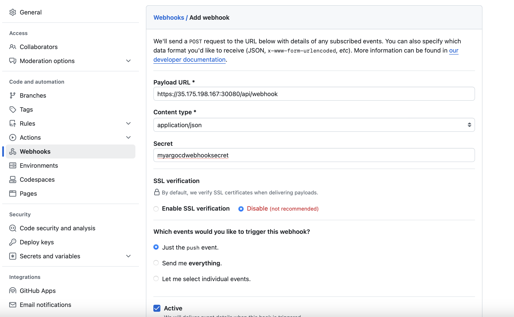

# Argo CD 

## What is ArgoCD?  
ArgoCD is a declarative, GitOps continuous delivery tool for Kubernetes. It follows the GitOps paradigm, where the desired state of your application is defined in Git, and ArgoCD ensures that your Kubernetes cluster matches this desired state.  

Source code can be found here:

* <https://github.com/argoproj/argo-helm/tree/main/charts/argo-cd>
* <https://github.com/argoproj/argo-cd>

## Installing Argo CD using the Helm Chart with custom values  

To install the chart with the release name `my-release`:  

```console
$ helm repo add argo https://argoproj.github.io/argo-helm
"argo" has been added to your repositories

$ helm install argocd-demo argo-cd/ -f argocd-custom-values.yaml  
NAME: my-release
...  
```


## Installing Argo CD using the Manifest Files  
```sh
kubectl create namespace argocd
kubectl apply -n argocd -f https://raw.githubusercontent.com/argoproj/argo-cd/stable/manifests/install.yaml
```  

## Troubleshoot 
```sh
$ helm install argocd-demo argo-cd/ -f argocd-custom-values.yaml
Error: INSTALLATION FAILED: An error occurred while checking for chart dependencies. You may need to run `helm dependency build` to fetch missing dependencies: found in Chart.yaml, but missing in charts/ directory: redis-ha
```  
If you face above issue follow the below steps to resolve it: 
1. Add the dandydevelope chart using the below command:
```sh
helm repo add dandy https://dandydeveloper.github.io/charts/
```
2. Run the following command to fetch the missing dependencies: 
```sh
helm dependency build argo-cd
```
3. Extract the redis-ha chart using the below command under sub charts section. 
```sh
tar -ztvf redis-ha-4.26.1.tgz
```  
3. Then proceed with the installation of the argocd helm chart.  


## Create project using CLI  
```sh
argocd proj create demo-proj \
--description "My first demo project" \
--dest 'https://kubernetes.default.svc,*' \
--src '*' \
--allow-cluster-resource '*/*'
```

## Create application using CLI 
```sh
argocd app create demo-app \
--repo https://github.com/anveshmuppeda/argo-cd-demo.git \
--path development \
--dest-server https://kubernetes.default.svc \
--dest-namespace argocd-demo \
--revision main \
--sync-policy auto \
--project demo-proj \
--sync-option CreateNamespace=true
```  

## Installing ArgoCD on Kubernetes  
You can install ArgoCD using the Helm chart, which offers greater flexibility for customization through Helm values.  

### Steps:  
1. Set up the ArgoCD Helm chart.
2. Update ArgoCD image versions and set the desired version.
3. Expose the ArgoCD UI using a NodePort or LoadBalancer by modifying the service type. Here's how to change it to NodePort:
```yml
server:
  service:
    type: NodePort
```
This configuration overrides the default ClusterIP service type, enabling access to the ArgoCD UI via a NodePort.  

### Verifying the Installation  
To confirm that ArgoCD is installed and running, use the following command:
```bash
kubectl get pods -n argocd
```

## Deploying Your First Application with ArgoCD
**Step 1:** Set Up a Git Repository  
Create a Git repository to host your Kubernetes manifests. This repository will serve as the source from which ArgoCD deploys your application.  

**Step 2:** Create an ArgoCD Application  
You can create an ArgoCD application by defining it in a YAML manifest and applying it with kubectl.  

1. Create the Manifest:  
Save the following configuration to a file named argocd-demo-app.yaml:  
```yml
apiVersion: argoproj.io/v1alpha1
kind: Application
metadata:
  name: first-argocd-demo-app
  namespace: argocd
spec:
  project: default

  source:
    repoURL: <target-github-repo-url>
    targetRevision: HEAD
    path: <github-path>

  destination:
    server: https://kubernetes.default.svc
    namespace: <target-namespace>

  syncPolicy:
    syncOptions:
    - CreateNamespace=true

    automated:
      selfHeal: true
      prune: true
```  
This manifest creates an ArgoCD application named first-argocd-demo-app in the argocd namespace. It will sync Kubernetes manifests from the specified Git repository to your target Kubernetes namespace.  
Once applied, ArgoCD will automatically deploy and manage your application based on the state defined in the Git repository.  

## 1. Polling from Git to ArgoCD  
ArgoCD periodically polls the Git repository (e.g., every minute, every 5 minutes).
ArgoCD checks if there are any new commits or changes in the repository.
If a change is detected, ArgoCD pulls the latest code and triggers a deployment to Kubernetes.  

### Pros of Polling:  
**Simplicity:** No need to configure webhooks or additional infrastructure. ArgoCD handles everything through periodic checks.   
**Resilience:** Even if the network between ArgoCD and GitHub goes down for a while, it will still sync the changes at the next interval.   
No reliance on external triggers: ArgoCD works independently, meaning there is no dependency on external services like webhooks.
**Security benefits:** Since ArgoCD pulls the updates itself, you don't need to expose it to incoming HTTP traffic, reducing the risk of attacks.   

### Cons of Polling:  
**Latency:** There can be delays between code commits and deployment because ArgoCD only checks at fixed intervals. If the polling interval is set to 5 minutes, a change may not be deployed for up to 5 minutes.  
**Resource consumption:** Polling regularly consumes more resources (CPU, network) as it makes constant requests to the Git repository, even when there are no changes.  
**Higher network traffic:** For every polling interval, even if there are no updates, ArgoCD still makes requests to check for changes. This can create unnecessary network traffic in large environments.  

## 2. Pushing via Webhooks from GitHub to ArgoCD  
A Git webhook is configured in GitHub (or another Git provider). When a new commit is pushed to the repository, the webhook notifies ArgoCD. ArgoCD pulls the latest code immediately and triggers a deployment to Kubernetes.

### Pros of Pushing:  
**Immediate updates (low latency)**: As soon as a change is made in the Git repository, the webhook triggers ArgoCD. This leads to near real-time deployments without waiting for a polling interval.  
**Efficient resource usage:** Since ArgoCD only syncs when it is triggered by the webhook, it doesn’t consume resources by polling the repository constantly.  
**Reduced network traffic:** Webhooks minimize the number of requests sent between GitHub and ArgoCD, as the notification is only sent when a change occurs.  
**More suited to frequent changes:** If your team frequently commits code, the push method ensures that all changes are handled and deployed quickly.  

### Cons of Pushing:  
**Dependency on webhook infrastructure:** If the webhook fails due to network issues, misconfigurations, or GitHub service outages, ArgoCD won’t be notified of the changes, potentially causing missed deployments.  
**More complex setup:** Webhooks require manual setup in the Git repository. They also need to be maintained and monitored to ensure they are functioning correctly.  
**Security concerns:** Webhooks rely on exposing an HTTP(S) endpoint. This endpoint needs to be secured with proper authentication, encryption (TLS), and access control to avoid malicious access or attacks.  

## Which Approach is Better?  
Both polling and pushing methods can be better suited to different scenarios, depending on your environment’s requirements:  

### Pushing via Webhooks is usually the better choice when:  
1. You need immediate and real-time deployments.  
2. Your development team frequently commits changes, and it’s essential to have those changes deployed quickly.  
3. You are looking to minimize resource consumption and network traffic.  
4. You are comfortable setting up and securing webhooks.  
5. Use Case: CI/CD pipelines, fast-moving teams, real-time updates.  

### Polling is typically better suited when:  
1. You want a simple, reliable system with minimal configuration.
2. You are okay with some delay in deployments (e.g., polling every 5-10 minutes).
3. You prefer to avoid exposing HTTP endpoints for security reasons.
4. You have an environment where changes are infrequent or where occasional missed changes (in the case of failed webhooks) would be problematic.  

Use Case: Environments with low-change frequency, high security needs, and lower urgency for real-time updates.  

## Customization Options:  
Both polling and pushing mechanisms can be tailored to your needs:  
### 1. Customizing Polling:  
The default polling interval is 3 minutes (180 seconds) with a configurable jitter. You can change the setting by updating the timeout.reconciliation value and the timeout.reconciliation.jitter in the **argocd-cm** config map. If there are any Git changes, Argo CD will only update applications with the auto-sync setting enabled. If you set it to 0 then Argo CD will stop polling Git repositories automatically and you can only use alternative methods such as webhooks and/or manual syncs for deploying applications.  

Application reconciliation timeout is the max amount of time required to discover if a new manifests version got published to the repository. Reconciliation by timeout is disabled if timeout is set to 0. Three minutes by default.  

> Note: argocd-repo-server deployment must be manually restarted after changing the setting.  

**Example:**  
```yaml
apiVersion: v1
data:
  admin.enabled: "true"
  application.instanceLabelKey: argocd.argoproj.io/instance
  exec.enabled: "false"
  server.rbac.log.enforce.enable: "false"
  statusbadge.enabled: "false"
  timeout.hard.reconciliation: 0s
  timeout.reconciliation: 180s
  url: https://argocd.example.com
kind: ConfigMap
metadata:
  name: argocd-cm
  namespace: argocd
```

## Create The Webhook in GitHub  
Login to GITHUB repository and navigate to the settings page where webhooks can be configured. The payload URL configured in the Git provider should use the **/api/webhook** endpoint of your Argo CD instance *ex:https://argocd.example.com/api/webhook*. If you wish to use a shared secret, input an arbitrary value in the secret. This value will be used when configuring the webhook.  



### Please be noted:  
* When creating the webhook in GitHub, the “Content type” needs to be set to “application/json“. The default value “application/x-www-form-urlencoded” is not supported by the library used to handle the hooks.  
* The webhook handler does not differentiate between branch events and tag events where the branch and tag names are the same. A hook event for a push to branch x will trigger a refresh for an app pointing at the same repo with targetRevision: **refs/tags/x**.  
* If Argo CD is publicly accessible, then configuring a webhook secret is recommended to prevent a DDoS attack.  

### Configure Argo CD with The WebHook Secret  
In the argocd-secret kubernetes secret, configure one of the following keys with the Git provider’s webhook secret configured.  

Edit the Argo CD kubernetes secret:  
```bash
kubectl edit secret argocd-secret -n argocd
```  

**TIP:** for ease of entering secrets, kubernetes supports inputting secrets in the stringData field, which saves you the trouble of base64 encoding the values and copying it to the data field. Simply copy the shared webhook secret created, to the corresponding GitHub/GitLab/BitBucket key under the stringData field:  

```yaml
apiVersion: v1
kind: Secret
metadata:
  name: argocd-secret
  namespace: argocd
type: Opaque
data:
...

stringData:
  # github webhook secret
  webhook.github.secret: shhhh! it's a GitHub secret

  # gitlab webhook secret
  webhook.gitlab.secret: shhhh! it's a GitLab secret

  # bitbucket webhook secret
  webhook.bitbucket.uuid: your-bitbucket-uuid

  # bitbucket server webhook secret
  webhook.bitbucketserver.secret: shhhh! it's a Bitbucket server secret

  # gogs server webhook secret
  webhook.gogs.secret: shhhh! it's a gogs server secret
```  

After saving, the changes should take effect automatically. 
Once you have add the secret(optional), you can goto your repository and edit any manifest.  
