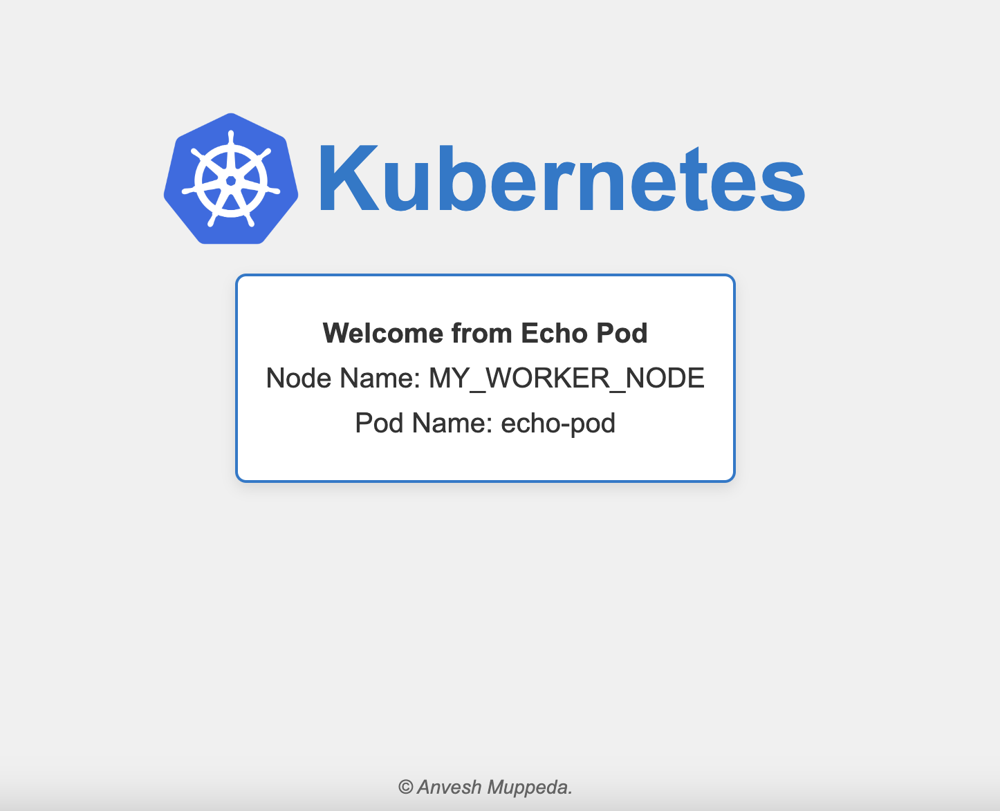

# echo-pod-name  
**Echo Pod Name** is a lightweight Docker image based on Nginx and Alpine, designed to display the Kubernetes pod name and node name dynamically on a web page. It is a simple tool for developers and operators to verify their Kubernetes setup and to provide quick insights into pod information.  

<div style="text-align: center;">
      
</div>

## Features  
* Displays the Pod Name and Node Name dynamically based on the environment.  
* Uses a lightweight base image (nginx:alpine) for fast startup and reduced resource usage.  
* Includes default values for pod and node names if not provided, ensuring robust behavior.  
* Simple HTML/CSS layout for easy customization and readability.  

# 
## Usage  
### 1. Pull the Image:  
```sh
docker pull anvesh35/echopod:latest
```  
### 2. Run the Container:  
```sh
docker run -d -p 80:80 -e NODE_NAME="your-node-name" anvesh35/echo-pod-name:latest
```
### 3. Access the Application:  
Open your web browser and navigate to http://<public-ip>:80 to see the pod information displayed.  

## Environment Variables  
**NODE_NAME:** Specify the name of the node where the pod is running. If not provided, the default value will be "Unknown Node".  
**POD_NAME:** The Pod Name is automatically determined by the hostname of the container.  

## Notes on Using Echo Pod Name in Kubernetes   
Sample Kubernetes YAML Configuration.  
Here’s a sample Kubernetes manifest to deploy the Echo Pod Name image:   
```yaml
apiVersion: apps/v1
kind: Deployment
metadata:
  name: echopod
  labels:
    app: echopod
spec:
  replicas: 2  # Number of pod replicas
  selector:
    matchLabels:
      app: echopod
  template:
    metadata:
      labels:
        app: echopod
    spec:
      containers:
      - name: echopod
        image: anvesh35/echo-pod-name
        ports:
        - containerPort: 80
        env:
        - name: NODE_NAME
          valueFrom:
            fieldRef:
              fieldPath: spec.nodeName
---
apiVersion: v1
kind: Service
metadata:
  name: echopod-service
spec:
  type: NodePort  # Change to LoadBalancer if using a cloud provider
  ports:
    - port: 80
      targetPort: 80
      nodePort: 30080  # Port to expose on the node
  selector:
    app: echopod
```