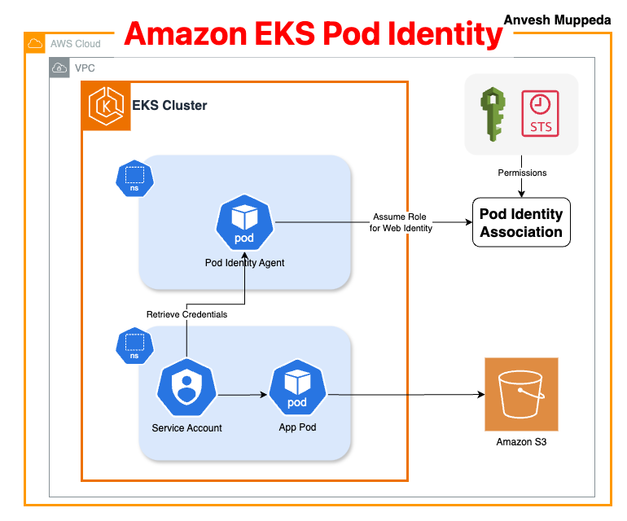

## Introduction to EKS Pod Identity

In Kubernetes, workloads often need to interact with AWS services like S3, DynamoDB, or RDS. Traditionally, granting pods access to AWS resources involved complex IAM role management or third-party solutions like `kiam` or `kube2iam`. AWS introduced **IAM Roles for Service Accounts (IRSA)** to simplify this, but it still required manual certificate management and role trust policies. 

Enter **EKS Pod Identity**—a game-changer announced in late 2023. This feature streamlines assigning IAM roles directly to Kubernetes service accounts, eliminating the need for manual OIDC provider configuration or role session tagging. In this guide, we'll explore why Pod Identity matters, how to set it up, and deploy a sample app to demonstrate its power.

---



## Why EKS Pod Identity?

### The Problem with IRSA
IRSA required:
1. Configuring an OIDC provider for your cluster.
2. Managing role trust policies with complex conditional statements.
3. Injecting temporary credentials via projected volumes, which could be over-permissioned if pods were compromised.

### Benefits of Pod Identity
- **Simplified Setup**: No OIDC provider or manual trust relationships.
- **Enhanced Security**: Credentials are ephemeral and rotated every hour.
- **Scalability**: Associate one IAM role with multiple service accounts across namespaces/clusters.

---

## Prerequisites
- AWS CLI v2 installed.
- `kubectl` and `eksctl` configured.
- Basic understanding of EKS and Kubernetes concepts.

---

## Step 1: Create an EKS Cluster

### Option 1: Using eksctl
Save this as **cluster.yaml**:
```yaml
apiVersion: eksctl.io/v1alpha5
kind: ClusterConfig
metadata:
  name: eks-pod-identity-demo
  region: us-west-2
  version: "1.28"
addons:
  - name: vpc-cni
  - name: coredns
  - name: kube-proxy
  - name: eks-pod-identity-agent  # Critical for Pod Identity
managedNodeGroups:
  - name: eks-shared-demo-mng
    instanceType: t3.medium
    privateNetworking: true
    minSize: 2
    desiredCapacity: 2
    maxSize: 5
```

Create the cluster:
```bash
eksctl create cluster -f cluster.yaml
```

### Option 2: Using CloudFormation
Use the template [eks-pod-identity.yaml](./cloudformation/eks-pod-identity.yaml).  
This CloudFormation Template (CFT):
1. Creates the EKS cluster with the `eks-pod-identity-agent` addon.
2. Provisions an IAM role with the correct trust relationship for Pod Identity.
3. Sets up a Pod Identity association for:
   - Namespace: `demo-ns`
   - Service Account: `demo-sa`
   - IAM Role: `AmazonS3ReadOnlyAccess`

**To modify namespaces/service accounts**:  
Edit the `EKSPodIdentityAssociation` resource in the CFT:
```yaml
EKSPodIdentityAssociation:
  Type: AWS::EKS::PodIdentityAssociation
  Properties:
    ClusterName: !Ref ClusterName
    Namespace: "demo-ns"  # ← Change this
    ServiceAccount: "demo-sa"  # ← Change this
    RoleArn: !GetAtt PodIdentityRole.Arn
```

---

## Step 2: Verify Pod Identity Agent
Ensure the agent pods are running:
```bash
kubectl get pods -n kube-system \
  --selector app.kubernetes.io/name=eks-pod-identity-agent
```
Output:
```
NAME                           READY   STATUS    RESTARTS   AGE
eks-pod-identity-agent-vkdmm   1/1     Running   0          31m
eks-pod-identity-agent-wt6m6   1/1     Running   0          31m
```

---

> **IMPORTANT**:  
> - If you used **CloudFormation (Option 2)**, skip to [Step 5](#step-5-deploy-the-demo-application).  
> - If you used **eksctl (Option 1)**, proceed to Step 3.

---

## Step 3: Create an IAM Role (Skip if Using CFT)

### Trust Policy
Save as **eks-pod-identity-trust-policy.json**:
```json
{
    "Version": "2012-10-17",
    "Statement": [{
        "Effect": "Allow",
        "Principal": { "Service": "pods.eks.amazonaws.com" },
        "Action": ["sts:AssumeRole", "sts:TagSession"]
    }]
}
```

Create the role and attach the S3 read-only policy:
```bash
# Create role
export POD_ROLE_ARN=$(aws iam create-role \
  --role-name s3-app-eks-pod-identity-role \
  --assume-role-policy-document file://eks-pod-identity-trust-policy.json \
  --output text --query 'Role.Arn')

# Attach policy
aws iam attach-role-policy \
  --role-name s3-app-eks-pod-identity-role \
  --policy-arn arn:aws:iam::aws:policy/AmazonS3ReadOnlyAccess
```

---

## Step 4: Associate the Role with EKS (Skip if Using CFT)

Replace `$CLUSTER_NAME` and `$AWS_REGION` with your values:
```bash
aws eks create-pod-identity-association \
  --cluster-name $CLUSTER_NAME \
  --namespace demo-ns \
  --service-account demo-sa \
  --role-arn $POD_ROLE_ARN \
  --region $AWS_REGION
```

---

## Step 5: Deploy the Demo Application

Save as **demo-app.yaml**:
```yaml
apiVersion: v1
kind: Namespace
metadata:
  name: demo-ns
---
apiVersion: v1
kind: ServiceAccount
metadata:
  name: demo-sa
  namespace: demo-ns
  annotations:
    # Optional: Add if using IRSA for migration
    eks.amazonaws.com/role-arn: $POD_ROLE_ARN
automountServiceAccountToken: false  # Security best practice
---
apiVersion: apps/v1
kind: Deployment
metadata:
  labels:
    app: awscli-app
  name: awscli-app
  namespace: demo-ns
spec:
  replicas: 2
  selector:
    matchLabels:
      app: awscli-app
  template:
    metadata:
      labels:
        app: awscli-app
    spec:
      serviceAccountName: demo-sa
      containers:
      - name: aws-cli-app
        image: amazon/aws-cli:latest
        securityContext:
          runAsNonRoot: true
          allowPrivilegeEscalation: false
          runAsUser: 1
        command: ["sleep", "infinity"]
```

Apply the manifest:
```bash
kubectl apply -f demo-app.yaml
```

---

## Step 6: Test AWS Access

Exec into a pod and verify permissions:
```bash
kubectl exec -it -n demo-ns awscli-app-78c6cf97f4-qj7xm -- sh

# 1. List S3 buckets (should succeed)
sh-4.2$ aws s3 ls

# 2. Check assumed role
sh-4.2$ aws sts get-caller-identity
{
    "UserId": "AROA6GBMDR6242KGGAMZP:eks-...",
    "Account": "975050084277",
    "Arn": "arn:aws:sts::975050084277:assumed-role/s3-app-eks-pod-identity-role/..."
}

# 3. Attempt to create a bucket (should FAIL)
sh-4.2$ aws s3 mb s3://my-test-bucket-$(date +%s)
An error occurred (AccessDenied) when calling the CreateBucket operation: Access Denied
```

---

## Key Takeaways

1. **Seamless Integration**: Pod Identity removes the friction of OIDC setup.
2. **Unified Role Management**: Use one IAM role across multiple clusters/namespaces.
3. **Security First**: Ephemeral credentials reduce blast radius compared to IRSA.
4. **Least Privilege**: The read-only access test confirms our role restrictions work.

---

## Cleanup
```bash
# Delete association (if not using CFT)
aws eks delete-pod-identity-association \
  --cluster-name $CLUSTER_NAME \
  --association-id <ID>

# Delete role (if not using CFT)
aws iam delete-role --role-name s3-app-eks-pod-identity-role

# Delete cluster
eksctl delete cluster --name eks-pod-identity-demo
```

---

## Conclusion

EKS Pod Identity simplifies secure access to AWS services from Kubernetes pods while adhering to least-privilege principles. By following this guide, you've learned how to:  
- Set up a cluster with the Pod Identity agent (via both eksctl and CloudFormation).
- Create and associate IAM roles with service accounts.
- Validate read-only access through success/failure tests.  

The failed bucket creation attempt proves our security model works as intended. For production, combine this with IAM Conditions (e.g., `eks:SourceNamespace`) for granular access control.

---

*Happy deploying!*