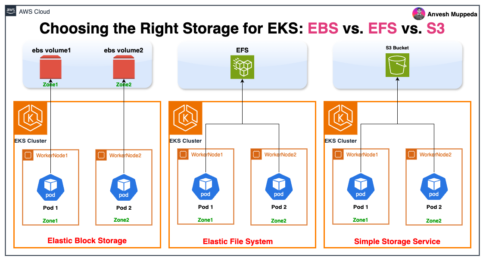

---
// filepath: kubernetes/docs/eks/010-eks-complete-storage.md
title: "A Guide to Amazon EKS Storage: EBS, EFS, and S3"
description: "Understanding the Key Storage Options for Amazon EKS"
sidebar_id: "eks-complete-storage"
sidebar_label: "Choosing Your EKS Storage"
sidebar_position: 13
---  

# A Guide to Amazon EKS Storage: EBS, EFS, and S3

Choosing the right storage solution is critical for running scalable, resilient, and cost-effective applications on Amazon EKS. AWS offers several powerful storage options that integrate with Kubernetes, each designed for different use cases. This guide provides a high-level overview of the three primary storage services—Amazon EBS, Amazon EFS, and Amazon S3 (via the Mountpoint CSI driver)—to help you understand their core features, differences, and ideal workloads.

For detailed, step-by-step implementation instructions and advanced configurations, please refer to the comprehensive individual guides:

  - **[EKS Storage with Amazon EBS: Complete Implementation Guide](./010-eks-ebs-storage.md)**
  - **[EKS Storage with Amazon EFS: Complete Implementation Guide](./011-eks-efs-storage.md)**
  - **[EKS Mountpoint for Amazon S3 CSI Driver: Complete Implementation Guide](./012-eks-s3-csi-driver.md)**

-----

## At a Glance: Comparing EKS Storage Options

The table below summarizes the key characteristics of each storage solution to help you make a quick decision.

| Feature | Amazon EBS (Elastic Block Store) | Amazon EFS (Elastic File System) | Mountpoint for Amazon S3 |
| :--- | :--- | :--- | :--- |
| **Primary Use Case** | Databases, stateful applications requiring high performance & low latency. | Web servers, CMS, CI/CD tools, and apps needing shared file storage. | Data analytics, machine learning, log aggregation, backup/archive. |
| **Access Modes** | `ReadWriteOnce` (RWO) | `ReadWriteMany` (RWX) | `ReadWriteMany` (RWX), `ReadOnlyMany` |
| **Storage Type** | Block Storage | File Storage (NFS) | Object Storage (accessed as a file system) |
| **Performance Model** | High IOPS, low-latency. Tied to a single Availability Zone (AZ). | Scalable throughput, latency sensitive to workload. Multi-AZ resilience. | High aggregate throughput, not for low-latency operations. |
| **Provisioning** | Dynamic & Static | Dynamic & Static | Static Only (uses existing buckets) |
| **Scalability** | Manually or automatically scale volume size. | Automatically scales storage capacity as you add or remove files. | Virtually unlimited capacity of S3. |
| **Key Benefit** | Best performance for single-pod access. | Simple, scalable, shared storage across many pods and AZs. | Massive scale, cost-effective, direct file-like access to object data. |

-----

## 1\. Amazon EBS (Elastic Block Store)

Amazon EBS provides high-performance, persistent block-level storage volumes for use with Amazon EC2 instances. In an EKS context, the EBS CSI driver allows you to attach these volumes directly to your pods, making it the ideal choice for applications that require the performance and low latency of dedicated block storage.

### When to Use EBS:

  - **Databases and Key-Value Stores:** Workloads like PostgreSQL, MySQL, or Cassandra that need fast, consistent I/O.
  - **Stateful Applications:** Any single-instance application that writes data to a dedicated disk and requires persistence beyond the pod's lifecycle.
  - **High-Performance Needs:** When your application's primary requirement is the lowest possible latency for I/O operations.

### Key Characteristics:

  - **Zone-Specific:** An EBS volume is tied to a specific Availability Zone (AZ). Kubernetes must schedule your pod in the same AZ where the EBS volume exists.
  - **Single-Pod Access:** With the `ReadWriteOnce` (RWO) access mode, an EBS volume can only be mounted by a single pod at a time.
  - **Dynamic Provisioning:** Kubernetes can automatically provision a new EBS volume when a `PersistentVolumeClaim` is created, simplifying storage management.

For a complete walkthrough on setting up static and dynamic provisioning, creating storage classes, and managing volumes, see the **[Detailed EBS Implementation Guide](./010-eks-ebs-storage.md)**.

-----

## 2\. Amazon EFS (Elastic File System)

Amazon EFS provides a serverless, fully elastic Network File System (NFS) that can be accessed concurrently by thousands of pods. The EFS CSI driver allows multiple pods—even across different Availability Zones—to mount and share the same file system.

### When to Use EFS:

  - **Web Content Management:** Serving shared assets for a fleet of web servers (e.g., WordPress, Drupal).
  - **Developer Tools:** Shared tooling, code repositories, or build artifacts for CI/CD pipelines.
  - **Shared Application Data:** Any application that requires multiple instances to read and write to a common file system.
  - **Persistent Multi-Pod Storage:** When you need a `ReadWriteMany` (RWX) solution that is fully managed and scales automatically.

### Key Characteristics:

  - **Shared Access:** As a file system, EFS is perfect for `ReadWriteMany` (RWX) workloads where multiple pods need to access the same data simultaneously.
  - **Elastic and Serverless:** EFS automatically grows and shrinks as you add and remove files, and you only pay for the storage you use.
  - **Multi-AZ Resilience:** EFS is designed for high availability and durability by storing data across multiple AZs within a region.

To learn how to configure EFS for dynamic and static provisioning, manage access points, and optimize performance, check out the **[Detailed EFS Implementation Guide](./011-eks-efs-storage.md)**.

-----

## 3\. Mountpoint for Amazon S3 CSI Driver

The Mountpoint for Amazon S3 CSI driver is a specialized tool that makes an S3 bucket appear as a local file system inside your pods. This allows applications that expect a standard file system interface to work directly with the virtually limitless, cost-effective storage of Amazon S3 without any code changes.

### When to Use the S3 CSI Driver:

  - **Large-Scale Data Processing:** Data analytics and machine learning workloads that need to read or write large datasets stored in S3.
  - **Log Aggregation:** Centralizing application logs by writing them directly to an S3 bucket from multiple pods.
  - **Backup and Archiving:** Easily backing up application data to S3.
  - **High-Throughput Workloads:** Applications optimized for sequential reads and writes, such as media processing or financial modeling.

### Key Characteristics:

  - **File-like Access to Objects:** It translates file system API calls from your application into S3 object API calls.
  - **High Throughput:** Optimized for high aggregate throughput, making it ideal for parallel processing jobs.
  - **Static Provisioning Only:** You cannot dynamically create S3 buckets. The driver works by mounting existing buckets as volumes.
  - **Not a POSIX Filesystem:** It is not a general-purpose replacement for EFS or EBS. It has different performance characteristics and does not support all POSIX operations.

For examples of mounting single and multiple buckets, configuring mount options, and troubleshooting, refer to the **[Detailed S3 Mountpoint CSI Driver Guide](./012-eks-s3-csi-driver.md)**.

## Conclusion

Choosing the right storage is a foundational decision in your EKS architecture. By understanding the distinct benefits and limitations of EBS, EFS, and the S3 Mountpoint driver, you can build more efficient, scalable, and cost-effective applications.

  - **Use EBS** for high-performance, single-pod access like databases.
  - **Use EFS** for simple, scalable, shared storage across multiple pods.
  - **Use S3 Mountpoint** for high-throughput access to object storage for data-intensive workloads.

Ready to get started? Dive into the detailed guides to begin implementing the perfect storage solution for your needs.

