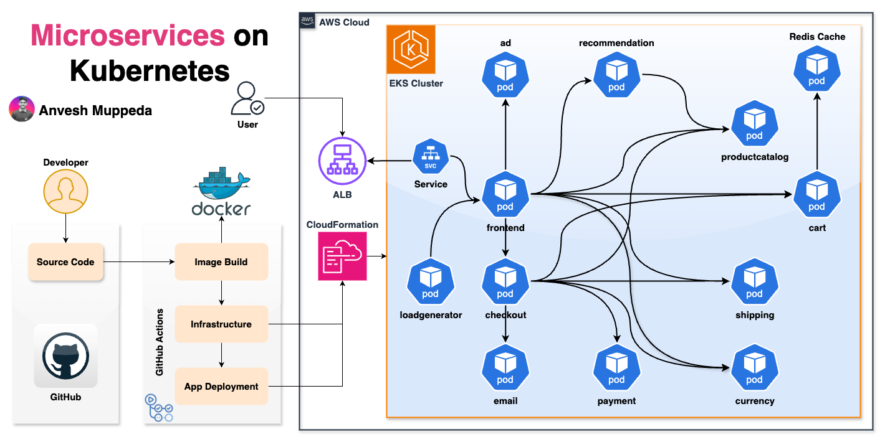

---
// filepath:kubernetes/docs/eks/010-eks-complete-storage.md
title: "A Guide to Amazon EKS Storage: EBS, EFS, and S3"
description: "Understanding the Key Storage Options for Amazon EKS"
sidebar_id: "eks-complete-storage"
sidebar_label: "Choosing Your EKS Storage"
sidebar_position: 13
---  

# Microservices on Kubernetes EKS - Complete Deployment Guide

   

A comprehensive hands-on guide for deploying a production-ready microservices application on AWS EKS using modern DevOps practices.



## 🏗️ Architecture Overview

This project demonstrates a complete microservices architecture deployed on AWS EKS, featuring:

- **11 Microservices**: Ad, Recommendation, Product Catalog, Cart, Shipping, Currency, Payment, Email, Checkout, Load Generator, and Frontend
- **AWS EKS Cluster**: Managed Kubernetes service for container orchestration
- **Application Load Balancer (ALB)**: For traffic routing and load balancing
- **Redis Cache**: For session management and caching
- **CloudFormation**: Infrastructure as Code for AWS resource provisioning
- **GitHub Actions**: Automated CI/CD pipeline
- **Docker Hub**: Container image registry

## 📁 Project Structure

```
├── infrastructure/         # AWS CloudFormation templates
│   └── microservice-demo-cft.yaml
├── helm-charts/           # Helm charts for application deployment
│   └── microservices-demo/
├── kubernetes-manifests/  # Raw Kubernetes YAML manifests
├── src/                  # Source code for all microservices
├── .github/workflows/    # GitHub Actions CI/CD pipelines
└── kustomization.yaml    # Kustomize configuration
```

## 🚀 Quick Start Guide

### Prerequisites

Before you begin, ensure you have the following tools installed:

- **AWS CLI** (v2.0+)
- **kubectl** (compatible with your EKS cluster version)
- **Docker** (for local testing)
- **Helm** (v3.0+)
- **Git**

### Step 1: Clone the Repository

```bash
git clone https://github.com/anveshmuppeda/kubernetes.git
cd kubernetes/projects/microservices-project
```

### Step 2: Deploy Complete Infrastructure & Application

You have two options for deployment:

#### Option A: Complete Automated Deployment (Recommended)

**Single-Command Full Stack Deployment** using GitHub Actions:

1. **Navigate to GitHub Actions** in your repository
2. **Select** "Deploy Microservices Demo Infra & Helm Chart to EKS Cluster" workflow
3. **Click "Run workflow"** and configure parameters:
   - **Stack Name**: `microservices-demo-eks` (default)
   - **EKS Cluster Name**: `microservices-demo-cluster` (default)
   - **Desired Node Size**: `2` (default)
   - **AWS Region**: Select from `us-east-1`, `us-east-2`, or `us-west-2`

4. **Monitor** the workflow execution:
   - **Phase 1**: Infrastructure deployment (15-20 minutes)
   - **Phase 2**: Application deployment via Helm (5-10 minutes)
   - **Total Time**: ~25-30 minutes for complete stack

This workflow will:
✅ Deploy EKS cluster with CloudFormation  
✅ Configure kubectl access  
✅ Install Helm charts  
✅ Deploy all microservices  
✅ Set up load balancers and networking  

#### Option B: Manual Step-by-Step Deployment

```bash
# Step 1: Configure AWS Credentials
aws configure

# Step 2: Deploy EKS Cluster using CloudFormation
cd infrastructure
aws cloudformation deploy \
  --region us-east-1 \
  --stack-name microservices-demo-eks \
  --template-file microservice-demo-cft.yaml \
  --capabilities CAPABILITY_NAMED_IAM CAPABILITY_AUTO_EXPAND \
  --parameter-overrides \
    EksClusterName=microservices-demo-cluster \
    DesiredSize=2

# Step 3: Update kubeconfig
aws eks update-kubeconfig --region us-east-1 --name microservices-demo-cluster

# Step 4: Deploy applications with Helm
helm upgrade --install microservice-demo \
  helm-charts/microservices-demo \
  --namespace microservices --create-namespace
```

#### Update kubeconfig
```bash
aws eks update-kubeconfig --region <your-region> --name microservices-demo-cluster
```

### Step 3: Verify Complete Deployment

After the automated deployment completes, verify everything is running:

```bash
# Check cluster status
kubectl get nodes

# Verify all pods are running
kubectl get pods -n microservices

# Check services and load balancers
kubectl get svc -n microservices

# Get the application URL
kubectl get ingress -n microservices
```

### Step 4: Access Your Application

Once deployment is complete, your microservices application will be accessible via the Application Load Balancer URL provided in the ingress output.

### Step 5: Set Up GitHub Actions Secrets (One-Time Setup)

Navigate to your GitHub repository and add the following secrets:

| Secret Name | Description | Example Value |
|-------------|-------------|---------------|
| `AWS_ACCESS_KEY_ID` | AWS Access Key for EKS deployment | `AKIAXXXXX` |
| `AWS_SECRET_ACCESS_KEY` | AWS Secret Key | `xxxxx` |
| `DOCKERHUB_USERNAME` | Your Docker Hub username | `anveshmuppeda` |
| `DOCKERHUB_TOKEN` | Docker Hub access token | `dckr_pat_xxxxx` |

### Step 6: Deploy Applications (Alternative Methods)

If you prefer manual deployment after infrastructure is ready:

#### Option A: Using Helm Charts (Automated in main workflow)
```bash
cd helm-charts

# Install the microservices application
helm upgrade --install microservice-demo \
  microservices-demo \
  --namespace microservices \
  --create-namespace
```

#### Option B: Using Kubernetes Manifests
```bash
cd kubernetes-manifests

# Apply all manifests
kubectl apply -f .
```

#### Option C: Using Kustomize
```bash
# Deploy using Kustomize
kubectl apply -k .
```

### Step 6: Verify Deployment

```bash
# Check all pods are running
kubectl get pods -n microservices

# Check services
kubectl get svc -n microservices

# Get the Load Balancer URL
kubectl get ingress -n microservices
```

## 🔄 CI/CD Pipeline Overview

This project features **three main GitHub Actions workflows** for complete automation:

### 1. Complete Infrastructure & Application Pipeline (Primary)

**Workflow**: `Deploy Microservices Demo Infra & Helm Chart to EKS Cluster`

**Purpose**: End-to-end deployment from infrastructure to running application

**Triggers**: Manual workflow dispatch with customizable parameters

**Two-Job Architecture**:

#### Job 1: Infrastructure Deployment (`deploy-cft`)
- **Duration**: ~15-20 minutes
- **Purpose**: Provisions AWS EKS cluster using CloudFormation
- **Features**:
  - Flexible configuration (stack name, cluster name, node size, region)
  - Multi-region support (`us-east-1`, `us-east-2`, `us-west-2`)
  - Scalable node groups (configurable desired size)
  - IAM capabilities for complex permissions

#### Job 2: Application Deployment (`deploy-helm`)
- **Duration**: ~5-10 minutes
- **Purpose**: Deploys all microservices using Helm charts
- **Dependencies**: Waits for infrastructure job completion
- **Features**:
  - Automatic kubectl configuration
  - Helm chart installation
  - Namespace creation and management
  - Service mesh deployment

**Complete Deployment Flow**:


### 2. Infrastructure-Only Pipeline

**Workflow**: `Deploy Microservices Demo EKS Cluster using CFT`

**Purpose**: Infrastructure provisioning only (for advanced users)

### 3. Application Build Pipeline

**Workflow**: `MicroServices Demo | AdService - Docker Build`

**Purpose**: Container image building and publishing

**Automated Build Process**:

1. **Triggers** on:
   - Manual dispatch with version bump selection
   - Push to `main` or `feature/microservicesdemo` branches
   - Changes to Dockerfile paths

2. **Version Management**:
   - Fetches latest version from Docker Hub
   - Calculates new version based on semantic versioning
   - Supports major, minor, and patch bumps

3. **Build Process**:
   - Multi-architecture builds (AMD64 and ARM64)
   - Pushes to Docker Hub with version tags
   - Updates both `latest` and versioned tags

### Pipeline Workflow Sequence


### Required GitHub Secrets

| Secret Name | Description | Usage |
|-------------|-------------|-------|
| `AWS_ACCESS_KEY_ID` | AWS Access Key for EKS deployment | Infrastructure Pipeline |
| `AWS_SECRET_ACCESS_KEY` | AWS Secret Key | Infrastructure Pipeline |
| `DOCKERHUB_USERNAME` | Docker Hub username | Application Pipeline |
| `DOCKERHUB_TOKEN` | Docker Hub access token | Application Pipeline |

### Manual Trigger Examples

```bash
# Complete Infrastructure + Application Deployment (Recommended)
gh workflow run "Deploy Microservices Demo Infra & Helm Chart to EKS Cluster" \
  --field stack-name="production-microservices" \
  --field EksClusterName="prod-cluster" \
  --field DesiredSize="4" \
  --field region="us-west-2"

# Infrastructure Only
gh workflow run "Deploy Microservices Demo EKS Cluster using CFT" \
  --field stack-name="staging-infrastructure" \
  --field EksClusterName="staging-cluster" \
  --field DesiredSize="2" \
  --field region="us-east-1"

# Application Build
gh workflow run "MicroServices Demo | AdService - Docker Build" \
  --field bump-type=minor

# Instead of AdService, you can specify any service like `frontend`, `cartservice`, etc.
```

### Deployment Timeline

| Phase | Duration | Description |
|-------|----------|-------------|
| **Infrastructure** | 15-20 min | EKS cluster, VPC, security groups, node groups |
| **Application** | 5-10 min | Helm chart deployment, pod startup, load balancer |
| **Total** | **20-30 min** | **Complete working application** |

## 🛠️ Service Details

### Core Services

| Service | Purpose | Port | Technology |
|---------|---------|------|------------|
| **frontend** | Web UI | 8080 | Go |
| **adservice** | Ad recommendations | 9555 | Java |
| **cartservice** | Shopping cart | 7070 | C# |
| **checkoutservice** | Order processing | 5050 | Go |
| **currencyservice** | Currency conversion | 7000 | Node.js |
| **emailservice** | Email notifications | 8080 | Python |
| **paymentservice** | Payment processing | 50051 | Node.js |
| **productcatalogservice** | Product catalog | 3550 | Go |
| **recommendationservice** | ML recommendations | 8080 | Python |
| **shippingservice** | Shipping quotes | 50051 | Go |

### Supporting Services

| Service | Purpose | Port |
|---------|---------|------|
| **redis-cart** | Cart session storage | 6379 |
| **loadgenerator** | Traffic simulation | - |

## 🔧 Configuration Management

### Environment Variables

Key environment variables for each service:

```yaml
# Frontend Service
- PORT: "8080"
- PRODUCT_CATALOG_SERVICE_ADDR: "productcatalogservice:3550"
- CURRENCY_SERVICE_ADDR: "currencyservice:7000"
- CART_SERVICE_ADDR: "cartservice:7070"

# Cart Service
- REDIS_ADDR: "redis-cart:6379"
- PORT: "7070"

# Checkout Service
- PRODUCT_CATALOG_SERVICE_ADDR: "productcatalogservice:3550"
- SHIPPING_SERVICE_ADDR: "shippingservice:50051"
- PAYMENT_SERVICE_ADDR: "paymentservice:50051"
```

### Resource Requirements

Recommended resource allocations:

```yaml
resources:
  requests:
    cpu: 100m
    memory: 64Mi
  limits:
    cpu: 200m
    memory: 128Mi
```

## 📊 Monitoring and Observability

### Health Checks

Each service includes health check endpoints:
```bash
# Check service health
kubectl get pods -n microservices
kubectl describe pod <pod-name> -n microservices
```

### Logs

View service logs:
```bash
# View logs for a specific service
kubectl logs -f deployment/frontend -n microservices

# View logs with timestamp
kubectl logs --timestamps deployment/cartservice -n microservices
```

## 🔒 Security Considerations

### Network Policies
Implement network policies to restrict pod-to-pod communication:

```yaml
apiVersion: networking.k8s.io/v1
kind: NetworkPolicy
metadata:
  name: microservices-netpol
spec:
  podSelector: {}
  policyTypes:
  - Ingress
  - Egress
```

### Service Accounts
Each service runs with minimal required permissions using dedicated service accounts.

## 📈 Scaling and Performance

### Horizontal Pod Autoscaler

Enable autoscaling for services:
```bash
kubectl autoscale deployment frontend --cpu-percent=70 --min=2 --max=10 -n microservices
```

### Load Testing

The included load generator creates realistic traffic:
```bash
# Check load generator status
kubectl logs deployment/loadgenerator -n microservices
```

## 🐛 Troubleshooting

### Common Issues

**Pods stuck in Pending state:**
```bash
kubectl describe pod <pod-name> -n microservices
# Check events section for resource constraints
```

**Service connectivity issues:**
```bash
# Test service connectivity
kubectl exec -it <pod-name> -n microservices -- nslookup productcatalogservice
```

**Load Balancer not accessible:**
```bash
# Check ALB controller logs
kubectl logs -n kube-system deployment/aws-load-balancer-controller
```

### Debug Commands

```bash
# Get all resources
kubectl get all -n microservices

# Check ingress status
kubectl describe ingress -n microservices

# View cluster events
kubectl get events -n microservices --sort-by=.metadata.creationTimestamp
```

## 🔄 Updates and Maintenance

### Rolling Updates

Update a service image:
```bash
kubectl set image deployment/frontend frontend=anveshmuppeda/microservices-demo-frontend:v1.2.3 -n microservices
```

### Backup Strategies

Regular backup of:
- EKS cluster configuration
- Application configurations
- Persistent volume data

## 📚 Additional Resources

### Related Documentation
- [AWS EKS User Guide](https://docs.aws.amazon.com/eks/latest/userguide/)
- [Kubernetes Documentation](https://kubernetes.io/docs/)
- [Docker Hub Registry](https://hub.docker.com/)

### Useful Commands Cheat Sheet

```bash
# Cluster Management
kubectl cluster-info
kubectl get nodes
kubectl top nodes

# Application Management
kubectl get pods -o wide
kubectl get svc
kubectl get ingress

# Scaling
kubectl scale deployment frontend --replicas=3
kubectl get hpa

# Logs and Debugging
kubectl logs -f <pod-name>
kubectl exec -it <pod-name> -- /bin/sh
kubectl port-forward svc/frontend 8080:8080
```

## 🤝 Contributing

1. Fork the repository
2. Create a feature branch (`git checkout -b feature/awesome-feature`)
3. Commit your changes (`git commit -m 'Add awesome feature'`)
4. Push to the branch (`git push origin feature/awesome-feature`)
5. Open a Pull Request

## 📄 License

This project is licensed under the MIT License - see the LICENSE file for details.

## 👨‍💻 Author

**Anvesh Muppeda**
- GitHub: [@anveshmuppeda](https://github.com/anveshmuppeda)
- Docker Hub: [anveshmuppeda](https://hub.docker.com/u/anveshmuppeda)

---

**Happy Deploying! 🚀**

For questions or support, please open an issue in the GitHub repository.