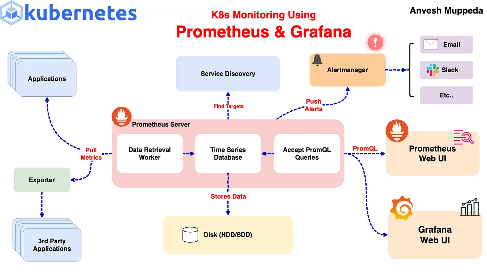
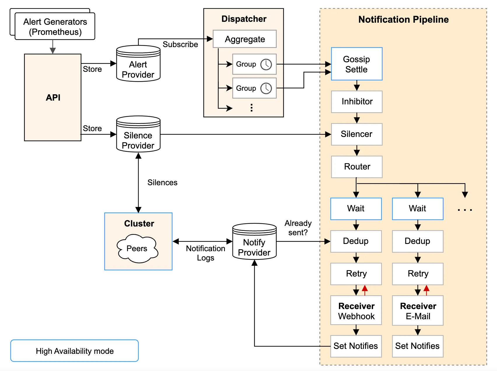
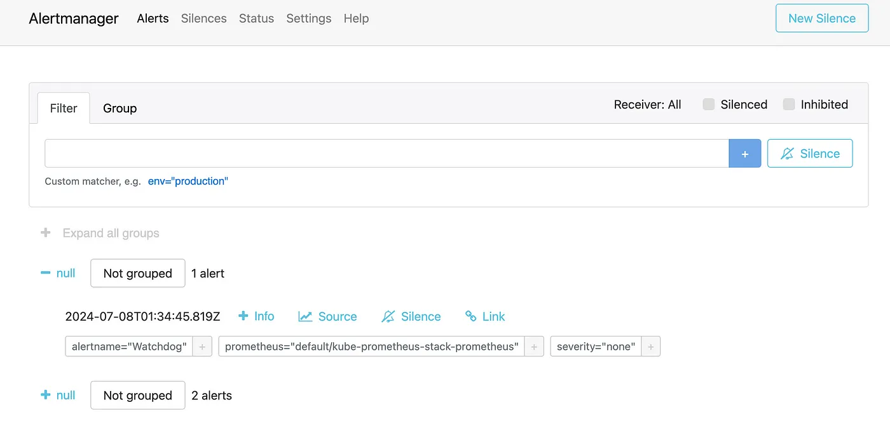
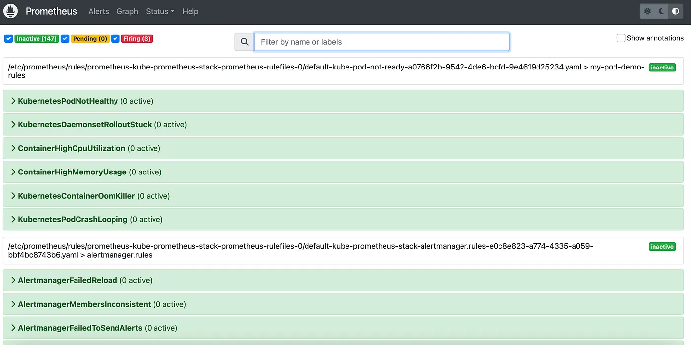

# ⎈ A Hands-On Guide: Setting Up Prometheus and AlertManager in Kubernetes with Custom Alerts 🛠️

#### *⇢ Understanding Prometheus & AlertManager Setup in Kubernetes with Custom Rules: A Comprehensive Guide*    




Monitoring your Kubernetes cluster is crucial for maintaining the health and performance of your applications. In this guide, we’ll walk through setting up Prometheus and Alertmanager using Helm and configuring custom alert rules to monitor your cluster effectively.
If you haven’t already, I recommend checking out my previous blog post on Kubernetes monitoring using Prometheus and Grafana for a comprehensive overview of setting up Prometheus and Grafana.

### Prerequisites

Before we start, ensure you have the following:  

- A running Kubernetes cluster.
- Helm installed on your local machine. 


### Step 1: Install Prometheus and Alertmanager using Helm

We’ll use the kube-prometheus-stack Helm chart from the Prometheus community. This chart includes Prometheus, Alertmanager, and Grafana, along with several pre-configured dashboards and alerting rules.  


First, create a custom-values.yaml file to specify our custom configurations:

```yaml
# custom-values.yaml
prometheus:
  service:
    type: NodePort
grafana:
  service:
    type: NodePort
alertmanager:
  service:
    type: NodePort
```
Next, install the kube-prometheus-stack using Helm:  

```yaml
helm upgrade --install kube-prometheus-stack prometheus-community/kube-prometheus-stack -f custom-values.yaml
```
This command will deploy Prometheus, Alertmanager, and Grafana to your cluster with the services exposed as NodePort.  



### Step 2: Verifying the Setup
To verify that Prometheus and Alertmanager are running correctly, you can access their web UIs. Since we exposed their services as NodePort, you can use kubectl port-forward to access them locally or you can use external IP of the cluster and nodeport of the respective service.  

For Prometheus:


For Alertmanager:


For Grafana:


Access the default Alertmanager rules:   
To access the alertmanager rules/alerts, navigate to Alerts section on prometheus UI:  


Here we can see that three alerts are in Firing state, so these alerts we can see in AlertManager UI to manage:   



### Step 3: Configuring Custom Alert Rules  
From the above steps we can see that the default alerts are configured in prometheus and alertmanager. Now, let’s add custom alert rules to monitor our Kubernetes cluster. We’ll create a PrometheusRule manifest to define these alerts.   

Create a file named custom-alert-rules.yaml with the following content:  

```yaml
apiVersion: monitoring.coreos.com/v1
kind: PrometheusRule
metadata:
  labels:
    app: kube-prometheus-stack
    app.kubernetes.io/instance: kube-prometheus-stack
    release: kube-prometheus-stack
  name: kube-pod-not-ready
spec:
  groups:
  - name: my-pod-demo-rules
    rules:
    - alert: KubernetesPodNotHealthy
      expr: sum by (namespace, pod) (kube_pod_status_phase{phase=~"Pending|Unknown|Failed"}) > 0
      for: 1m
      labels:
        severity: critical
      annotations:
        summary: Kubernetes Pod not healthy (instance {{ $labels.instance }})
        description: "Pod {{ $labels.namespace }}/{{ $labels.pod }} has been in a non-running state for longer than 15 minutes.\n  VALUE = {{ $value }}\n  LABELS = {{ $labels }}"      
    - alert: KubernetesDaemonsetRolloutStuck
      expr: kube_daemonset_status_number_ready / kube_daemonset_status_desired_number_scheduled * 100 < 100 or kube_daemonset_status_desired_number_scheduled - kube_daemonset_status_current_number_scheduled > 0
      for: 10m
      labels:
        severity: warning
      annotations:
        summary: Kubernetes DaemonSet rollout stuck (instance {{ $labels.instance }})
        description: "Some Pods of DaemonSet {{ $labels.namespace }}/{{ $labels.daemonset }} are not scheduled or not ready\n  VALUE = {{ $value }}\n  LABELS = {{ $labels }}"
    - alert: ContainerHighCpuUtilization
      expr: (sum(rate(container_cpu_usage_seconds_total{container!=""}[5m])) by (pod, container) / sum(container_spec_cpu_quota{container!=""}/container_spec_cpu_period{container!=""}) by (pod, container) * 100) > 80
      for: 2m
      labels:
        severity: warning
      annotations:
        summary: Container High CPU utilization (instance {{ $labels.instance }})
        description: "Container CPU utilization is above 80%\n  VALUE = {{ $value }}\n  LABELS = {{ $labels }}"
    - alert: ContainerHighMemoryUsage
      expr: (sum(container_memory_working_set_bytes{name!=""}) BY (instance, name) / sum(container_spec_memory_limit_bytes > 0) BY (instance, name) * 100) > 80
      for: 2m
      labels:
        severity: warning
      annotations:
        summary: Container High Memory usage (instance {{ $labels.instance }})
        description: "Container Memory usage is above 80%\n  VALUE = {{ $value }}\n  LABELS = {{ $labels }}"
    - alert: KubernetesContainerOomKiller
      expr: (kube_pod_container_status_restarts_total - kube_pod_container_status_restarts_total offset 10m >= 1) and ignoring (reason) min_over_time(kube_pod_container_status_last_terminated_reason{reason="OOMKilled"}[10m]) == 1
      for: 0m
      labels:
        severity: warning
      annotations:
        summary: Kubernetes Container oom killer (instance {{ $labels.instance }})
        description: "Container {{ $labels.container }} in pod {{ $labels.namespace }}/{{ $labels.pod }} has been OOMKilled {{ $value }} times in the last 10 minutes.\n  VALUE = {{ $value }}\n  LABELS = {{ $labels }}"
    - alert: KubernetesPodCrashLooping
      expr: increase(kube_pod_container_status_restarts_total[1m]) > 3
      for: 2m
      labels:
        severity: warning
      annotations:
        summary: Kubernetes pod crash looping (instance {{ $labels.instance }})
        description: "Pod {{ $labels.namespace }}/{{ $labels.pod }} is crash looping\n  VALUE = {{ $value }}\n  LABELS = {{ $labels }}"
```
Apply the manifest to your Kubernetes cluster:

```yaml
kubectl apply -f custom-alert-rules.yaml
```
Once the PromethuesRule is created then check the newly created alerts on Prometheus UI.  



That’s it we have successfully added our new custom alerts on alertmanager.  

### Step 4: Test the custom rules:
To ensure our custom alert rules are working correctly, we’ll simulate a failure by creating a pod with an incorrect image tag. This will help us verify if the alerts are triggered and properly reported in Alertmanager. KubernetesPodNotHealthy alert is responsible to report this alert.  


1. **Create a Pod with an Invalid Image**

This will simulate a failure by using an incorrect image tag:  

```yaml
kubectl run nginx-pod --image=nginx:lates3
```
Note: The correct tag is latest, so lates3 is intentionally incorrect to cause the pod to fail.   

2. **Verify the Pod Status**

Check the status of the pod to confirm that it is failing:  

```yaml
kubectl get pods nginx-pod
NAME        READY   STATUS             RESTARTS   AGE
nginx-pod   0/1     ImagePullBackOff   0          5m35s
```

You should see the pod in a ErrImagePull state. You can also describe the pod for more details


```yaml
kubectl describe pod nginx-pod
```
This will provide information about why the pod is failing.  

3. **Check for Alerts in Alertmanager**  

Since you have set up custom alert rules, these should trigger an alert when the pod fails. Look for alerts related to pod failures. The custom alerts you configured should appear in the Alertmanager interface.  


This process ensures that your custom alerting rules are working correctly and that you are notified when a pod fails.  

### Step 5: Understanding Custom Alert Rules
To better understand how to create and customize alert rules, let’s break down one of the alert rules defined in our custom-alert-rules.yaml. We'll use the KubernetesPodNotHealthy alert as an example:   

```yaml
- alert: KubernetesPodNotHealthy
  expr: sum by (namespace, pod) (kube_pod_status_phase{phase=~"Pending|Unknown|Failed"}) > 0
  for: 1m
  labels:
    severity: critical
  annotations:
    summary: Kubernetes Pod not healthy (instance {{ $labels.instance }})
    description: "Pod {{ $labels.namespace }}/{{ $labels.pod }} has been in a non-running state for longer than 15 minutes.\n  VALUE = {{ $value }}\n  LABELS = {{ $labels }}"
```
## Alert Fields Breakdown

**alert:** The name of the alert (KubernetesPodNotHealthy).   
**expr:** The Prometheus expression to evaluate. This alert triggers if any pod in a Pending, Unknown, or Failed state is detected.   
**for:** The duration for which the condition should be true before the alert fires (1m or 1 minute).   
**labels:** Additional labels to categorize the alert. In this case, we label it with a severity of critical.     
**annotations:** Descriptive information about the alert. These fields can provide context when the alert is triggered:    
**— — summary:** A brief description of the alert (Kubernetes Pod not healthy (instance  labels.instance )).    
**— — description:** A detailed description that includes dynamic values from the alert labels (Pod  $labels.namespace /labels.pod  has been in a non-running state for longer than 15 minutes.\n VALUE =  value \n LABELS =  $labels ).    

These fields help to provide clarity and context when an alert is triggered, making it easier to diagnose and respond to issues in your cluster.   


For more examples of custom Prometheus alert rules, you can refer to this Awesome Prometheus Alerts repository.
### Step 5: Cleanup  
If you want to remove Prometheus, Alertmanager, and Grafana from your Kubernetes cluster, you can do so with the following commands:  

1. **Uninstall the Helm Chart:**
```yaml
helm uninstall kube-prometheus-stack
```
2. **Verify Resources Are Deleted:**  
Check that the Prometheus, AlertManager, and Grafana resources have been removed:  
```yaml
kubectl get all -l release=kube-prometheus-stack
```
## Conclusion

In this guide, we have successfully set up Prometheus and Alertmanager in a Kubernetes cluster using Helm and configured custom alert rules to monitor the cluster’s health. We also explored the components of an alert rule to better understand how they work. This setup provides a robust monitoring solution that can be further extended and customized to suit your needs. For more examples of custom Prometheus alert rules, you can refer to this Awesome Prometheus Alerts repository.   


