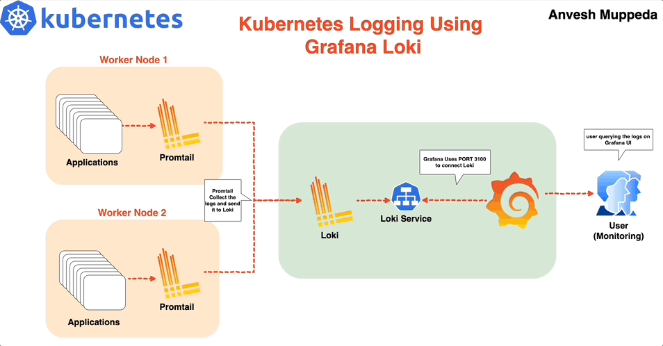
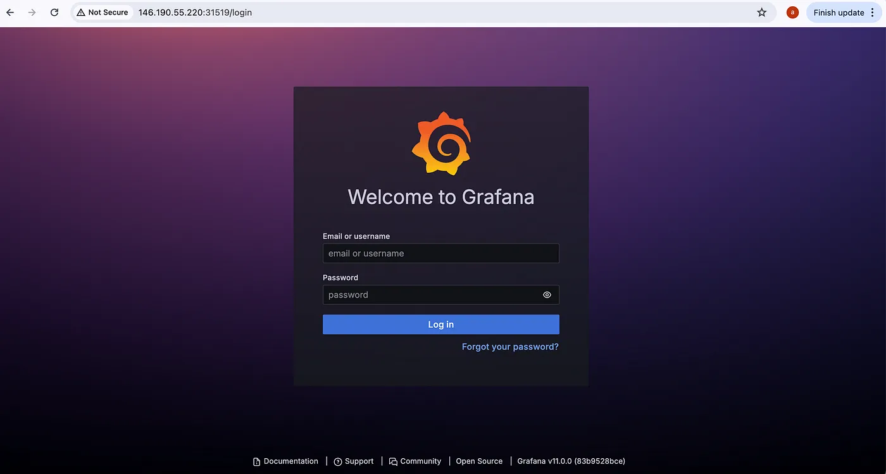
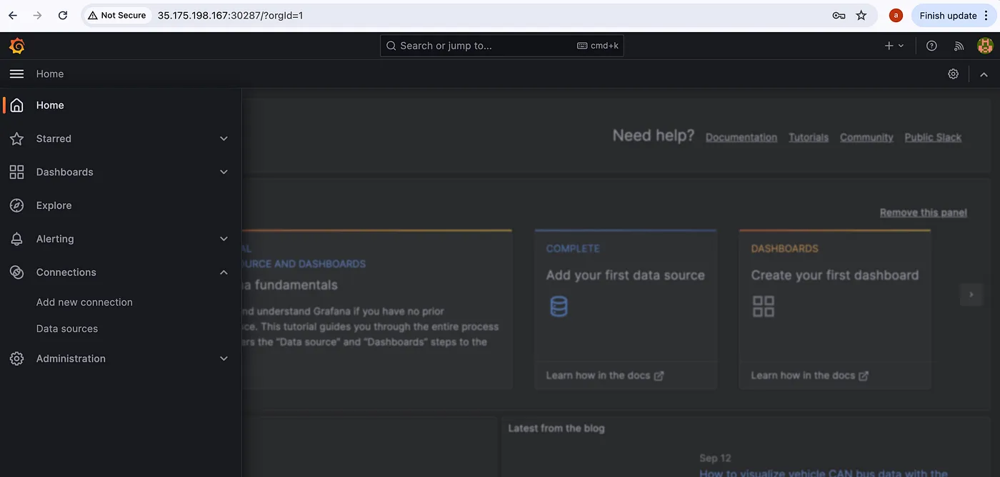

# ⎈ A Hands-On Guide to Kubernetes Logging Using Grafana Loki ⚙️

#### *⇢ A Comprehensive Guide to Setting Up the Grafana Loki on Kubernetes with Helm: Practical Example*


In a microservices architecture, monitoring and logging are essential to keep track of various components. Kubernetes generates a large number of logs, and managing them effectively is key to running a healthy cluster. **Grafana Loki** is a highly efficient logging solution that integrates seamlessly with **Grafana** for visualizing logs, allowing you to query and explore logs from multiple sources in one place.

In this guide, I’ll walk you through setting up Grafana Loki in a Kubernetes cluster using Helm, a package manager for Kubernetes. We will use the Loki Stack, which comes bundled with Loki, Promtail, and optionally Grafana.




### Prerequisites

Before starting, make sure you have:


- A Kubernetes cluster up and running
- Helm installed on your system
- kubectl configured to interact with your cluster  

## Steps to Set Up Grafana Loki on Kubernetes

Once you have the prerequisites in place, follow the steps below to set up Grafana Loki using Helm.

### Step 1: Add the Grafana Helm Repository

The first step is to add the Grafana Helm repository, which contains the Helm chart for deploying Loki.  

Run the following command to add the Grafana repo to Helm:
 
```yaml
 helm repo add grafana https://grafana.github.io/helm-charts 
```

After adding the repository, it’s a good practice to update the Helm repo to ensure you have the latest chart versions. Use the command:

```yaml
helm repo update
```

Now, list every repository with the word “Loki” in it by running:

```yaml
helm search repo loki
```

You should see several results, but we will be using the grafana/loki-stack repository to deploy Promtail and Grafana, and to configure Loki. 

### Step 2: Customize Helm Chart Configuration Values
Before deploying Loki, you may want to customize some  of the default values in the Helm chart. This step is especially important if you want to install Grafana alongside Loki or configure other advanced features like persistent storage.


First, download the default values of the Loki Helm chart into a YAML file by running:

```yaml
helm show values grafana/loki-stack > loki-custom-values.yaml
```
Now, open the loki-values.yaml file and make the following changes to meet your specific configuration needs.  
Here is the custom loki-custom-values.yaml file:

```yaml
test_pod:
  enabled: true
  image: bats/bats:1.8.2
  pullPolicy: IfNotPresent

loki:
  enabled: true
  isDefault: true
  url: http://{{(include "loki.serviceName" .)}}:{{ .Values.loki.service.port }}
  readinessProbe:
    httpGet:
      path: /ready
      port: http-metrics
    initialDelaySeconds: 45
  livenessProbe:
    httpGet:
      path: /ready
      port: http-metrics
    initialDelaySeconds: 45
  datasource:
    jsonData: "{}"
    uid: ""


promtail:
  enabled: true
  config:
    logLevel: info
    serverPort: 3101
    clients:
      - url: http://{{ .Release.Name }}:3100/loki/api/v1/push

fluent-bit:
  enabled: false

grafana:
  enabled: true
  sidecar:
    datasources:
      label: ""
      labelValue: ""
      enabled: true
      maxLines: 1000
  image:
    tag: 10.3.3
  service:
    type: NodePort

prometheus:
  enabled: false
  isDefault: false
  url: http://{{ include "prometheus.fullname" .}}:{{ .Values.prometheus.server.service.servicePort }}{{ .Values.prometheus.server.prefixURL }}
  datasource:
    jsonData: "{}"

filebeat:
  enabled: false
  filebeatConfig:
    filebeat.yml: |
      # logging.level: debug
      filebeat.inputs:
      - type: container
        paths:
          - /var/log/containers/*.log
        processors:
        - add_kubernetes_metadata:
            host: ${NODE_NAME}
            matchers:
            - logs_path:
                logs_path: "/var/log/containers/"
      output.logstash:
        hosts: ["logstash-loki:5044"]

logstash:
  enabled: false
  image: grafana/logstash-output-loki
  imageTag: 1.0.1
  filters:
    main: |-
      filter {
        if [kubernetes] {
          mutate {
            add_field => {
              "container_name" => "%{[kubernetes][container][name]}"
              "namespace" => "%{[kubernetes][namespace]}"
              "pod" => "%{[kubernetes][pod][name]}"
            }
            replace => { "host" => "%{[kubernetes][node][name]}"}
          }
        }
        mutate {
          remove_field => ["tags"]
        }
      }
  outputs:
    main: |-
      output {
        loki {
          url => "http://loki:3100/loki/api/v1/push"
          #username => "test"
          #password => "test"
        }
        # stdout { codec => rubydebug }
      }

# proxy is currently only used by loki test pod
# Note: If http_proxy/https_proxy are set, then no_proxy should include the
# loki service name, so that tests are able to communicate with the loki
# service.
proxy:
  http_proxy: ""
  https_proxy: ""
  no_proxy: ""
```

***Key Points in Custom Configuration:***


- **Loki** is enabled and configured with readiness and liveness probes for health checking.
- **Promtail** is enabled to forward logs from Kubernetes nodes to Loki.
- **Grafana** is enabled with a **NodePort** service to allow access to the Grafana UI from outside the cluster.
- **Prometheus**, **Filebeat**, and **Logstash** are explicitly disabled.

### Step 3: Deploy the Loki Stack with Custom Values  

After editing the loki-cusomt-values.yaml file, you are ready to deploy the Loki stack. Use the following command to install or upgrade the Helm release:  
```yaml

helm upgrade --install --values loki-custom-values.yaml loki grafana/loki-stack -n grafana-loki --create-namespace
```
**This command:**
- Deploys the **Loki**, **Promtail**, and **Grafana** components.  
- Disables the **Prometheus**, **Filebeat**, and **Logstash** components as per the configuration.
- Creates a namespace grafana-loki and deploys all components inside this namespace.

### Step 4: Access Grafana and Configure Data Source
Once the Helm chart has been successfully deployed, it’s time to access Grafana and verify that everything is working correctly.

1. ***First, check the pods in the grafana-loki namespace to ensure everything is running:***
```yaml
$ kubectl get pods -n grafana-loki
NAME                            READY   STATUS    RESTARTS   AGE
loki-0                          1/1     Running   0          19m
loki-grafana-567d65596c-gvt5q   2/2     Running   0          17m
loki-promtail-8jng6             1/1     Running   0          19m
loki-promtail-hb6x2             1/1     Running   0          19m
```

2. ***Find the NodePort assigned to Grafana:***

```yaml
$ kubectl get svc loki-grafana -n grafana-loki  -o jsonpath="{.spec.ports[0].nodePort}"
30287
```
This command retrieves the NodePort assigned to Grafana, which you will use to access the Grafana web interface.

3. ***Access Kibana:***

Open your web browser and navigate to:

```yaml
http://<EXTERNAL-IP>:<NODE-PORT>
```

Replace EXTERNAL-IP with the IP address of your Kubernetes cluster and NODE-PORT with the NodePort value obtained in step 1



4. ***Log in to Grafana:***

You can get the login credentials for Grafana from the loki-grafana secret using the below commands.

```yaml
$ kubectl get secret loki-grafana -n grafana-loki -o jsonpath="{.data.admin-user}" | base64 --decode
admin
$ kubectl get secret loki-grafana -n grafana-loki -o jsonpath="{.data.admin-password}" | base64 --decode
C43ICy6t22dwI3W93DsDPiiSUeX5Z4aHMwKWkNvq%                                                                                                         
```

Once you log in you can see the home screen of Grafana, press the three lines at the top left corner you can see the menu then go to **Connections > Data sources** as shown in the below image.



In Data sources you can see Loki has been configured as shown below 


Now, check if you are getting logs or not. Go to Explore by pressing the Explore button.


To query logs select a Label and Value, Loki will collect every log in your Kubernetes cluster and label it according to container, pod, namespace, deployments, jobs and other objects of Kubernetes.


After selecting a Label(namespace) and Value(grafana-loki), press the blue button at the top right corner(Run Query)to query logs.


Promtail, running as a DaemonSet, will collect logs from all nodes and forward them to Loki. You can query these logs in Grafana, making it easy to monitor your Kubernetes applications. 


## Conclusion
In this post, we walked through how to deploy Grafana Loki on Kubernetes using Helm with customized values. By enabling Loki, Promtail, and Grafana, and disabling unnecessary components like Prometheus, Filebeat, and Logstash, we tailored the setup to meet specific logging needs.   
Grafana Loki offers an efficient, scalable solution for Kubernetes log management. With this setup, you can now monitor and explore your Kubernetes logs with ease.