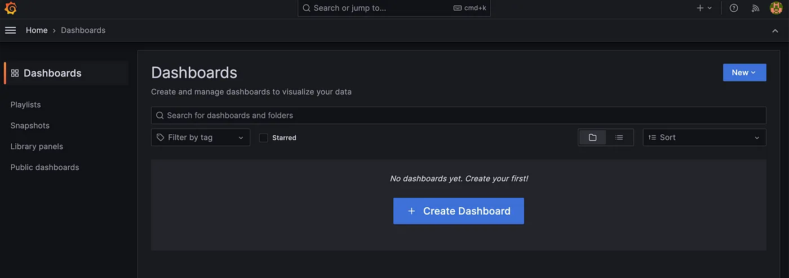
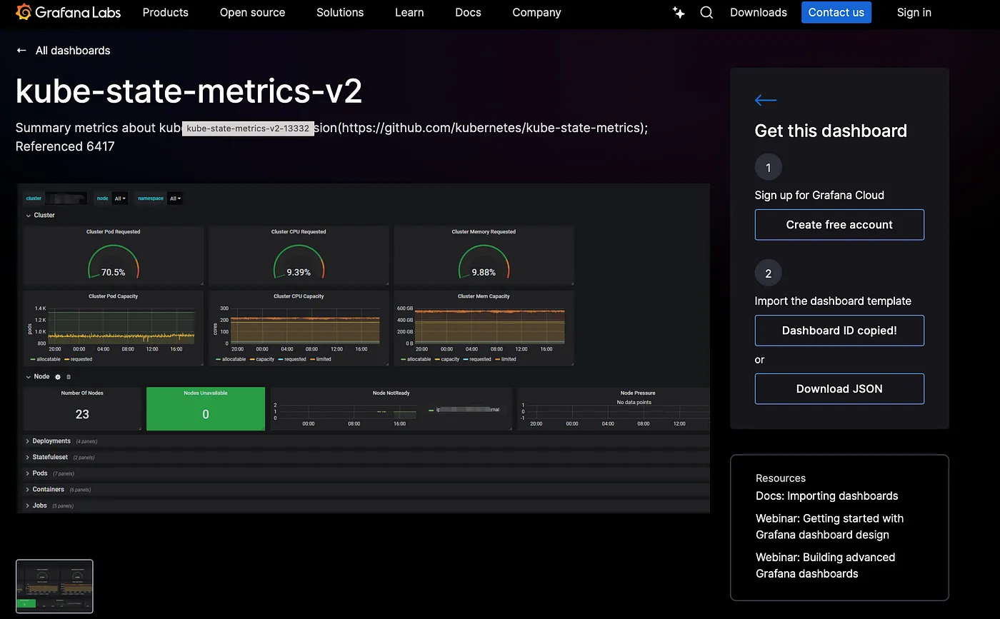
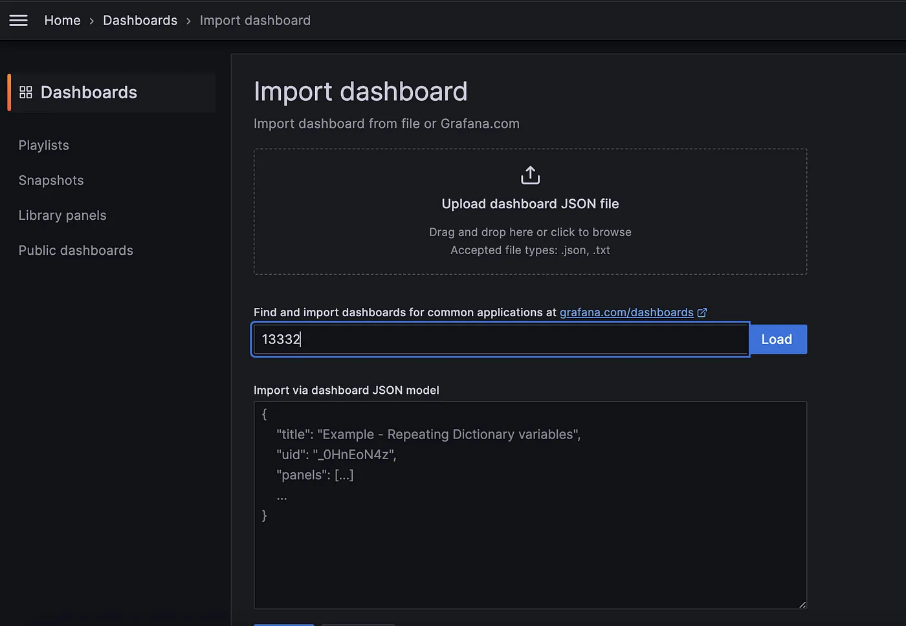

# ⎈ A Hands-On Guide to Kubernetes Monitoring: Metrics and Logging with Grafana Loki ⚙️ 

#### *⇢ A Step-by-Step Guide to Setting Up Metrics and Logging in Kubernetes Using the Grafana, Loki, Prometheus, Logstash, and Filebeat for Full Cluster Observability* 


In a microservices architecture, monitoring both **metrics** and **logs** is critical for ensuring the health and performance of your applications. When running Kubernetes clusters, the ability to efficiently collect and visualize this data can be complex. With tools like **Grafana**, **Loki**, **Prometheus**, **Logstash**, and **Filebeat**, we can set up a powerful monitoring stack that provides complete observability.


This blog will guide you through setting up a comprehensive monitoring solution in Kubernetes, focusing on both metrics and logging. We will use the following tools:

- **Grafana:** For visualizing metrics and logs.   
- **Loki:** For aggregating and storing logs.  
- **Prometheus:** For collecting metrics.  
- **Logstash:** For log processing and forwarding.  
- **Filebeat:** For collecting log files from Kubernetes pods.  


We’ll use Helm to deploy these tools as it simplifies managing Kubernetes applications through charts. This tutorial builds upon the previous setup of Grafana Loki for logging and expands it to include Prometheus for metrics and more robust log collection with Logstash and Filebeat.

## Prerequisites

Before starting, ensure you have the following:


- A Kubernetes cluster up and running.   
- Helm installed on your machine.   
- kubectl configured to interact with your cluster.  

### Step 1: Add the Grafana Helm Repository

To begin, add the Grafana Helm repository, which contains the charts for deploying Loki and other monitoring tools:

```yaml
helm repo add grafana https://grafana.github.io/helm-charts
helm repo update
```
Next, search for the Loki chart:

```yaml
helm search repo loki
```

We will be using the grafana/loki-stack chart for this deployment, which includes Grafana, Loki, and additional components.  

### Step 2: Customize Helm Chart Configuration

We’ll customize the default Helm chart values to enable Prometheus for metrics, configure Filebeat for log collection, and set up Logstash for advanced log processing. Below is the updated loki-custom-values.yaml file:  

```yaml

test_pod:
  enabled: true
  image: bats/bats:1.8.2
  pullPolicy: IfNotPresent

loki:
  enabled: true
  isDefault: true
  fullnameOverride: loki
  url: http://{{(include "loki.serviceName" .)}}:{{ .Values.loki.service.port }}
  readinessProbe:
    httpGet:
      path: /ready
      port: http-metrics
    initialDelaySeconds: 45
  livenessProbe:
    httpGet:
      path: /ready
      port: http-metrics
    initialDelaySeconds: 45
  datasource:
    jsonData: "{}"
    uid: ""


promtail:
  enabled: false
  config:
    logLevel: info
    serverPort: 3101
    clients:
      - url: http://{{ .Release.Name }}:3100/loki/api/v1/push

fluent-bit:
  enabled: false

grafana:
  enabled: true
  sidecar:
    datasources:
      label: ""
      labelValue: ""
      enabled: true
      maxLines: 1000
  image:
    tag: 10.3.3
  service:
    type: NodePort

prometheus:
  enabled: true
  isDefault: false
  url: http://{{ include "prometheus.fullname" .}}:{{ .Values.prometheus.server.service.servicePort }}{{ .Values.prometheus.server.prefixURL }}
  datasource:
    jsonData: "{}"
  server:
    service:
      type: NodePort
    persistentVolume:
      ## If true, Prometheus server will create/use a Persistent Volume Claim
      ## If false, use emptyDir
      ##
      enabled: false

filebeat:
  enabled: true
  filebeatConfig:
    filebeat.yml: |
      # logging.level: debug
      filebeat.inputs:
      - type: container
        paths:
          - /var/log/containers/*.log
        processors:
        - add_kubernetes_metadata:
            host: ${NODE_NAME}
            matchers:
            - logs_path:
                logs_path: "/var/log/containers/"
      output.logstash:
        hosts: ["logstash-loki-headless:5044"]

logstash:
  enabled: true
  image: grafana/logstash-output-loki
  imageTag: 1.0.1

  fullnameOverride: logstash-loki

  logstashConfig:
    logstash.yml: |
      http.host: 0.0.0.0
      xpack.monitoring.enabled: false

  logstashPipeline:
    logstash.conf: |
      input {
        beats {
          port => 5044
        }
      }

      filter {
        if [kubernetes] {
          mutate {
            add_field => {
              "container" => "%{[kubernetes][container][name]}"
              "namespace" => "%{[kubernetes][namespace]}"
              "pod" => "%{[kubernetes][pod][name]}"
            }
            replace => { "host" => "%{[kubernetes][node][name]}"}
          }
        }
        mutate {
          remove_field => ["tags"]
        }
      }

      output {
        loki {
          url => "http://loki:3100/loki/api/v1/push"
        }
        # stdout { codec => rubydebug }
      }

proxy:
  http_proxy: ""
  https_proxy: ""
  no_proxy: ""
```

Key points:

- **Prometheus** is enabled for metrics collection with NodePort service.  
- **Filebeat** is enabled for log collection from Kubernetes pods.  
- **Logstash** is enabled and configured to receive logs from Filebeat and forward them to Loki.  

### Step 3: Deploy the Monitoring Stack  

Once the loki-custom-values.yaml file is ready, deploy the stack using Helm:  

```yaml
helm upgrade --install --values loki-custom-values.yaml loki grafana/loki-stack -n grafana-loki --create-namespace
```
This command:  

- Deploys Loki, Prometheus, Filebeat, Logstash, and Grafana.  
- Disable Promtail.   
- Configures Prometheus to collect metrics and Filebeat to collect logs.    
- Sets up Logstash to forward logs to Loki for central logging.  

### Step 4: Access the Cluster Logs on Grafana
After the deployment, you need to access Grafana and configure data sources for metrics and logs.

1. **Check the Pods:** Verify that all the components are running correctly in the grafana-loki namespace:

```yaml
$ kubectl get pods -n grafana-loki

NAME                                           READY   STATUS    RESTARTS   AGE
logstash-loki-0                                1/1     Running   0          59m
loki-0                                         1/1     Running   0          6h5m
loki-alertmanager-0                            1/1     Running   0          22m
loki-filebeat-6gl8t                            1/1     Running   0          53m
loki-filebeat-jrn5n                            1/1     Running   0          53m
loki-filebeat-p8pl8                            1/1     Running   0          53m
loki-grafana-568895c66-c7pxl                   2/2     Running   0          59m
loki-kube-state-metrics-77ffbdd8db-x64lh       1/1     Running   0          50m
loki-prometheus-node-exporter-2hfgb            1/1     Running   0          50m
loki-prometheus-node-exporter-9qq9c            1/1     Running   0          50m
loki-prometheus-node-exporter-tkctf            1/1     Running   0          50m
loki-prometheus-pushgateway-69d48d6874-hgd7v   1/1     Running   0          50m
loki-prometheus-server-8475684f7c-qh44p        2/2     Running   0          48m
```

2. **Find the NodePort** for Grafana: Retrieve the NodePort assigned to the Grafana service:


```yaml
$ kubectl get svc loki-grafana -n grafana-loki -o jsonpath="{.spec.ports[0].nodePort}"

32181
```

3. **Access the Grafana UI:** Open your browser and navigate to:

```yaml
http://<EXTERNAL-IP>:<NODE-PORT>
```

Replace EXTERNAL-IP with your cluster's IP address and NODE-PORT with the NodePort you retrieved.

  

4. **Log in to Grafana:** Retrieve the default login credentials:

```yaml
kubectl get secret loki-grafana -n grafana-loki -o jsonpath="{.data.admin-user}" | base64 --decode
kubectl get secret loki-grafana -n grafana-loki -o jsonpath="{.data.admin-password}" | base64 --decode
```
Once you log in you can see the home screen of Grafana, press the three lines at the top left corner you can see the menu then go to **Connections > Data sources** as shown in the below image.


In Data sources you can see Loki has been configured as shown below


Now, check if you are getting logs or not. Go to Explore by pressing the Explore button.   


To query logs select a Label and Value, Loki will collect every log in your Kubernetes cluster and label it according to container, pod, namespace, deployments, jobs and other objects of Kubernetes.


After selecting a Label(namespace) and Value(grafana-loki), press the blue button at the top right corner(Run Query)to query logs.  


Filebeat, running as a DaemonSet, will collect logs from all nodes and send them to Logstash, and logstash forward them to Loki. You can query these logs in Grafana, making it easy to monitor your Kubernetes applications.


### Step 5: Access Metrics on Grafana by Adding new Dashboards
    
1. Login to the Grafana by follwoing the above same steps.
2. Navigate to Home > Dashboards section 



3. Add/Create new Dashboards

We also have the flexibility to create our own dashboards from scratch or import multiple Grafana dashboards from the Grafana library.   

To import a Grafana dashboard, follow these steps:  

Step 1: Access the Grafana library.  

Step 2. Select the desired dashboard ID to add.  

Considering kube-state-metrics-v2 Dashboard



Copy the Id of kube-state-metrics-v2 Dashboard i.e., 13332  


### Step 3: Import selected Dashboard in Grafana

Access Home > Dashboard section & click on Import section.




Now enter the ID of the target new Dashboard i.e., 13332 then click on Load to load the new dashboard into Grafana.


Click on Import to import the new Dashboard & Access it.


These steps allow us to easily integrate any dashboard from the Grafana library. Now that everything is set up, you can start visualizing both metrics and logs in Grafana.


## Conclusion 

In this blog, we have built a complete monitoring stack for Kubernetes that includes both metrics and logs. By using Grafana for visualization, Loki for log aggregation, Prometheus for metrics collection, Filebeat for log collection, and Logstash for log processing, you can ensure that your Kubernetes cluster is fully observable. This setup provides a powerful way to monitor and troubleshoot your applications, ensuring better reliability and performance.
