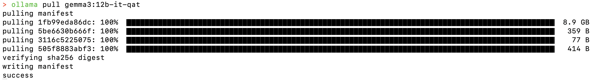
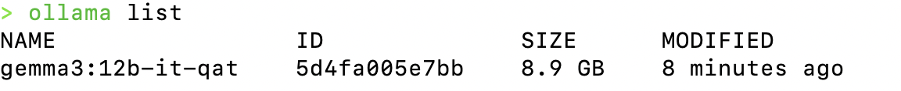
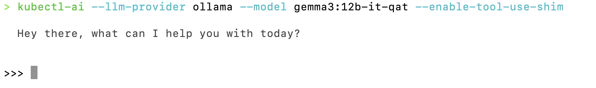

# Kubectl-AI: Enhance Kubernetes Management with AI


---

## kubectl-ai Introduction

`kubectl-ai` is a plugin and CLI tool that turns natural-language queries into Kubernetes commands. Instead of memorizing `kubectl` flags or YAML manifests, you simply ask questions like “show me all pods in the default namespace” or “scale the nginx deployment to 5 replicas,” and `kubectl-ai` figures out the exact `kubectl` commands to run. Under the hood it uses large language models (LLMs) to parse your intent, then executes the corresponding `kubectl` operations and returns both the raw output and an explanation in plain English.

Key benefits:
- **Natural-language interface:** No more guessing flag names or resource kinds.
- **Context awareness:** In interactive mode, follow-on questions (“What about in the staging cluster?”) carry context.
- **Extensible backends:** Works with commercial LLMs (Gemini, OpenAI, Azure OpenAI, Grok) or fully offline local models (Ollama, llama.cpp).
- **Scriptable & pipable:** Use it in CI, scripts, or combine with shell pipes (`echo … | kubectl-ai`).

  

---

## Installation

You need a working `kubectl` binary configured against your cluster, plus one of these ways to install `kubectl-ai` itself:

### Quick Install (Linux & macOS)

```bash
curl -sSL https://raw.githubusercontent.com/GoogleCloudPlatform/kubectl-ai/main/install.sh | bash
```

This will download the latest release, install the `kubectl-ai` binary into `~/.local/bin` (or similar), and add it to your PATH for the current session.

### Manual Installation (Linux, macOS & Windows)

1. Visit the [releases page](https://github.com/GoogleCloudPlatform/kubectl-ai/releases/latest) and download the archive matching your OS/arch (e.g. `kubectl-ai_Darwin_arm64.tar.gz` for Apple Silicon macOS).
2. Unpack, make executable, and move into your PATH:

   ```bash
   tar -zxvf kubectl-ai_Darwin_arm64.tar.gz
   chmod +x kubectl-ai
   sudo mv kubectl-ai /usr/local/bin/
   ```

3. Verify installation:

   ```bash
   kubectl-ai version
   ```

---

## Usage

Once installed, you can run `kubectl-ai` in two main modes: using cloud-hosted LLMs (Gemini by default) or local models (Ollama/llama.cpp).

---

### Using Gemini (Default)

1. **Obtain a key**  
   Go to [Google AI Studio](https://aistudio.google.com), create a project, and copy your Gemini API key.  

2. **Export the environment variable**  
   ```bash
   export GEMINI_API_KEY="your_gemini_api_key_here"
   ```

3. **Run `kubectl-ai`**  
   - **Interactive shell:**  
     ```bash
     kubectl-ai
     ```
     You’ll get a `kubectl-ai> ` prompt where you can ask a sequence of questions.

   - **Single-query mode:**  
     ```bash
     kubectl-ai --quiet "fetch logs for nginx app in hello namespace"
     ```

4. **Switch models** (optional)  
   ```bash
   # Use a specific Gemini model
   kubectl-ai --model gemini-2.5-pro-exp-03-25 "list services in default"
   ```

---

### Using AI Models Running Locally (Ollama or llama.cpp)

You can run entirely offline by hosting your own LLM with either [Ollama](https://ollama.com/) or [llama.cpp](https://github.com/ggml-org/llama.cpp). Below are detailed steps for each:

---

#### A. Ollama

1. **Install Ollama**  
   ```bash
   # macOS via Homebrew
   brew install ollama
   # or Linux via their install script
   curl -fsSL https://ollama.com/install.sh | sh
   ```
   
   Alternatively, you can download the Ollama binary directly from their website:
    1. Visit the Ollama [download page](https://ollama.com/download/mac).
    2. Click on the Download for macOS button.
    3. Once the download is complete, locate the .zip file in your ~/Downloads folder.
    4. Double-click the .zip file to extract its contents. This should create Ollama.app.
    5. Move the Ollama.app to your Applications folder for easy access.
    6. Open the Applications folder and double-click on Ollama.app to launch it.
    7. Follow any on-screen instructions to complete the installation.
   8. Once installed, you can run the Ollama CLI commands in your terminal.


2. **Run the Ollama server**  
   ```bash
   ollama serve
   ```
   By default, this listens on `http://localhost:11434`.

    

3. **Pull a model**  
   ```bash
   ollama pull gemma3:12b-it-qat
   ```
    This downloads the `gemma3:12b-it-qat` model, which is optimized for Kubernetes tasks.
    
     

4. **List models**  
   ```bash
   ollama list
   ```
   This command will show you all the models you have downloaded and their status.

    
   You should see `gemma3:12b-it-qat` in the list.

5. **Configure `kubectl-ai`**  
   ```bash
   export OLLAMA_HOST="http://localhost:11434"
   kubectl-ai \
     --llm-provider=ollama \
     --model=gemma3:12b-it-qat \
     --enable-tool-use-shim
   ```
   The `--enable-tool-use-shim` flag ensures the prompt includes the right instructions for invoking `kubectl`.
    This is important for the model to understand how to interact with Kubernetes.
    
     

6. **Use it**  
   - Interactive: `kubectl-ai`  
   - Single query:  
     ```bash
     kubectl-ai --quiet "describe deployment my-app"
     ```

7. **Remove a model**  
   ```bash
   ollama remove gemma3:12b-it-qat
   ```
   This command will delete the model from your local machine.

8. **Stop the server**  
   ```bash
   ollama stop
   ```
   This command will stop the Ollama server.


---

#### B. llama.cpp

1. **Install or build**  
   ```bash
   # Homebrew (macOS/Linux)
   brew install llama.cpp
   ```
   The formula is automatically updated with new llama.cpp releases.

2. **Get a model**  
   - Download a GGUF (quantized) model from Hugging Face (e.g. `alpaca-7b-q4_0.gguf`).
   - Place it in `~/models/` or your chosen directory.

3. **Run the server**  
   ```bash
   ./main --model ~/models/alpaca-7b-q4_0.gguf --server
   ```
   This starts an OpenAI-compatible API on `http://127.0.0.1:8080`.

4. **Configure `kubectl-ai`**  
   ```bash
   export LLAMA_CPP_SERVER="http://127.0.0.1:8080"
   kubectl-ai \
     --llm-provider=llama.cpp \
     --model=alpaca-7b-q4_0.gguf \
     --enable-tool-use-shim
   ```

5. **Use it**  
   - Interactive: `kubectl-ai`  
   - Single query:  
     ```bash
     kubectl-ai --quiet "scale deployment nginx to 4 replicas"
     ```

---
## References   
- [GoogleCloudPlatform GitHub Repository](https://github.com/GoogleCloudPlatform/kubectl-ai)
- [Google AI Studio](https://aistudio.google.com)
- [Ollama](https://ollama.com/)
- [llama.cpp](https://github.com/ggml-org/llama.cpp)

With these sections in place, users have everything needed to get started with `kubectl-ai`—from installation through cloud (Gemini) or local (Ollama/llama.cpp) usage.

