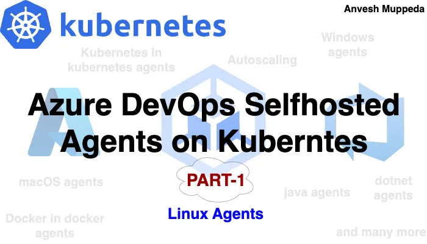
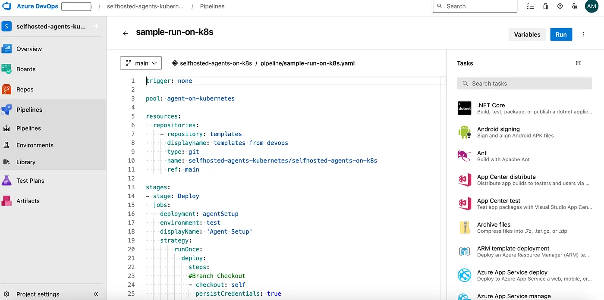

# ⎈ Azure DevOps — Self Hosted Agents on Kubernetes — PART-1 ⎈
#### *Unlocking Efficiency and Scalability for Your CI/CD Workflows🚀*




Are you tired of wrestling with manual agent management, lengthy pipeline queues, or soaring infrastructure costs in your Azure DevOps setup? Look no further! In this comprehensive series of guides, we’ll explore how leveraging Kubernetes for self-hosted agents can revolutionize your CI/CD processes. Say goodbye to operational headaches and hello to streamlined, efficient pipelines.

### Introduction

If you find yourself grappling with the management of Azure DevOps self-hosted agents or experiencing prolonged wait times in pipeline queues, or perhaps facing higher costs associated with agent infrastructure, or struggling with the setup and maintenance of self-hosted agent environments, then Kubernetes presents an optimal solution to address these challenges.

Furthermore, the absence of Kubernetes orchestration complicates the setup of diverse environments for running pipelines on self-hosted agents. Organizations may struggle to configure and manage different agent environments for testing, staging, and production, resulting in inconsistency and potential deployment issues. Additionally, without the scalability and elasticity provided by Kubernetes, organizations may experience bottlenecks and delays due to long queue times in Azure DevOps pipelines, leading to decreased productivity and slower time-to-market.

In summary, without leveraging Kubernetes for Azure DevOps self-hosted agents, organizations may face a myriad of challenges including operational inefficiencies, pipeline delays, increased costs, and complexity in environment management. Embracing Kubernetes as a solution offers scalability, flexibility, cost-effectiveness, and streamlined operations, enabling organizations to optimize their CI/CD workflows and accelerate software delivery.

### Challenges with Traditional Self-Hosted Agents

- Management overhead: The manual effort required to provision, configure, and manage self-hosted agents.

- Queue times: Prolonged wait times in pipeline queues due to limited agent capacity.

- Cost implications: Inefficient resource utilization leading to increased infrastructure costs.

- Environment setup complexities: Difficulties in configuring and managing diverse environments for running pipelines.

### Benefits of using the Kubernetes for Self-Hosted Agents  

**Key features:** Scalability, flexibility, portability, and automated management.

- **Benefits for CI/CD:** Enabling dynamic scaling, resource optimization, and simplified management of agent infrastructure.
- **Scalability:** Ability to scale agent capacity up or down based on workload demands.
- **Flexibility:** Customizable agent configurations and support for diverse environments.
- **Cost-effectiveness:** Efficient resource utilization leading to reduced infrastructure costs.
- **Simplified management:** Automated deployment, scaling, and maintenance of agent infrastructure.

### Prerequisites

- Kubernetes environment.
- Azure Devops active account.
- Docker environment

### Getting Started: Setting Up Azure DevOps Self-Hosted Agents on Kubernetes

Let’s start setting up these Azure DevOps Self-Hosted Agents on Kubernetes by following the below steps one by one.

- **Building Docker images:** Building Docker images containing Azure Pipelines Agent software.
- **Configuring Azure DevOps:** Setting up agent pools and generating Personal Access Tokens (PATs).
- **Deploying agent pods:** Using Kubernetes manifests to deploy agent pods in the cluster.
- **Registering agents:** Configuring agent pods to register themselves with Azure DevOps using PATs.

#### Building Docker Images:

Assume you have Docker environment is ready to build the required docker images.

1. Open the target CLI to run docker commands

2. Create a new directory.
```yaml
mkdir azsh-linux-agent/
```

3. Change the directory to newly created.
```yaml
cd azsh-linux-agent/
```
4. Create the Dockerfile with below content, name it as **azsh-linux-agent.dockerfile**
```yaml
FROM ubuntu:22.04

RUN apt update
RUN apt upgrade -y
RUN apt install -y curl git jq libicu70

# Also can be "linux-arm", "linux-arm64".
ENV TARGETARCH="linux-x64"

WORKDIR /azp/

COPY ./start.sh ./
RUN chmod +x ./start.sh

RUN useradd agent
RUN chown agent ./
USER agent
# Another option is to run the agent as root.
# ENV AGENT_ALLOW_RUNASROOT="true"

ENTRYPOINT ./start.sh
```

5. Create a **start.sh** file using below content, which will be used by the above docker file.

```yaml
#!/bin/bash
set -e

if [ -z "${AZP_URL}" ]; then
  echo 1>&2 "error: missing AZP_URL environment variable"
  exit 1
fi

if [ -z "${AZP_TOKEN_FILE}" ]; then
  if [ -z "${AZP_TOKEN}" ]; then
    echo 1>&2 "error: missing AZP_TOKEN environment variable"
    exit 1
  fi

  AZP_TOKEN_FILE="/azp/.token"
  echo -n "${AZP_TOKEN}" > "${AZP_TOKEN_FILE}"
fi

unset AZP_TOKEN

if [ -n "${AZP_WORK}" ]; then
  mkdir -p "${AZP_WORK}"
fi

cleanup() {
  trap "" EXIT

  if [ -e ./config.sh ]; then
    print_header "Cleanup. Removing Azure Pipelines agent..."

    # If the agent has some running jobs, the configuration removal process will fail.
    # So, give it some time to finish the job.
    while true; do
      ./config.sh remove --unattended --auth "PAT" --token $(cat "${AZP_TOKEN_FILE}") && break

      echo "Retrying in 30 seconds..."
      sleep 30
    done
  fi
}

print_header() {
  lightcyan="\033[1;36m"
  nocolor="\033[0m"
  echo -e "\n${lightcyan}$1${nocolor}\n"
}

# Let the agent ignore the token env variables
export VSO_AGENT_IGNORE="AZP_TOKEN,AZP_TOKEN_FILE"

print_header "1. Determining matching Azure Pipelines agent..."

AZP_AGENT_PACKAGES=$(curl -LsS \
    -u user:$(cat "${AZP_TOKEN_FILE}") \
    -H "Accept:application/json;" \
    "${AZP_URL}/_apis/distributedtask/packages/agent?platform=${TARGETARCH}&top=1")

AZP_AGENT_PACKAGE_LATEST_URL=$(echo "${AZP_AGENT_PACKAGES}" | jq -r ".value[0].downloadUrl")

if [ -z "${AZP_AGENT_PACKAGE_LATEST_URL}" -o "${AZP_AGENT_PACKAGE_LATEST_URL}" == "null" ]; then
  echo 1>&2 "error: could not determine a matching Azure Pipelines agent"
  echo 1>&2 "check that account "${AZP_URL}" is correct and the token is valid for that account"
  exit 1
fi

print_header "2. Downloading and extracting Azure Pipelines agent..."

curl -LsS "${AZP_AGENT_PACKAGE_LATEST_URL}" | tar -xz & wait $!

source ./env.sh

trap "cleanup; exit 0" EXIT
trap "cleanup; exit 130" INT
trap "cleanup; exit 143" TERM

print_header "3. Configuring Azure Pipelines agent..."

./config.sh --unattended \
  --agent "${AZP_AGENT_NAME:-$(hostname)}" \
  --url "${AZP_URL}" \
  --auth "PAT" \
  --token $(cat "${AZP_TOKEN_FILE}") \
  --pool "${AZP_POOL:-Default}" \
  --work "${AZP_WORK:-_work}" \
  --replace \
  --acceptTeeEula & wait $!

print_header "4. Running Azure Pipelines agent..."

chmod +x ./run.sh

# To be aware of TERM and INT signals call ./run.sh
# Running it with the --once flag at the end will shut down the agent after the build is executed
./run.sh "$@" & wait $!
```

6. Let’s build the docker image using below command.
```yaml
docker build --tag "azsh-linux-agent:tag" --file "./azsh-linux-agent.dockerfile" .
```

7. Now push the above docker image to your target repository.
### Configuring Azure DevOps
**Create Agent Pool**

- In your Azure DevOps organization, navigate to “Project Settings” > “Agent Pools”.
- Create a new agent pool or use an existing one for your Kubernetes agents.
- Click on the “New agent pool” button to create a new pool, or select an existing one.

**Create PAT Token**

- Click on “**User Settings**” from top-right corner of the page.
- Select “**Personal access tokens**” from the dropdown menu.
- Generate a Personal Access Token (PAT) with the appropriate scope for registering agents, and save it for next steps.

**Deploying agent pods**

Imagine you’ve got your Kubernetes cluster ready to roll. If not, don’t worry — we’ve got you covered. Even if you’re new to Kubernetes, setting up Azure DevOps agents on your behalf is a breeze. Simply follow along with the steps outlined in this guide, and you’ll be up and running in no time!

Create a **azsh-linux-agent-deployment.yaml** file using below content.
```yaml
apiVersion: apps/v1
kind: Deployment
metadata:
  name: azsh-linux
  namespace: az-devops
  labels:
    app: azsh-linux-agent
spec:
  replicas: 1
  selector:
    matchLabels:
      app: azsh-linux-agent
  template:
    metadata:
      labels:
        app: azsh-linux-agent
    spec:
      containers:
      - name: kubepodcreation
        image: anvesh35/azsh-linux-agent:02062024
        env:
          - name: AZP_URL
            valueFrom:
              secretKeyRef:
                name: azdevops
                key: AZP_URL
          - name: AZP_TOKEN
            valueFrom:
              secretKeyRef:
                name: azdevops
                key: AZP_TOKEN
          - name: AZP_POOL
            valueFrom:
              secretKeyRef:
                name: azdevops
                key: AZP_POOL
        volumeMounts:
        - mountPath: /var/run/docker.sock
          name: docker-volume
      volumes:
      - name: docker-volume
        hostPath:
          path: /var/run/docker.sock
```
Create a **azsh-linux-agent-secret.yaml** file using below content. This secret will help us to authenticate our kubernetes pods with Azure devops.

```yaml
apiVersion: v1
data:
  AZP_POOL: <agent-pool-name>
  AZP_TOKEN: <PAT-token>
  AZP_URL: <https://dev.azure.com/username>
kind: Secret
metadata:
  name: azdevops
  namespace: az-devops
type: Opaque
```

Here replace your <agent-pool-name> with your newly created Agent Pool name, <PAT-Token> with PAT token, and AZP_URL with your Azure devops portal URL.

Now create a new namespace for azure devops self-hosted agents in your kubernetes cluster.
```yaml
kubectl create namespace az-devops
```
Let’s deploy the deployment using below command.
```yaml
kubectl apply -f azsh-linux-agent-deployment.yaml
```
Let’s create the secret to authenticate our agent pods to azure devops using below command.
```yaml
kubectl apply -f azsh-linux-agent-secret.yaml
```

Verify the newly created pods and secrets status using below command.
```yaml
kubectl get pods -n az-devops
kubectl get secret -n az-devops
```
```yaml
kubectl get pods -n az-devops 
NAME                                  READY   STATUS    RESTARTS   AGE
azdevops-deployment-b684fd756-nmn54   1/1     Running   0          21h

kubectl get secret -n az-devops
NAME       TYPE     DATA   AGE
azdevops   Opaque   3      21h
```

Now the pods are up and running, let’s check in our Azure Devops Portal for our self-hosted agents in our agent pool.


That’s it your agents are online now you can run your pipelines based on your number of replicas.

### Running your first Azure DevOps pipeline on Kubernetes Self-Hosted agents
Lets create a new sample pipeline using below steps.

Create a new file in **/pipelines/sample-pipeline.yaml** path in your azure devops repository using below content. 

```yaml
trigger: none

pool: <agent-pool>

resources:
  repositories:
    - repository: templates
      displayname: templates from devops
      type: git
      name: <projectname>/<repositoryname>
      ref: <branch>

stages:
- stage: Deploy
  jobs:
  - deployment: helloWorld
    displayName: 'Agent Setup'
    strategy:
        runOnce:
          deploy:
            steps:
            #Branch Checkout
            - checkout: self
              persistCredentials: true
            
            # Hello World program
            - template: /scripts/kubernetes/hello-world.yaml@templates
```
Create the script **/scripts/kubernetes/hello-world.yaml** to run the sample program on self-hosted agent on kubernetes.
```yaml

steps:
    -   bash: |
            echo "Hello, Welcome to Anvesh World!"
        displayName: 'Hello World'
    
```

Now create a new pipeline using below steps.
Select the project where you want to create the YAML pipeline.

1. Click on the “Pipelines” menu option in the left sidebar.  
2. You should see a button labeled “New pipeline” on the Pipelines page.   
3. Click on it to start creating a new pipeline.
4. Choose the repository where your code is located. Azure DevOps supports Git repositories, GitHub repositories, and others.  
5. Choose where your YAML file is located(i.e., /pipelines/sample-pipeline.yaml)   
6. Now save the pipeline.  
7. should see your pipeline listed in the Pipelines page of your Azure DevOps project. You can review the pipeline configuration and manually trigger a run to test it.

That’s it! You’ve successfully created a YAML pipeline in Azure DevOps and ran it using self hosted agent from kubernetes.




## Best Practices and Tips
- **Resource management:** Setting resource limits and requests for agent pods to ensure efficient resource utilization.
- **Monitoring and logging:** Implementing monitoring and logging solutions to track agent performance and troubleshoot issues.
- **Automation:** Leveraging automation tools and scripts for seamless deployment and configuration of agent infrastructure.
- Will discuss all these in upcoming parts.