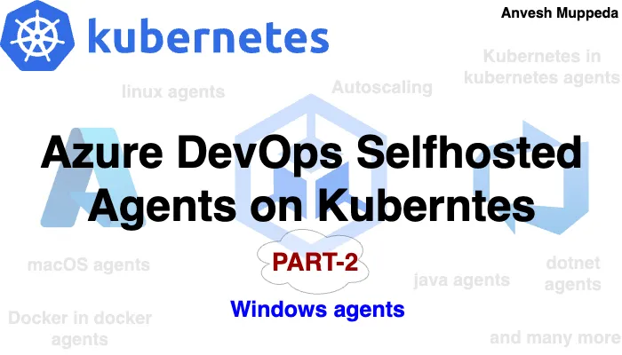
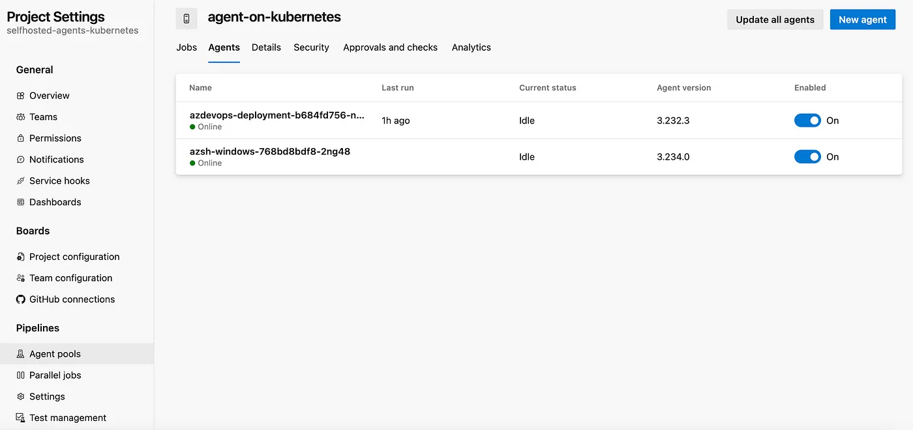
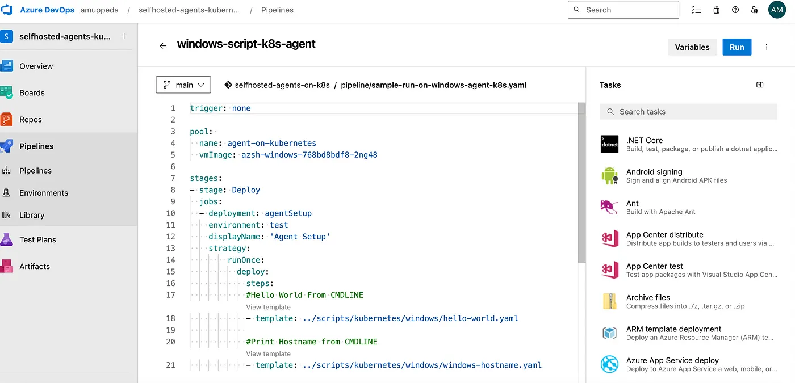
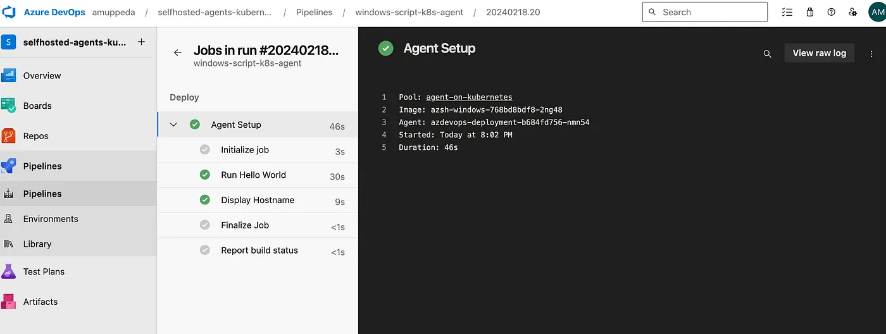
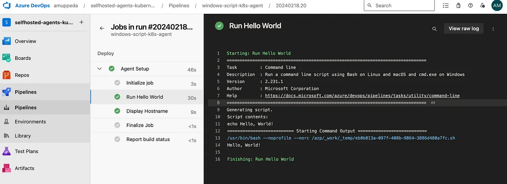
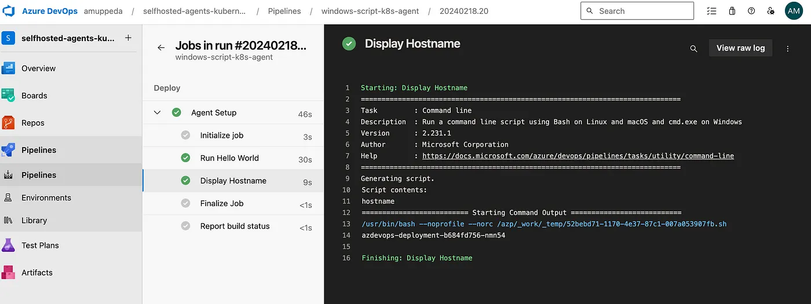

# ⎈ Azure DevOps — Self Hosted Agents on Kubernetes — PART-2 ⎈
#### *Build and Deploy Windows SelfHosted Agents 🚀*



## Welcome to Part 2
### Deploying Windows Self-Hosted Agents on Kubernetes for Azure DevOps


In the first part of our blog series, we explored the setup of **Linux self-hosted agents on Kubernetes,** demonstrating how to seamlessly run sample scripts from Kubernetes-managed agents within Azure DevOps pipelines. Now, in Part 2, we delve into the world of Windows self-hosted agents, focusing on building Docker images tailored for Windows environments, deploying these agents to Kubernetes clusters, and executing command-line scripts on them.

Throughout this installment, we’ll guide you through the process of creating a Windows self-hosted agent Docker image, deploying it to Kubernetes, and harnessing its power to execute Windows command-line scripts within Azure DevOps pipelines. Whether you’re a seasoned DevOps engineer or just beginning your journey into automation, this guide will equip you with the knowledge and tools needed to streamline your CI/CD workflows in Windows environments.


Join us as we unlock the potential of Windows self-hosted agents in Kubernetes and Azure DevOps, empowering you to elevate your development and deployment processes to new heights. Let’s dive in!

### 1. Building Windows Self-Hosted Agent Docker Image

1. Create **Dockerfile:**
Start by creating a Dockerfile for your Windows self-hosted agent.  

```yaml
FROM mcr.microsoft.com/windows/servercore:ltsc2022

WORKDIR /azp/

COPY ./start.ps1 ./

CMD powershell .\start.ps1
```

2. Create start.ps1 in same directory with below content.

```yaml

function Print-Header ($header) {
  Write-Host "`n${header}`n" -ForegroundColor Cyan
}

if (-not (Test-Path Env:AZP_URL)) {
  Write-Error "error: missing AZP_URL environment variable"
  exit 1
}

if (-not (Test-Path Env:AZP_TOKEN_FILE)) {
  if (-not (Test-Path Env:AZP_TOKEN)) {
    Write-Error "error: missing AZP_TOKEN environment variable"
    exit 1
  }

  $Env:AZP_TOKEN_FILE = "\azp\.token"
  $Env:AZP_TOKEN | Out-File -FilePath $Env:AZP_TOKEN_FILE
}

Remove-Item Env:AZP_TOKEN

if ((Test-Path Env:AZP_WORK) -and -not (Test-Path $Env:AZP_WORK)) {
  New-Item $Env:AZP_WORK -ItemType directory | Out-Null
}

New-Item "\azp\agent" -ItemType directory | Out-Null

# Let the agent ignore the token env variables
$Env:VSO_AGENT_IGNORE = "AZP_TOKEN,AZP_TOKEN_FILE"

Set-Location agent

Print-Header "1. Determining matching Azure Pipelines agent..."

$base64AuthInfo = [Convert]::ToBase64String([Text.Encoding]::ASCII.GetBytes(":$(Get-Content ${Env:AZP_TOKEN_FILE})"))
$package = Invoke-RestMethod -Headers @{Authorization=("Basic $base64AuthInfo")} "$(${Env:AZP_URL})/_apis/distributedtask/packages/agent?platform=win-x64&`$top=1"
$packageUrl = $package[0].Value.downloadUrl

Write-Host $packageUrl

Print-Header "2. Downloading and installing Azure Pipelines agent..."

$wc = New-Object System.Net.WebClient
$wc.DownloadFile($packageUrl, "$(Get-Location)\agent.zip")

Expand-Archive -Path "agent.zip" -DestinationPath "\azp\agent"

try {
  Print-Header "3. Configuring Azure Pipelines agent..."

  .\config.cmd --unattended `
    --agent "$(if (Test-Path Env:AZP_AGENT_NAME) { ${Env:AZP_AGENT_NAME} } else { hostname })" `
    --url "$(${Env:AZP_URL})" `
    --auth PAT `
    --token "$(Get-Content ${Env:AZP_TOKEN_FILE})" `
    --pool "$(if (Test-Path Env:AZP_POOL) { ${Env:AZP_POOL} } else { 'Default' })" `
    --work "$(if (Test-Path Env:AZP_WORK) { ${Env:AZP_WORK} } else { '_work' })" `
    --replace

  Print-Header "4. Running Azure Pipelines agent..."

  .\run.cmd
}
 finally 
{
  Print-Header "Cleanup. Removing Azure Pipelines agent..."

  .\config.cmd remove --unattended `
    --auth PAT `
    --token "$(Get-Content ${Env:AZP_TOKEN_FILE})"
}

```
3. Run the following command within that directory:

```yaml
docker build --tag "<windows-image-name>:<windows-image-tag>" --file "./Dockerfile" .
```

4. Push the above windows docker image to your repository.

```yaml
docker push <windows-image-name>:<windows-image-tag>
```
### 2. Deploying Windows Self-Hosted Agent to Kubernetes   

***Ensuring that your Kubernetes cluster has Windows worker nodes is crucial for deploying and running Windows self-hosted agents. Windows worker nodes provide the necessary environment for executing Windows-based containers, allowing your self-hosted agents to operate effectively within the Kubernetes cluster.***


***Before proceeding with the deployment of Windows self-hosted agents on Kubernetes, verify that your cluster configuration includes Windows worker nodes alongside Linux nodes. This ensures compatibility and availability for running Windows containers and accommodating the specific requirements of your Windows-based workloads.***

Create a new namespace for Azure DevOps Self Hosted Agents using the below command

```yaml
kubectl create namespace az-devops
```

***Create All Azure DevOps self hosted agents related workloads within the az-devops namespace***

Create Kubernetes Deployment with below content and name it as **windows-sh-agent-deploy.yaml**

```yaml
apiVersion: apps/v1
kind: Deployment
metadata:
  name: azsh-windows
  namespace: az-devops
  labels:
    app: azsh-windows-agent
spec:
  replicas: 1
  selector:
    matchLabels:
      app: azsh-windows-agent
  template:
    metadata:
      labels:
        app: azsh-windows-agent
    spec:
      containers:
      - name: kubepodcreation
        image: anvesh35/azsh-windows-agent:1602204
        env:
          - name: AZP_URL
            valueFrom:
              secretKeyRef:
                name: azdevops
                key: AZP_URL
          - name: AZP_TOKEN
            valueFrom:
              secretKeyRef:
                name: azdevops
                key: AZP_TOKEN
          - name: AZP_POOL
            valueFrom:
              secretKeyRef:
                name: azdevops
                key: AZP_POOL
        volumeMounts:
        - mountPath: /var/run/docker.sock
          name: docker-volume
      volumes:
      - name: docker-volume
        hostPath:
          path: /var/run/docker.sock
```

Create Kubernetes secret which is used to connect to the Azure DevOps

```yaml
kubectl -n az-devops create secret generic azdevops \
  --from-literal=AZP_URL=https://dev.azure.com/yourOrg \
  --from-literal=AZP_TOKEN=YourPAT \
  --from-literal=AZP_POOL=NameOfYourPool
```

Now apply deployment manifest file using the below commands  

```yaml
kubectl apply -f windows-sh-agent-deploy.yaml
```

Verify that the agent pods are created and running successfully by checking their status with below command  

```yaml
kubectl get pods -n az-devops
```
```yaml
NAME                            READY   STATUS    RESTARTS   AGE
azsh-windows-768bd8bdf8-2ng48   1/1     Running   0          3h1m
```

Now Azure DevOps windows Self-Hosted Agent pod is up and running. Now, let’s ensure it’s available in the Azure DevOps Agent Pool by following these steps:


1. **Login to Azure DevOps Portal:** Go to the Azure DevOps portal and log in with your credentials.
2. **Navigate to Project Settings:** Once logged in, navigate to your project settings. You can usually find this option in the bottom-left corner of the Azure DevOps portal.

3. **Click on Agent Pools:** In the project settings, click on the “Agent pools” option. This will take you to the page where you can manage agent pools for your project.
4. **Select the Target Agent Pool:** Choose the target agent pool that you are using within the secret mentioned in your setup. This is the pool where your Windows Self-Hosted Agent pod should be available.  
5. **Go to the Agents Section:** Within the selected agent pool, navigate to the “Agents” section. Here, you should be able to see a list of agents registered in this pool.
6. **Verify Your Windows Agent:** Look for your Windows Self-Hosted Agent in the list. It should be listed here if it’s successfully registered and connected to the Azure DevOps Agent Pool.

By following these steps, you can ensure that your Windows Self-Hosted Agent is correctly configured and available in the desired agent pool within Azure DevOps. If you encounter any issues, double-check the configuration and connectivity settings of your agent.




### 3. Running Command-Line Scripts on Windows Self-Hosted Agents
Lets create a new sample windows pipeline using below steps.


Create a new file in **/pipelines/sample-windows-pipeline.yaml** path in your Azure DevOps repository using below content.

```yaml
trigger: none

pool: 
  name: <agent-pool-name>
  vmImage: <agent-name>

stages:
- stage: Deploy
  jobs:
  - deployment: agentSetup
    environment: test
    displayName: 'Running on Windows Agent'
    strategy:
        runOnce:
          deploy:
            steps:
            #Hello World From CMDLINE
            - template: ../scripts/kubernetes/windows/hello-world.yaml
            
            #Print Hostname from CMDLINE
            - template: ../scripts/kubernetes/windows/windows-hostname.yaml

```

Create the first command line script /scripts/kubernetes/hello-world.yaml to run the Hello World program on Windows Self-Hosted Agent on kubernetes.

```yaml
steps:
  - task: CmdLine@2
    displayName: 'Run Hello World'
    inputs:
      script: 'echo Hello, World!'
```
Create the second command line script **/scripts/kubernetes/hello-world.yaml** to display the hostname on Windows Self-Hosted Agent on kubernetes.

```yaml
steps:
    -   task: CmdLine@2
        displayName: 'Display Hostname'
        inputs:
            script: 'hostname'
```
Now create a new pipeline using below steps.

1. Select the project where you want to create the YAML pipeline.
2. Click on the “Pipelines” menu option in the left sidebar.
3. You should see a button labeled “New pipeline” on the Pipelines page. Click on it to start creating a new pipeline.
4. Choose the repository where your code is located. Azure DevOps supports Git repositories, GitHub repositories, and others.
5. Choose where your YAML file is located(i.e., /pipelines/sample-pipeline.yaml)
6. Now save the pipeline.
7. should see your pipeline listed in the Pipelines page of your Azure DevOps project. You can review the pipeline configuration and manually trigger a run to test it.

That’s it! You’ve successfully created a YAML pipeline in Azure DevOps and ran it using Windows Self-Hosted Agent from kubernetes cluster.  









### 4. Best Practices and Tips

- **Resource management:** Setting resource limits and requests for agent pods to ensure efficient resource utilization.
- **Monitoring and logging:** Implementing monitoring and logging solutions to track agent performance and troubleshoot issues.
- **Automation:** Leveraging automation tools and scripts for seamless deployment and configuration of agent infrastructure.
- Will discuss all these in upcoming parts.