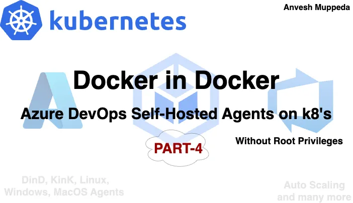
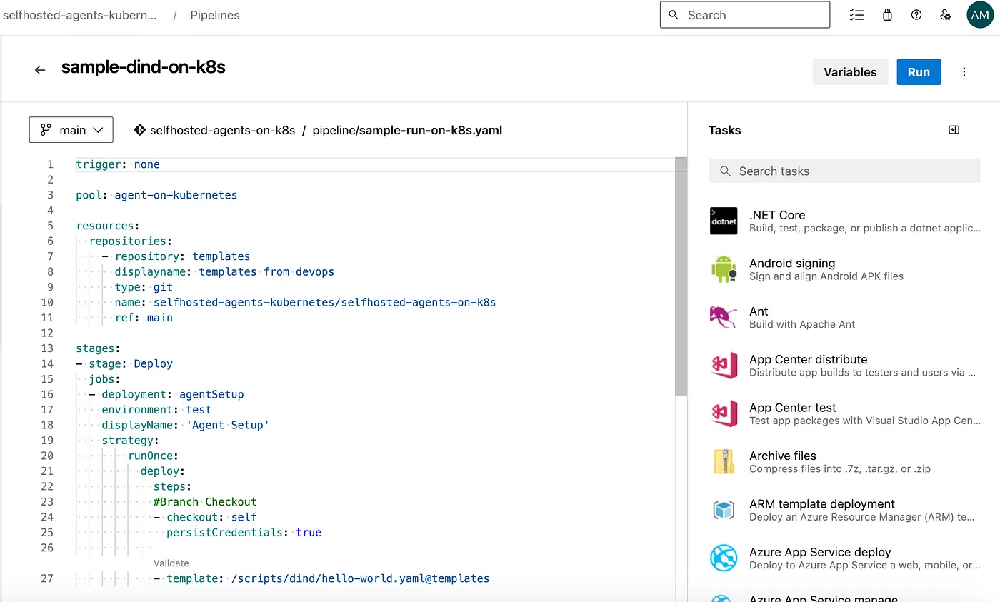
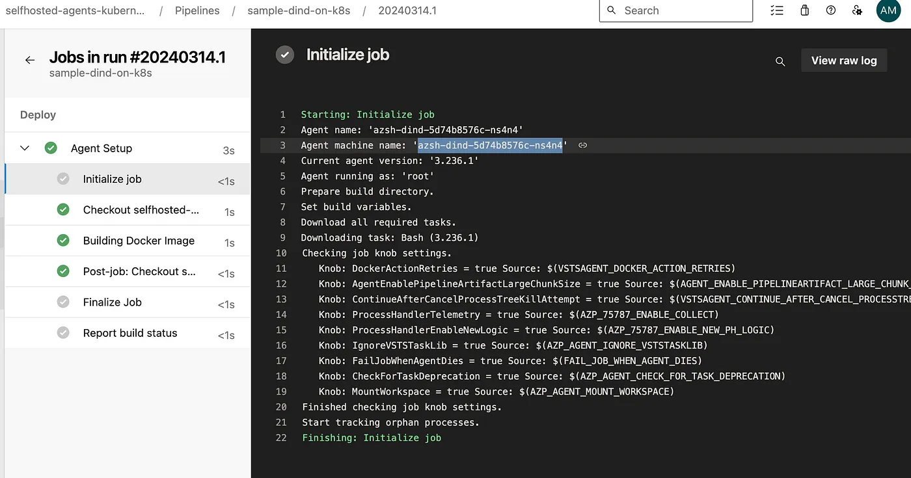
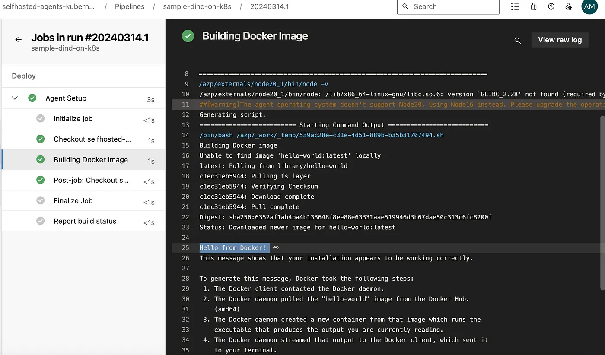

# ⎈ Azure DevOps — Self Hosted Agents on Kubernetes — PART-4 ⎈

#### *Build and Deploy ‘Docker in Docker’ SelfHosted Agents 🐳*




Welcome to our series on Azure DevOps self-hosted agents! In this blog, we’ll delve into the powerful realm of Docker in Docker (DinD). This technique allows us to run Docker commands within a Docker container, opening up a world of possibilities for containerized workflows.
This series on making Docker and Azure DevOps work seamlessly together! In this blog post, we’re exploring a cool trick called Docker in Docker (DinD). It’s like nesting containers within containers, and it’s a game-changer for anyone working with Kubernetes.
Imagine being able to run Docker commands right from your Azure DevOps pipelines, all within Kubernetes. That’s exactly what we’ll show you how to do!
We’ll walk you through creating Docker in Docker images and running them in Kubernetes pods. And we’ll connect everything back to Azure DevOps, so you can run your Docker tasks hassle-free.
Get ready to simplify your Kubernetes workflows and take your DevOps game to the next level with Docker in Docker and Azure DevOps. Let’s dive in!

### Understanding Docker in Docker
Docker in Docker, as the name suggests, enables us to nest Docker containers within one another. This capability is particularly useful in scenarios where we need to build, test, or deploy Dockerized applications within an isolated environment.

### Setting up Docker in Docker Image
To begin, we’ll create a Docker in Docker image. This image will allow us to execute Docker commands seamlessly within a container. By encapsulating the Docker runtime environment, we ensure consistency and portability across different platforms.

Let’s build a Docker in Docker(DinD) image:

Create **Dockerfile** with below content in your docker environment

```yaml
#
# Ubuntu Bionic + Docker
#
# Instructions for docker installation taken from:
# https://docs.docker.com/install/linux/docker-ce/ubuntu/
#

FROM ubuntu:bionic

# Docker install
RUN apt-get update && apt-get install --no-install-recommends -y \
       apt-transport-https \
       ca-certificates \
       curl \
       gnupg-agent \
       software-properties-common
RUN curl -fsSL https://download.docker.com/linux/ubuntu/gpg | apt-key add -
RUN apt-key fingerprint 0EBFCD88

RUN add-apt-repository \
       "deb [arch=amd64] https://download.docker.com/linux/ubuntu \
       $(lsb_release -cs) \
       stable"
RUN apt-get update && apt-get install --no-install-recommends -y docker-ce docker-ce-cli containerd.io

RUN apt update -y && apt upgrade -y && apt install curl git jq libicu60 -y

# Also can be "linux-arm", "linux-arm64".
ENV TARGETARCH="linux-x64"

WORKDIR /azp/

COPY ./start.sh ./
RUN chmod +x ./start.sh

ENV AGENT_ALLOW_RUNASROOT="true"

# # Set start.sh script as ENTRYPOINT.
ENTRYPOINT ["/azp/start.sh"]
```
Create a start.sh script within the same path with below content(this script will help us to start the docker inside the container and connect to the Azure DevOps agent pool)

```yaml
#!/bin/bash
set -e

print_header() {
  lightcyan="\033[1;36m"
  nocolor="\033[0m"
  echo -e "\n${lightcyan}$1${nocolor}\n"
}

print_header "Starting the Docker Process..."
dockerd > /var/log/dockerd.log 2>&1 &

if [ -z "${AZP_URL}" ]; then
  echo 1>&2 "error: missing AZP_URL environment variable"
  exit 1
fi

if [ -z "${AZP_TOKEN_FILE}" ]; then
  if [ -z "${AZP_TOKEN}" ]; then
    echo 1>&2 "error: missing AZP_TOKEN environment variable"
    exit 1
  fi

  AZP_TOKEN_FILE="/azp/.token"
  echo -n "${AZP_TOKEN}" > "${AZP_TOKEN_FILE}"
fi

unset AZP_TOKEN

if [ -n "${AZP_WORK}" ]; then
  mkdir -p "${AZP_WORK}"
fi

cleanup() {
  trap "" EXIT

  if [ -e ./config.sh ]; then
    print_header "Cleanup. Removing Azure Pipelines agent..."

    # If the agent has some running jobs, the configuration removal process will fail.
    # So, give it some time to finish the job.
    while true; do
      ./config.sh remove --unattended --auth "PAT" --token $(cat "${AZP_TOKEN_FILE}") && break

      echo "Retrying in 30 seconds..."
      sleep 30
    done
  fi
}

# Let the agent ignore the token env variables
export VSO_AGENT_IGNORE="AZP_TOKEN,AZP_TOKEN_FILE"

print_header "1. Determining matching Azure Pipelines agent..."

AZP_AGENT_PACKAGES=$(curl -LsS \
    -u user:$(cat "${AZP_TOKEN_FILE}") \
    -H "Accept:application/json;" \
    "${AZP_URL}/_apis/distributedtask/packages/agent?platform=${TARGETARCH}&top=1")

AZP_AGENT_PACKAGE_LATEST_URL=$(echo "${AZP_AGENT_PACKAGES}" | jq -r ".value[0].downloadUrl")

if [ -z "${AZP_AGENT_PACKAGE_LATEST_URL}" -o "${AZP_AGENT_PACKAGE_LATEST_URL}" == "null" ]; then
  echo 1>&2 "error: could not determine a matching Azure Pipelines agent"
  echo 1>&2 "check that account "${AZP_URL}" is correct and the token is valid for that account"
  exit 1
fi

print_header "2. Downloading and extracting Azure Pipelines agent..."

curl -LsS "${AZP_AGENT_PACKAGE_LATEST_URL}" | tar -xz & wait $!

source ./env.sh

trap "cleanup; exit 0" EXIT
trap "cleanup; exit 130" INT
trap "cleanup; exit 143" TERM

print_header "3. Configuring Azure Pipelines agent..."

./config.sh --unattended \
  --agent "${AZP_AGENT_NAME:-$(hostname)}" \
  --url "${AZP_URL}" \
  --auth "PAT" \
  --token $(cat "${AZP_TOKEN_FILE}") \
  --pool "${AZP_POOL:-Default}" \
  --work "${AZP_WORK:-_work}" \
  --replace \
  --acceptTeeEula & wait $!

print_header "4. Running Azure Pipelines agent..."

chmod +x ./run.sh

# To be aware of TERM and INT signals call ./run.sh
# Running it with the --once flag at the end will shut down the agent after the build is executed
./run.sh "$@" & wait $!
```
Now build the image using below command

```yaml
docker build -t <dind-image>:<dind-tag> .
```
Remember to replace dind-image and dind-tag with your desired image name and tag.

Let’s check the newly created image using below command

```yaml
docker images
```
Following these steps ensures the creation of a Docker image capable of running Docker commands within containers i.e., Docker in Docker (DinD).

### Deploying Docker in Docker(DinD) image in Kubernetes
Before diving into deploying our Docker in Docker(DinD) image in Kubernetes, it’s crucial to prepare our Kubernetes cluster to support Docker in Docker without necessitating root privileges. To accomplish this, we’ll employ Sysbox, a powerful tool that facilitates running Docker in Docker within Kubernetes pods without the need for elevated permissions.

By leveraging Sysbox, we can seamlessly execute Docker commands within our pods, bypassing the requirement for root privileges on the worker nodes’ Docker daemon. This not only simplifies the setup process but also enhances security by mitigating potential root access vulnerabilities.

Before proceeding with our Docker in Docker deployment, let’s first establish Sysbox within our Kubernetes cluster. This foundational step ensures a smooth and secure environment for our containerized workflows.

***Setting up sysbox***

Installation is easily done via a daemonset called “sysbox-deploy-k8s”, which installs the Sysbox and CRI-O binaries onto the desired K8s nodes and performs all associated config.

***Select the specific worker nodes to run your sysbox using labels so that other workloads cannot be disturbed***

**Steps:**

Add labels to the target worker nodes

```yaml
kubectl label nodes <node-name> sysbox-install=yes
```
Create the sysbox-daemon.yaml manifest file using below content:

```yaml
---
apiVersion: v1
kind: ServiceAccount
metadata:
  name: sysbox-label-node
  namespace: kube-system
---
kind: ClusterRole
apiVersion: rbac.authorization.k8s.io/v1
metadata:
  name: sysbox-node-labeler
rules:
- apiGroups: [""]
  resources: ["nodes"]
  verbs: ["get", "patch"]
---
kind: ClusterRoleBinding
apiVersion: rbac.authorization.k8s.io/v1
metadata:
  name: sysbox-label-node-rb
roleRef:
  apiGroup: rbac.authorization.k8s.io
  kind: ClusterRole
  name: sysbox-node-labeler
subjects:
- kind: ServiceAccount
  name: sysbox-label-node
  namespace: kube-system
---
apiVersion: apps/v1
kind: DaemonSet
metadata:
  name: sysbox-deploy-k8s
  namespace: kube-system
spec:
  selector:
      matchLabels:
        sysbox-install: "yes"
  template:
    metadata:
        labels:
          sysbox-install: "yes"
    spec:
      serviceAccountName: sysbox-label-node
      nodeSelector:
        sysbox-install: "yes"
      tolerations:
      - key: "sysbox-runtime"
        operator: "Equal"
        value: "not-running"
        effect: "NoSchedule"
      containers:
      - name: sysbox-deploy-k8s
        image: registry.nestybox.com/nestybox/sysbox-deploy-k8s:v0.6.3
        imagePullPolicy: Always
        command: [ "bash", "-c", "/opt/sysbox/scripts/sysbox-deploy-k8s.sh ce install" ]
        env:
        - name: NODE_NAME
          valueFrom:
            fieldRef:
              fieldPath: spec.nodeName
        securityContext:
          privileged: true
        volumeMounts:
        - name: host-etc
          mountPath: /mnt/host/etc
        - name: host-osrelease
          mountPath: /mnt/host/os-release
        - name: host-dbus
          mountPath: /var/run/dbus
        - name: host-run-systemd
          mountPath: /run/systemd
        - name: host-lib-systemd
          mountPath: /mnt/host/lib/systemd/system
        - name: host-etc-systemd
          mountPath: /mnt/host/etc/systemd/system
        - name: host-lib-sysctl
          mountPath: /mnt/host/lib/sysctl.d
        - name: host-opt-lib-sysctl
          mountPath: /mnt/host/opt/lib/sysctl.d
        - name: host-usr-bin
          mountPath: /mnt/host/usr/bin
        - name: host-opt-bin
          mountPath: /mnt/host/opt/bin
        - name: host-usr-local-bin
          mountPath: /mnt/host/usr/local/bin
        - name: host-opt-local-bin
          mountPath: /mnt/host/opt/local/bin
        - name: host-usr-lib-mod-load
          mountPath: /mnt/host/usr/lib/modules-load.d
        - name: host-opt-lib-mod-load
          mountPath: /mnt/host/opt/lib/modules-load.d
        - name: host-run
          mountPath: /mnt/host/run
        - name: host-var-lib
          mountPath: /mnt/host/var/lib
      volumes:
        - name: host-etc
          hostPath:
            path: /etc
        - name: host-osrelease
          hostPath:
            path: /etc/os-release
        - name: host-dbus
          hostPath:
            path: /var/run/dbus
        - name: host-run-systemd
          hostPath:
            path: /run/systemd
        - name: host-lib-systemd
          hostPath:
            path: /lib/systemd/system
        - name: host-etc-systemd
          hostPath:
            path: /etc/systemd/system
        - name: host-lib-sysctl
          hostPath:
            path: /lib/sysctl.d
        - name: host-opt-lib-sysctl
          hostPath:
            path: /opt/lib/sysctl.d
        - name: host-usr-bin
          hostPath:
            path: /usr/bin/
        - name: host-opt-bin
          hostPath:
            path: /opt/bin/
        - name: host-usr-local-bin
          hostPath:
            path: /usr/local/bin/
        - name: host-opt-local-bin
          hostPath:
            path: /opt/local/bin/
        - name: host-usr-lib-mod-load
          hostPath:
            path: /usr/lib/modules-load.d
        - name: host-opt-lib-mod-load
          hostPath:
            path: /opt/lib/modules-load.d
        - name: host-run
          hostPath:
            path: /run
        - name: host-var-lib
          hostPath:
            path: /var/lib
  updateStrategy:
    rollingUpdate:
      maxUnavailable: 1
    type: RollingUpdate
---
apiVersion: node.k8s.io/v1
kind: RuntimeClass
metadata:
  name: sysbox-runc
handler: sysbox-runc
scheduling:
  nodeSelector:
    sysbox-runtime: running
---
```
Now let’s deploy the above daemonset using below command
```yaml
kubectl apply -f sysbox-daemon.yaml
```
Make sure the sysbox-deploy-k8s daemonset pods are up and runing without any errors.
```yaml
kubectl get pods -n kube-system -l sysbox-install=yes
NAME                      READY   STATUS    RESTARTS   AGE
sysbox-deploy-k8s-7zhbl   1/1     Running   1          24h
```
```yaml
kubectl get nodes -l sysbox-install=yes
NAME                                STATUS   ROLES   AGE   VERSION
aks-userpool-48158934-vmss000000    Ready    agent   25h   v1.27.9
```
### Now let’s deploy our Docker in Docker(DinD)
Create dind-deploy.yaml manifest file using below content:
```yaml
apiVersion: apps/v1
kind: Deployment
metadata:
  name: azsh-dind
  namespace: az-devops
  labels:
    app: azsh-dind-agent
spec:
  replicas: 1
  selector:
    matchLabels:
      app: azsh-dind-agent
  template:
    metadata:
      labels:
        app: azsh-dind-agent
      annotations:
        io.kubernetes.cri-o.userns-mode: "auto:size=65536"
    spec:
      runtimeClassName: sysbox-runc
      containers:
      - name: dind
        image: anvesh35/azsh-dind-agent
        command: ["/azp/start.sh"]
        env:
          - name: AZP_URL
            valueFrom:
              secretKeyRef:
                name: azdevops
                key: AZP_URL
          - name: AZP_TOKEN
            valueFrom:
              secretKeyRef:
                name: azdevops
                key: AZP_TOKEN
          - name: AZP_POOL
            valueFrom:
              secretKeyRef:
                name: azdevops
                key: AZP_POOL
```

Create Kubernetes secret which is used to connect & authenticate withthe Azure DevOps

```yaml
kubectl -n az-devops create secret generic azdevops \
  --from-literal=AZP_URL=https://dev.azure.com/yourOrg \
  --from-literal=AZP_TOKEN=YourPAT \
  --from-literal=AZP_POOL=NameOfYourPool
```
Now apply above dind-deploy.yaml manifest file using the below commands
```yaml
kubectl apply -f dind-deploy.yaml
```
Verify that the DinD agent pods are created and running successfully by checking their status with below command

```yaml
kubectl get pods -n az-devops
```
```yaml
NAME                         READY   STATUS    RESTARTS   AGE
azsh-dind-5d74b8576c-ns4n4   1/1     Running   0          3h
```
Now Azure DevOps DinD Self-Hosted Agent pod is up and running. Now, let’s ensure it’s available in the Azure DevOps Agent Pool by following these steps:

1. **Login to Azure DevOps Portal:** Go to the Azure DevOps portal and log in with your credentials.
2. **Navigate to Project Settings:** Once logged in, navigate to your project settings. You can usually find this option in the bottom-left corner of the Azure DevOps portal.
3. **Click on Agent Pools:** In the project settings, click on the “Agent pools” option. This will take you to the page where you can manage agent pools for your project.
4. **Select the Target Agent Pool:** Choose the target agent pool that you are using within the secret mentioned in your setup. This is the pool where your DinD Self-Hosted Agent pod should be available.
5. **Go to the Agents Section:** Within the selected agent pool, navigate to the “Agents” section. Here, you should be able to see a list of agents registered in this pool.
6. **Verify Your DinD Agent:** Look for your DinD Self-Hosted Agent in the list. It should be listed here if it’s successfully registered and connected to the Azure DevOps Agent Pool.


By following these steps, you can ensure that your DinD Self-Hosted Agent is correctly configured and available in the desired agent pool within Azure DevOps. If you encounter any issues, double-check the configuration and connectivity settings of your agent.


#### Running Docker commands on DinD Self-Hosted Agents
Lets create a new sample DinD pipeline using below steps.

Create a new file in **/pipelines/sample-dind-pipeline.yaml** path in your Azure DevOps repository using below content.

```yaml
trigger: none

pool: agent-on-kubernetes

resources:
  repositories:
    - repository: templates
      displayname: templates from devops
      type: git
      name: selfhosted-agents-kubernetes/selfhosted-agents-on-k8s
      ref: main

stages:
- stage: Deploy
  jobs:
  - deployment: agentSetup
    environment: test
    displayName: 'Agent Setup'
    strategy:
        runOnce:
          deploy:
            steps:
            #Branch Checkout
            - checkout: self
              persistCredentials: true
            
            - template: /scripts/dind/hello-world.yaml@templates
```

Create the first simeple docker commands script /scripts/kubernetes/hello-world.yaml to run the simple Hello World container on DinD Self-Hosted Agent on kubernetes.
```yaml
steps:
    -   bash: |
            echo "Running Hello World Docker image"
            docker run hello-world
        displayName: 'Test Docker Commands'
```
Now create a new pipeline using below steps.

1. Select the project where you want to create the YAML pipeline.
2. Click on the “Pipelines” menu option in the left sidebar.
3. You should see a button labeled “New pipeline” on the Pipelines page. Click on it to start creating a new pipeline.
4. Choose the repository where your code is located. Azure DevOps supports Git repositories, GitHub repositories, and others.
5. Choose where your YAML file is located(i.e., /pipelines/sample-dind-pipeline.yaml)
6. Now save the pipeline.
7. Now you should see your pipeline listed in the Pipelines page of your Azure DevOps project. You can review the pipeline configuration and manually trigger a run to test it.

That’s it! You’ve successfully created a YAML pipeline in Azure DevOps and ran it using **DinD Self-Hosted Agent** from kubernetes cluster.






Kubernetes DinD pod logs: 
```yaml
$ kubectl logs azsh-dind-5d74b8576c-ns4n4 -n az-devops --tail=10
Testing agent connection.
2024-03-14 00:15:57Z: Settings Saved.

4. Running Azure Pipelines agent...

Scanning for tool capabilities.
Connecting to the server.
2024-03-14 00:15:58Z: Listening for Jobs
2024-03-14 00:28:10Z: Running job: Agent Setup
2024-03-14 00:28:19Z: Job Agent Setup completed with result: Succeeded
```
### Advantages of Docker in Docker(DinD) for Azure DevOps

- **Enhanced Isolation:** Docker in Docker provides a sandboxed environment for executing Docker commands, minimizing interference with the host system.
- **Improved Portability:** By encapsulating the Docker runtime environment within a container, we ensure consistent behavior across different environments.
- **Seamless Integration:** Integrating Docker in Docker with Azure DevOps self-hosted agents enables us to seamlessly incorporate Docker tasks into our CI/CD pipelines.
- **Scalability:** Leveraging Kubernetes for orchestration allows us to scale our containerized workloads dynamically, ensuring optimal resource utilization.
- **Reduced Privilege Requirements:** With DinD, Docker commands can be executed within containers without requiring root privileges on the host machine. This is particularly advantageous in Kubernetes environments where granting root access to containers can introduce security risks. By utilizing DinD, Kubernetes clusters can maintain stricter security postures by minimizing the need for elevated permissions.
- **Enhanced Resource Utilization:** Kubernetes excels at efficiently managing containerized workloads, including DinD containers. By orchestrating DinD containers alongside other Kubernetes resources, such as pods and deployments, clusters can optimize resource utilization while maintaining security boundaries. This ensures that resources are allocated appropriately and reduces the risk of resource contention or abuse.