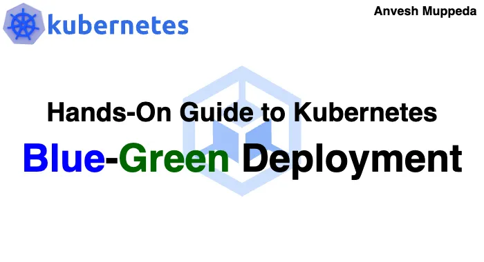
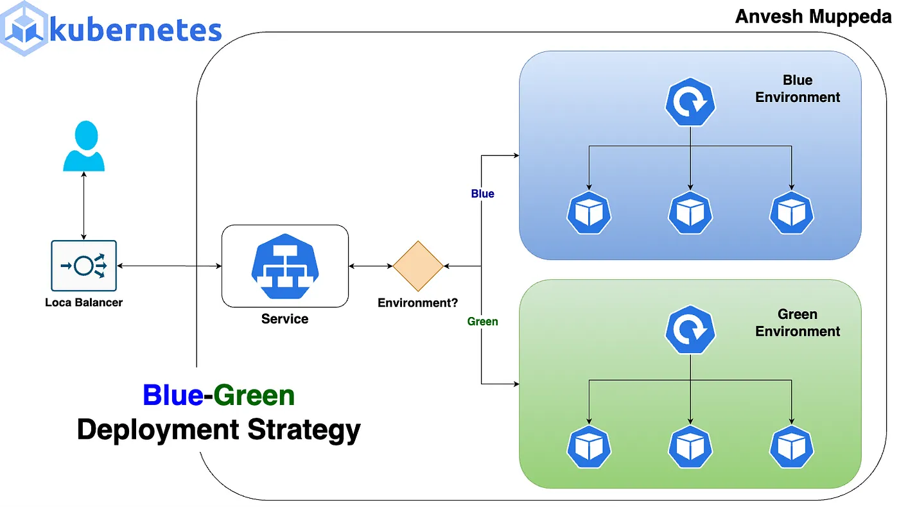
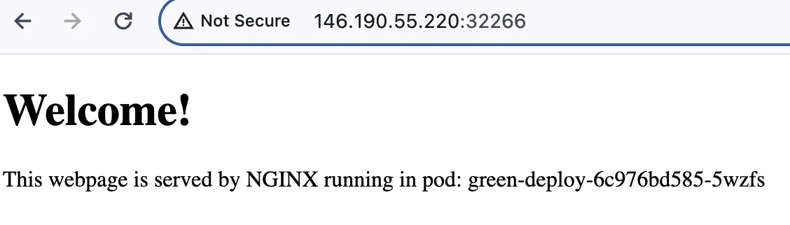
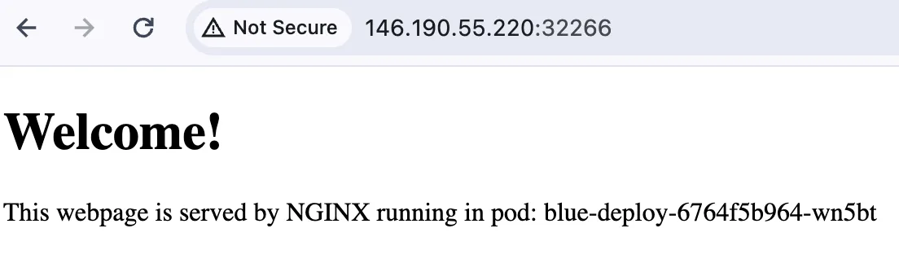

# ⎈ Blue-Green Deployment in Kubernetes 🟦🟩

#### *⇢ A Hands-On Example with Deployment and Service Manifests*



#### Introduction:
In the fast-paced world of software development, deploying updates and new features while maintaining uptime and minimizing risks is crucial. Blue-Green Deployment is a strategy that helps achieve this by reducing downtime and risk during deployments. In this guide, we’ll explore what Blue-Green Deployment is, its benefits, how it works, and a practical example using Kubernetes.
#### What is Blue-Green Deployment?
Blue-Green Deployment is a technique used to release software updates with minimal downtime and risk. In this approach, two identical environments, typically referred to as “blue” and “green,” are set up: one represents the currently live production environment (blue), while the other is a clone where the new version is deployed (green). Once the new version in the green environment is tested and ready, traffic is switched from blue to green, making the green environment the new production environment.



### Benefits of Blue-Green Deployment:
**Zero Downtime:** By having two identical environments, you can switch traffic seamlessly from one environment to another without any downtime.  
**Risk Mitigation:** Since the new version is deployed in an isolated environment, any issues can be identified and resolved before directing traffic to it.   
**Rollback Capability:** If any issues arise after switching traffic to the green environment, you can quickly rollback by redirecting traffic back to the blue environment.

### How Blue-Green Deployment Works:
**1. Set Up Environments:** Create two identical environments, typically labeled blue and green, using Kubernetes clusters.  
**2. Deploy New Version:** Deploy the new version of your application to the green environment.  
**3. Testing:** Conduct thorough testing in the green environment to ensure the new version functions as expected and meets quality standards.  
**4. Switch Traffic:** Once testing is successful, reroute traffic from the blue environment to the green environment using load balancers or DNS changes.  
**5. Monitoring:** Monitor the green environment closely to detect any issues that may arise after the switch.  
**6. Rollback (if necessary):** If any issues occur post-deployment, quickly rollback by switching traffic back to the blue environment.  


### Real-Time Example:
Let’s demonstrate Blue-Green Deployment with a practical example using Kubernetes. Consider a simple web application which display the pod name(so that it easy to test the traffic from where it is getting the response) with version 1.0. We’ll update it to version 2.0 using Blue-Green Deployment.

### 1. Setup Environments
***1.1 Deploy Blue Application (Version 1.0)***
Use the below manifest file as Blue Deployment and save it as **blue-deployment.yaml:**
```yaml
apiVersion: apps/v1
kind: Deployment
metadata:
  name: blue-deploy
  labels:
    app: echo-application
    env: blue
    version: v1.0.0
spec:
  replicas: 3
  selector:
    matchLabels:
      app: echo-application
      env: blue
  template:
    metadata:
      labels:
        app: echo-application
        env: blue
        version: v1.0.0
    spec:
      containers:
      - name: echoapp
        image: anvesh35/echo-pod-name:v1.0.0
        ports:
        - containerPort: 80
```
***Apply the above blue-deployment.yaml (deployment) manifest to deploy version 1.0.0 of the echo application using the below command:***
```yaml
kubectl apply -f blue-deployment.yaml
```

#### 1.2 Deploy Green Application (Version 1.0)
Use the below manifest file as Green Deployment and save it as **green-deployment.yaml:**

```yaml

apiVersion: apps/v1
kind: Deployment
metadata:
  name: green-deploy
  labels:
    app: echo-application
    env: green
    version: v1.0.0
spec:
  replicas: 3
  selector:
    matchLabels:
      app: echo-application
      env: green
  template:
    metadata:
      labels:
        app: echo-application
        env: green
        version: v1.0.0
    spec:
      containers:
      - name: echoapp
        image: anvesh35/echo-pod-name:v1.0.0
        ports:
        - containerPort: 80
```

***Apply the above green-deployment.yaml (deployment) manifest to deploy version 1.0.0 of the echo application using the below command:***
```yaml
kubectl apply -f green-deployment.yaml
```
#### 1.3 Deploy Service
Use the below manifest file for service t route traffic between blue and green deployments and save it as ***svc-manifest.yaml:***
```yaml

apiVersion: v1
kind: Service
metadata:
  name: echoapp-svc
spec:
  selector:
    app: echo-application
    env: blue
  ports:
  - name: http
    port: 80
    targetPort: 80
  type: NodePort
```
The above service manifest will route the traffic to blue application since we are using selector as env: blue. Apply the above svc-manifest.yaml (service) manifest to deploy service for above echo application using the below command:
```yaml
kubectl apply -f svc-manifest.yaml
```
Using the above steps we have deployed identical applications (blue and green deployments) and created a service which routes the traffic to the Blue deployment.

```yaml
$ kubectl get all
NAME                                READY   STATUS    RESTARTS   AGE
pod/blue-deploy-6764f5b964-lzkwj    1/1     Running   0          15m
pod/blue-deploy-6764f5b964-wn5bt    1/1     Running   0          15m
pod/blue-deploy-6764f5b964-xmk4d    1/1     Running   0          15m
pod/green-deploy-6c976bd585-5wzfs   1/1     Running   0          15m
pod/green-deploy-6c976bd585-7k7p6   1/1     Running   0          15m
pod/green-deploy-6c976bd585-ztlkw   1/1     Running   0          15m

NAME                  TYPE        CLUSTER-IP      EXTERNAL-IP   PORT(S)        AGE
service/echoapp-svc   NodePort    10.225.214.77   <none>        80:32266/TCP   15m

NAME                           READY   UP-TO-DATE   AVAILABLE   AGE
deployment.apps/blue-deploy    3/3     3            3           15m
deployment.apps/green-deploy   3/3     3            3           15m

NAME                                      DESIRED   CURRENT   READY   AGE
replicaset.apps/blue-deploy-6764f5b964    3         3         3       15m
replicaset.apps/green-deploy-6c976bd585   3         3         3       15m
```
Let’s try to access the application to verify the traffic and functionality.
#### Testing-blue-application  


Or we can use the below curl command to test the traffic:  
```yaml
$ for i in $(seq 1 10); do curl <app-url>; done | grep -o '<span id='\'podName\''>[^<]*' | sed 's/<[^>]*>//g'
```
```yaml
$ for i in $(seq 1 10); do curl 146.190.533.230:32266; done | grep -o '<span id='\'podName\''>[^<]*' | sed 's/<[^>]*>//g'
blue-deploy-6764f5b964-wn5bt
blue-deploy-6764f5b964-xmk4d
blue-deploy-6764f5b964-lzkwj
blue-deploy-6764f5b964-lzkwj
blue-deploy-6764f5b964-wn5bt
blue-deploy-6764f5b964-lzkwj
blue-deploy-6764f5b964-wn5bt
blue-deploy-6764f5b964-wn5bt
blue-deploy-6764f5b964-wn5bt
blue-deploy-6764f5b964-lzkwj
```
Using the above steps we have successfully configured the two identical environments(**Blue** & **Green**).

### 2. Deploy New Version
***2.1 Update the Green deployment version***
To deploy the new version (v2.0.0) of your application to the green environment, update the image for the green deployment to anvesh35/echo-pod-name:v2.0.0 (in green-deployment.yaml). This change will upgrade the version of the application running in the green environment.   
Apply the changes by executing the following command:

```yaml
kubectl apply -f green-deployment.yaml
```
### 3. Switch Traffic:
***3.1 Update the Service to Point Green deployment***
Update the service to route traffic to the green deployment by changing the selector field to env: green. This ensures that traffic is directed to the green deployment, which now hosts the newer version.   
After updating the selector field to env: green in svc-manifest.yaml apply the manifest file using the following command:

```yaml
kubectl apply -f svc-manifest.yaml
```
These changes will upgrade the green environment to the newer version (**v2.0.0**) compared to the blue environment (**v1.0.0**) and update the service to route traffic to the **Green environment** from the **Blue environment**.

### 4. Test & Monitor the New Version
With the newer version successfully deployed in the green environment and traffic routed from the blue environment, it’s time to test and monitor the new version.   
Access the service endpoint to observe the behavior of the green deployment. In our scenario, the service endpoint prints the pod name of the environment, so it should now display the pod name of the green deployment.
#### Testing-green-application



Or using curl command:

```yaml
$ for i in $(seq 1 10); do curl 146.190.55.220:32266; done | grep -o '<span id='\'podName\''>[^<]*' | sed 's/<[^>]*>//g'
green-deploy-6c976bd585-7k7p6
green-deploy-6c976bd585-7k7p6
green-deploy-6c976bd585-5wzfs
green-deploy-6c976bd585-7k7p6
green-deploy-6c976bd585-5wzfs
green-deploy-6c976bd585-7k7p6
green-deploy-6c976bd585-7k7p6
green-deploy-6c976bd585-ztlkw
green-deploy-6c976bd585-ztlkw
green-deploy-6c976bd585-5wzfs
```
Now, the traffic is being routed to the new version (v2.0.0) from the Green Environment.  

### 5. Rollback
By following the above steps, we have successfully upgraded the application in the green environment and redirected the traffic from the blue environment to the green environment. In case we encounter any issues, bugs, or unexpected behavior with the new version, we can quickly rollback to the older version (v1.0.0) which is still available in the blue environment. To do this, simply update the selectors in the service manifest file to app: blue and apply the changes. This will effectively route the traffic from the newer version(v2.0.0 from Green environment) to the older version (v1.0.0 from Blue environment).    
Once the svc-manifest.yaml files is updated with app: blue then apply the new changes using the below command:

```yaml
kubectl apply -f svc-manifest.yaml
```

Once the service is routed to older version(v1.0.0 from Blue environment) then verify the traffic status:

#### Rollout-older-version



curl command output:

```yaml
$ for i in $(seq 1 10); do curl 146.190.55.220:32266; done | grep -o '<span id='\'podName\''>[^<]*' | sed 's/<[^>]*>//g'
blue-deploy-6764f5b964-xmk4d
blue-deploy-6764f5b964-wn5bt
blue-deploy-6764f5b964-wn5bt
blue-deploy-6764f5b964-xmk4d
blue-deploy-6764f5b964-xmk4d
blue-deploy-6764f5b964-lzkwj
blue-deploy-6764f5b964-xmk4d
blue-deploy-6764f5b964-lzkwj
blue-deploy-6764f5b964-lzkwj
blue-deploy-6764f5b964-wn5bt
```
### Conclusion:
**Blue-Green** Deployment is a powerful strategy for deploying software updates with minimal downtime and risk. By setting up identical environments and switching traffic seamlessly, teams can release updates confidently while maintaining high availability. In Kubernetes, Blue-Green Deployment can be achieved effectively using namespaces and service routing. Incorporating Blue-Green Deployment into your deployment strategy can significantly improve your release process.

