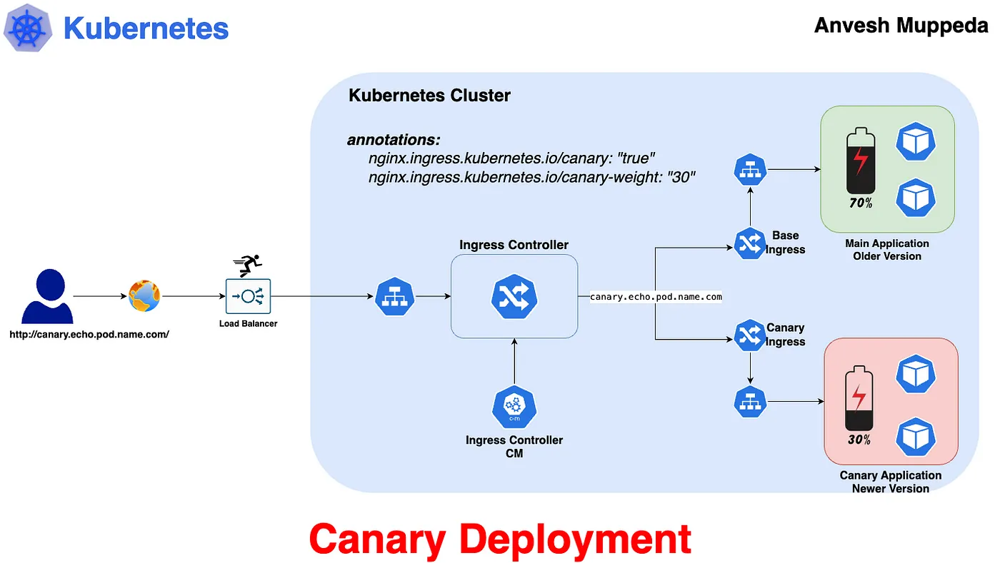
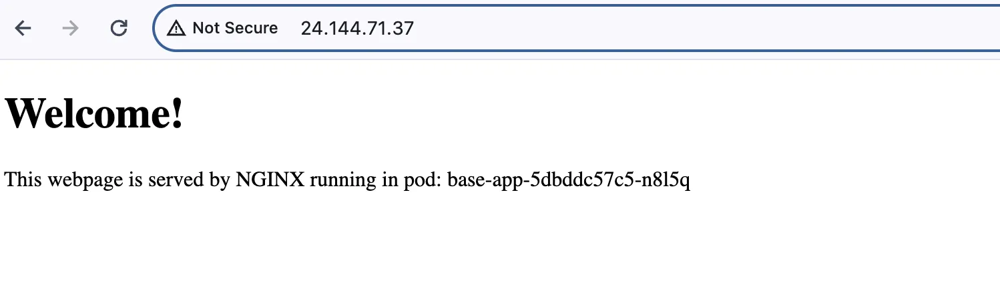
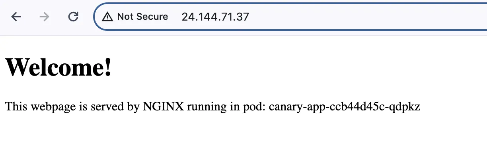

# 🐤 Implementing Canary Deployment in Kubernetes ⎈

#### *⇢ Understanding Canary Deployment in Kubernetes with a Practical Example — PART-6*

Canary deployment is a technique used to reduce the risk of introducing a new version of software into production by gradually rolling out the change to a small subset of users before making it available to the wider audience.
In Kubernetes, canary deployments are achieved by running multiple versions of an application simultaneously and routing a portion of the traffic to the newer version while monitoring its performance. In this article, we’ll explore what canary deployment is, why it’s important, and how to implement it in Kubernetes using a practical example.



### Why Canary Deployment?
Canary deployments offer several advantages, including:
**Risk Reduction:** By exposing only a small percentage of users to the new version, you can mitigate the impact of potential bugs or issues before they affect the entire user base.
**Early Feedback:** Canary deployments allow you to gather feedback from real users in a production-like environment, enabling you to identify any problems early and make necessary adjustments.
**Rollback Capability:** If issues are detected during the canary phase, you can quickly roll back to the previous version without affecting all users.
**Gradual Rollout:** Gradually increasing the traffic to the new version gives you confidence in its stability and performance, ensuring a smooth transition.

### Use Case:
Imagine you’re deploying a new feature to an e-commerce platform. With canary deployment, you can release the feature to a small percentage of users initially. This allows you to monitor key metrics such as conversion rates, user engagement, and error rates in real-time. If the new feature performs well, you can gradually increase the traffic to it. If issues arise, you can quickly roll back to the stable version, minimizing any negative impact on user experience.

### Practical Example
**1. Create Base Application (Main Application — Older Version) and Service:**
```yaml
apiVersion: apps/v1
kind: Deployment
metadata:
  name: base-app
spec:
  replicas: 1
  selector:
    matchLabels:
      app: base-app
  template:
    metadata:
      labels:
        app: base-app
    spec:
      containers:
      - name: base-app
        image: anvesh35/echo-pod-name
        ports:
          - containerPort: 80
---
apiVersion: v1
kind: Service
metadata:
  name: base-svc
  labels:
    app: base-app
spec:
  type: ClusterIP
  selector:
    app: base-app
  ports:
    - protocol: TCP
      port: 80
      targetPort: 80
```

***This creates the main deployment of your application, representing the older version, along with a service to route traffic to it.***

**2. Create Canary Application (New Version of Main Application) and Service:**
```yaml
apiVersion: apps/v1
kind: Deployment
metadata:
  name: canary-app
spec:
  replicas: 1
  selector:
    matchLabels:
      app: canary-app
  template:
    metadata:
      labels:
        app: canary-app
    spec:
      containers:
      - name: canary-app
        image: anvesh35/echo-pod-name
        ports:
          - containerPort: 80
---
apiVersion: v1
kind: Service
metadata:
  name: canary-svc
  labels:
    app: canary-app
spec:
  type: ClusterIP
  selector:
    app: canary-app
  ports:
    - protocol: TCP
      port: 80
      targetPort: 80
```
***This creates the canary deployment, representing the newer version, along with a service to route traffic to it.***

Here I am using same image since this image shows us the dynamic results, which means it display the pod name so we can easily test using this image.

**3. Expose Base Application with Ingress:**
```yaml
apiVersion: networking.k8s.io/v1
kind: Ingress
metadata:
  name: base-ingress
spec:
  ingressClassName: nginx
  rules:
  - host: canary.echo.pod.name.com
    http:
      paths:
      - pathType: Prefix
        path: /
        backend:
          service:
            name: base-svc
            port:
              number: 80
```
***This creates an Ingress resource to expose the main application (older version) outside the cluster.***

**4. Expose Canary Application with Ingress:**
```yaml
apiVersion: networking.k8s.io/v1
kind: Ingress
metadata:
  name: canary-ingress
  annotations:
    nginx.ingress.kubernetes.io/canary: "true"
    nginx.ingress.kubernetes.io/canary-weight: "30"
spec:
  ingressClassName: nginx
  rules:
  - host: canary.echo.pod.name.com
    http:
      paths:
      - pathType: Prefix
        path: /
        backend:
          service:
            name: canary-svc
            port:
              number: 80
```
***This creates an Ingress resource to expose the canary application (newer version) outside the cluster.***

The above Ingress configurations for the canary deployment. Pay attention to the following:

1. The **hostname** should be identical to the main ingress hostname.   
2. The annotation ***nginx.ingress.kubernetes.io/canary: "true"*** is required to mark this Ingress as a canary deployment. Without this, Ingresses may clash.  
3. The annotation ***nginx.ingress.kubernetes.io/canary-weight: "30"*** determines the routing weight. In this case, there's a "30%" chance that a request will hit the canary deployment instead of the main deployment.   

**5. Testing Your Setup:**
Use the below command to test your canary setup and ensure traffic is being routed correctly between the main and canary deployments.
```yaml
for i in $(seq 1 10); do curl -s --resolve canary.echo.pod.name.com:80:<Ingress-Controller-IP> canary.echo.pod.name.com; done
```
This command hits the hostname specified in both the base and canary Ingresses. Out of 10 requests, it will hit the base application 7 times and the canary application 3 times.   
In my case I am using the below command which is same as a above but adding grep to it, to simplifies the output.   
```yaml
$ for i in $(seq 1 10); do curl -s --resolve canary.echo.pod.name.com:80:24.144.71.37 canary.echo.pod.name.com; done | grep -o '<span id='\'podName\''>[^<]*' | sed 's/<[^>]*>//g'
base-app-5dbddc57c5-n8l5q
base-app-5dbddc57c5-n8l5q
canary-app-ccb44d45c-qdpkz
base-app-5dbddc57c5-n8l5q
base-app-5dbddc57c5-n8l5q
base-app-5dbddc57c5-n8l5q
canary-app-ccb44d45c-qdpkz
canary-app-ccb44d45c-qdpkz
base-app-5dbddc57c5-n8l5q
base-app-5dbddc57c5-n8l5q
```
The output from the previous command shows that the curl command hits the older version (base application) 7 times and the newer version (canary application) 3 times.   

**Old-version**


**New-version**


***That’s it, we have successfully implemented Canary Deployment***
### Animated FlowChart


