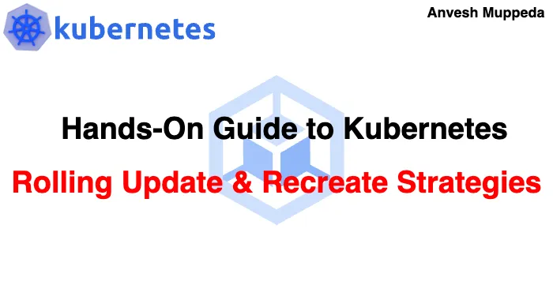
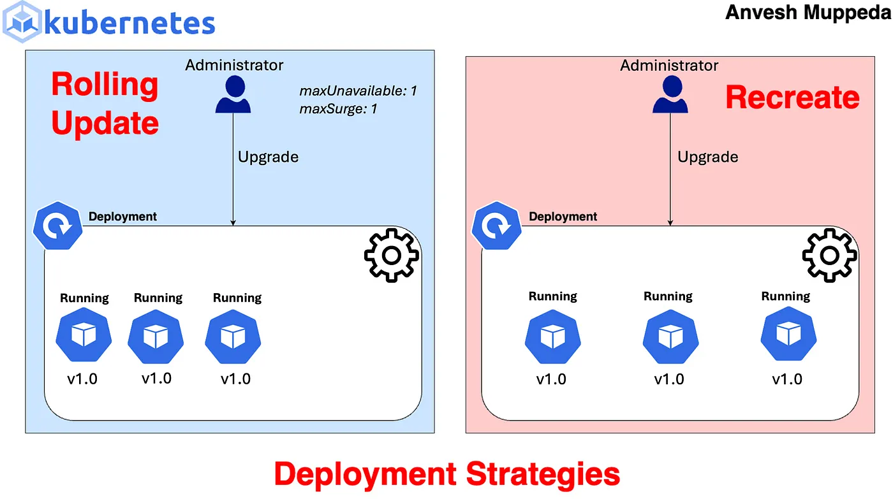

# ⎈ Rolling Update & Recreate Deployment Strategies in Kubernetes ⚙️

#### *✨ Choose the Right Strategy for Seamless Deployments*




When deploying applications in Kubernetes, choosing the right deployment strategy is crucial for ensuring minimal downtime and smooth updates. Two common strategies are Rolling Updates and Recreate. In this blog post, we’ll explore these strategies, their differences, and how to configure them effectively.


## Rolling Update

Rolling update is the default deployment strategy in Kubernetes. It ensures that your application is updated gradually, by replacing old instances with new ones in a controlled manner.  

### How it works:  

**1. Pod Replacement:** Kubernetes replaces old pods with new ones, one at a time.  
**2. Gradual Rollout:** It ensures that a specified number of new pods are available and healthy before terminating old ones.   
**3. Controlled Progress:** The rollout is managed by controlling parameters like maxUnavailable and maxSurge. 
### Flow-chart  



### Animated Flowchart  


#### Parameters:
**maxUnavailable:** Specifies the maximum number or percentage of pods that can be unavailable during the update. Default is 25%. This means that during the update, at least 75% of the desired number of pods must be available.   
**maxSurge:** Specifies the maximum number or percentage of pods that can be created above the desired number of pods. Default is 25%. This means that during the update, there can be at most 125% of the desired number of pods.  
#### Real-time Use Case:
Suppose you’re running a web application with multiple instances behind a load balancer. Using rolling updates ensures that the application remains available to users even during updates. This is crucial for maintaining uninterrupted service and avoiding disruptions for users accessing the application.

### Example:
Consider a deployment with 4 replicas and a rolling update with default parameters:  
maxUnavailable: 25% of 4 = 1  
maxSurge: 25% of 4 = 1   
During the update, Kubernetes will replace one old pod with a new one, ensuring there are always at least 3 (75% of 4) available. It may also create one additional pod, resulting in 5 pods temporarily (125% of 4).  
Now let’s test the above example in kubernetes cluster.  
Save the below manifest file as ***rolling-update-deploy.yaml:***

```yaml
apiVersion: apps/v1
kind: Deployment
metadata:
  name: echo-app-perc
  labels:
    app: echo-application
    env: test
    version: v1.0.0
spec:
  strategy:
    type: RollingUpdate
    rollingUpdate:
      # The default value is 25%.
      # maxUnavailable is an optional field that specifies the maximum number of Pods that can be unavailable during the update process.
      maxUnavailable: 20% # The value can be an absolute number (for example, 5) or a percentage of desired Pods (for example, 10%). 
      # maxSurge is an optional field that specifies the maximum number of Pods that can be created over the desired number of Pods.
      maxSurge: 20% # The value can be an absolute number (for example, 5) or a percentage of desired Pods (for example, 10%). 
  replicas: 5
  selector:
    matchLabels:
      app: echo-application
      env: test
  template:
    metadata:
      labels:
        app: echo-application
        env: test
        version: v1.0.0
    spec:
      containers:
      - name: echoapp
        image: anvesh35/echo-pod-name:v1.0.0
        ports:
        - containerPort: 80
        startupProbe:
            tcpSocket:
              port: 80
            initialDelaySeconds: 20
            periodSeconds: 5
---
apiVersion: v1
kind: Service
metadata:
  name: echoapp-svc
spec:
  selector:
    app: echo-application
  ports:
  - name: http
    port: 80
    targetPort: 80
  type: NodePort
```
This example demonstrates a rolling update deployment strategy, gradually replacing old pods with new ones while maintaining availability by allowing up to 20%(i.e., 1 pod out of 5pods ) of pods to be unavailable during the update process and surging up to 20%(i.e., 1 pod out of 5pods ) additional pods above the desired number of pods. Along with the deployment it will create a service as well to expose the application outside world.   

Let’s create the above deployment using the below command:

```yaml
kubectl apply -f rolling-update-deploy.yaml
```

Results:    

```yaml
$ kubectl get po
NAME                            READY   STATUS    RESTARTS   AGE
echo-app-perc-95f589c4c-2w2cb   1/1     Running   0          29s
echo-app-perc-95f589c4c-ctzhv   1/1     Running   0          29s
echo-app-perc-95f589c4c-n6b62   1/1     Running   0          29s
echo-app-perc-95f589c4c-qt95z   1/1     Running   0          29s
echo-app-perc-95f589c4c-t8d5h   1/1     Running   0          29s
```


We deployed the application with 5 replicas and now let’s upgrade the image version from v1.0.0 to v2.0.0. After applying the changes, we will observe how the rollout strategy works and understand the behavior of maxUnavailable and maxSurge.

```yaml
$ kubectl get po                   
NAME                             READY   STATUS              RESTARTS   AGE
echo-app-perc-65c66d895b-kphbw   0/1     ContainerCreating   0          2s
echo-app-perc-65c66d895b-tn2f4   0/1     ContainerCreating   0          2s
echo-app-perc-95f589c4c-2w2cb    1/1     Terminating         0          7m51s
echo-app-perc-95f589c4c-ctzhv    1/1     Running             0          7m51s
echo-app-perc-95f589c4c-n6b62    1/1     Running             0          7m51s
echo-app-perc-95f589c4c-qt95z    1/1     Running             0          7m51s
echo-app-perc-95f589c4c-t8d5h    1/1     Running             0          7m51s
```
After updating the image versions and applying the changes, we’ll notice the following:

Initially, one pod is terminated and two new pods are created. This means there are already four pods running and one pod is not available (maxUnavailable).    Additionally, with four running pods and two containers being created, there are a total of six pods, exceeding the desired number by one (maxSurge).  
This process continues until all pods are updated, with old ones being replaced one by one with new ones   
```yaml
$ kubectl get po
NAME                             READY   STATUS    RESTARTS   AGE
echo-app-perc-65c66d895b-h4lsf   1/1     Running   0          32s
echo-app-perc-65c66d895b-hj9p6   1/1     Running   0          57s
echo-app-perc-65c66d895b-kphbw   1/1     Running   0          83s
echo-app-perc-65c66d895b-tn2f4   1/1     Running   0          83s
echo-app-perc-65c66d895b-wh88c   1/1     Running   0          57s
```
This demonstrates the rolling update strategy’s behavior, ensuring a smooth transition by controlling the number of unavailable pods (maxUnavailable) and the surge in additional pods (maxSurge).  


## Recreate
Recreate deployment strategy involves terminating all existing instances of pods before creating new ones. It leads to downtime during the update process but ensures a clean, predictable transition.   


### How it works:
**1. Pod Termination:** Kubernetes terminates all existing pods.  
**2. Pod Creation:** It creates new pods with updated configurations.  
### Parameters:    
Recreate strategy doesn’t have parameters like maxUnavailable or maxSurge.  
### Real-time Use Cases:
1. **Batch Processing:** In scenarios where you have batch jobs or background tasks that can be paused temporarily, recreate strategy works well. For example, if you’re running a batch processing system where processing can be paused for a brief period, using recreate ensures a clean transition without risking data inconsistencies or job failures.   
2. In a single-node cluster where the deployment’s pods consume all available resources, using the rolling update strategy may lead to issues. If the rolling update attempts to create additional pods before terminating the old ones, it can result in resource exhaustion. Since the cluster has only one node, there’s no room for extra pods, causing the update to fail.
In such a scenario, the recreate strategy becomes more suitable. By terminating all existing pods before creating new ones, the recreate strategy ensures that resources are freed up before new pods are launched. This allows for a smoother update process without the risk of resource exhaustion.   
### Example:
When using recreate strategy, Kubernetes terminates all existing pods and then creates new ones. This leads to a downtime where the application is not available until all new pods are up and running.
Now let’s test the above example in kubernetes cluster.
Save the below manifest file as ***recreate-deploy.yaml:***
```yaml
apiVersion: apps/v1
kind: Deployment
metadata:
  name: echo-app
  labels:
    app: echo-application
    env: test
    version: v1.0.0
spec:
  strategy:
    type: Recreate
  replicas: 5
  selector:
    matchLabels:
      app: echo-application
      env: test
  template:
    metadata:
      labels:
        app: echo-application
        env: test
        version: v1.0.0
    spec:
      containers:
      - name: echoapp
        image: anvesh35/echo-pod-name:v3.0.0
        ports:
        - containerPort: 80
        startupProbe:
            tcpSocket:
              port: 80
            initialDelaySeconds: 20
            periodSeconds: 5
---
apiVersion: v1
kind: Service
metadata:
  name: echoapp-svc
spec:
  selector:
    app: echo-application
  ports:
  - name: http
    port: 80
    targetPort: 80
  type: NodePort
```
This deployment strategy terminates all existing replicas (i.e., 5 replicas) before creating new ones with the updated version of the application, resulting in a brief period of downtime as the old pods are replaced with new ones.    

Let’s deploy the above application using the below command:

```yaml
kubectl apply -f recreate-deploy.yaml
```

Results:

```yaml
$ kubectl get po
NAME                       READY   STATUS    RESTARTS   AGE
echo-app-cbff574bb-47qjv   1/1     Running   0          43s
echo-app-cbff574bb-4qlk9   1/1     Running   0          43s
echo-app-cbff574bb-g2qtk   1/1     Running   0          43s
echo-app-cbff574bb-qn26s   1/1     Running   0          43s
echo-app-cbff574bb-r4vg5   1/1     Running   0          43s
```
We deployed the application with 5 replicas and now let’s upgrade the image version from v1.0.0 to v2.0.0. After applying the changes, we will observe how the recreate strategy works.


***Initially terminated all pods***

```yaml
$ kubectl get po    
NAME                       READY   STATUS        RESTARTS   AGE
echo-app-cbff574bb-47qjv   1/1     Terminating   0          2m25s
echo-app-cbff574bb-4qlk9   1/1     Terminating   0          2m25s
echo-app-cbff574bb-g2qtk   1/1     Terminating   0          2m25s
echo-app-cbff574bb-qn26s   1/1     Terminating   0          2m25s
echo-app-cbff574bb-r4vg5   1/1     Terminating   0          2m25s
```


Then it created all the pods with new version:

```yaml
$ kubectl get po
NAME                        READY   STATUS    RESTARTS   AGE
echo-app-64cd874965-5vmtn   1/1     Running   0          2m42s
echo-app-64cd874965-6w8cv   1/1     Running   0          2m42s
echo-app-64cd874965-v74xx   1/1     Running   0          2m42s
echo-app-64cd874965-z9swp   1/1     Running   0          2m42s
echo-app-64cd874965-zgcxh   1/1     Running   0          2m42s
```

After updating the image versions and applying the changes, we’ll observe the following sequence:     
Initially, all 5 replicas are terminated.  
Then, all 5 replic as are created with the newer version.     
This demonstrates the behavior of the recreate strategy, which ensures downtime by terminating all pods before recreating them with the updated image version.   

### Conclusion
**Rolling Update:** Gradual replacement of pods, suitable for applications that need to remain available during updates.  
**Recreate:** Simultaneous termination and creation of pods, suitable for applications with lower tolerance for downtime.   
Choose the deployment strategy that best fits your application’s requirements and availability needs.    Understanding the parameters and behaviors of each strategy helps in making informed decisions for managing application updates in Kubernetes.  