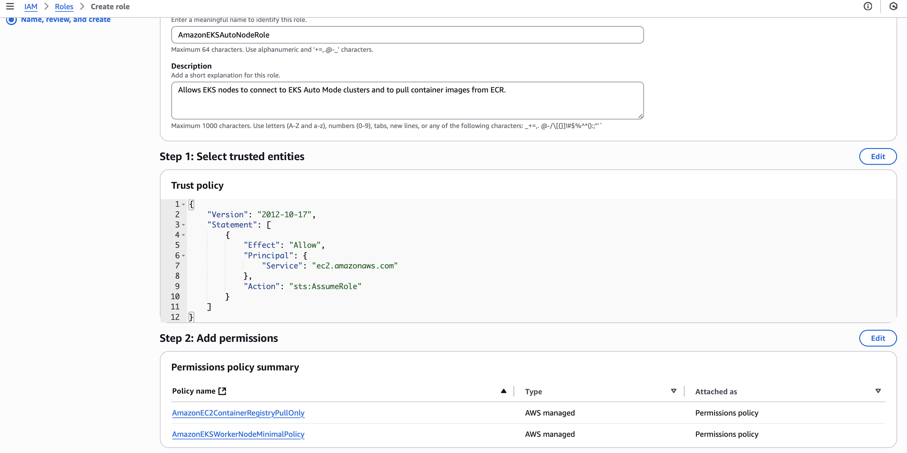

## What Is Amazon EKS Auto Mode?

EKS Auto Mode extends AWS’s managed control plane by fully automating:

1. **Compute:** Automatically launches EC2 nodes when pods can’t be scheduled, and drains/terminates under-utilized nodes.
2. **Networking:** Provisions and configures Application and Network Load Balancers for Services and Ingresses.
3. **Storage:** Creates, attaches, encrypts, and cleans up EBS volumes for your PVCs.

### Key Features

* **Streamlined Operations:** Immutable, locked-down AMIs with SELinux and read-only root filesystems; nodes refresh every 21 days.
* **Cost Efficiency:** Dynamically consolidates workloads to reduce idle capacity.
* **Security & Compliance:** No SSH/SSM access; regular node cycling and automated patching.
* **Managed Add-Ons:** Built-in GPU drivers, DNS caching, network policies and EBS CSI—no manual installs.

---

## Prerequisites

* An AWS account with EKS (IAM) permissions
* AWS CLI or `eksctl` installed & configured
* `kubectl` installed

---

## 1. Create Your Cluster

### A. CloudFormation

Use this template [eks-auto-mode.yam](./cloudformation/eks-auto-mode.yaml) to spin up an EKS cluster with Auto Mode enabled:


### B. eksctl

```bash
# eksctl
eksctl create cluster \
  --name my-auto-cluster \
  --region us-west-2 \
  --enable-auto-mode
```

### C. AWS Management Console

1. Open the [EKS console](https://console.aws.amazon.com/eks/home#/clusters)
2. Choose **Quick configuration (with EKS Auto Mode – new)**
   
3. Create or select the recommended IAM roles for cluster & nodes  
    *Cluster IAM roles are created automatically, but you can customize them if needed.*
    
    *Node IAM roles are created automatically, but you can customize them if needed.*
    
4. Fill in VPC, subnets, and other settings
5. Review & **Create**

---

## 2. Verify Auto Mode Is Active

1. **Configure kubeconfig**

   ```bash
   aws eks --region us-west-2 update-kubeconfig --name my-auto-cluster
   ```
2. **Check for managed CRDs**

   ```bash
   kubectl get crd
   ```
3. **Inspect NodePools & NodeClasses**

   ```bash
   kubectl get nodepools
   kubectl get nodeclasses
   kubectl get nodeclaims
   ```

At this point, no nodes exist until you deploy pods that need them.

---

## 3. Test with nginx Deployment

1. **Deploy nginx**

   ```bash
   kubectl create deployment nginx --image=nginx
   ```
2. **Observe a new node spin up**

   ```bash
   kubectl get pods
   kubectl get nodes
   ```
3. **Tear down & confirm cleanup**

   ```bash
   kubectl delete deployment nginx
   kubectl get nodes  # should return “No resources found”
   ```

---

## 4. Test with Persistent Volume (Alpine-Writer)

Use this manifest (`alpine-writer.yaml`):

```yaml
apiVersion: apps/v1
kind: Deployment
metadata:
  name: alpine-writer
spec:
  replicas: 1
  selector:
    matchLabels:
      app: alpine-writer
  template:
    metadata:
      labels:
        app: alpine-writer
    spec:
      containers:
      - name: alpine-writer
        image: alpine
        command: ["/bin/sh","-c","while true; do date >> /mnt/data/date.txt; sleep 1; done"]
        volumeMounts:
        - name: data-volume
          mountPath: /mnt/data
      volumes:
      - name: data-volume
        persistentVolumeClaim:
          claimName: alpine-writer-pvc
---
apiVersion: v1
kind: PersistentVolumeClaim
metadata:
  name: alpine-writer-pvc
spec:
  storageClassName: gp2
  accessModes:
    - ReadWriteOnce
  resources:
    requests:
      storage: 1Gi
  volumeMode: Filesystem
```

1. **Apply the manifest**

   ```bash
   kubectl apply -f alpine-writer.yaml
   ```
2. **Verify pod and PVC**

   ```bash
   kubectl get po
   kubectl get pvc
   ```
3. **Inspect the underlying volume**

   ```bash
   kubectl describe pvc alpine-writer-pvc
   ```
4. **Cleanup**

   ```bash
   kubectl delete deployment alpine-writer
   kubectl delete pvc alpine-writer-pvc
   ```

---

## 5. Customization & Tips

* **Custom NodePools / NodeClasses**
  Create additional NodePools for Spot instances, GPU workloads, or specialized storage without editing the defaults.
* **DaemonSets**
  Use DaemonSets to inject logging, monitoring, or security agents across all nodes.
* **Unsupported Features**
  Auto Mode currently doesn’t support per-pod security groups, advanced AWS CNI options (warm IP pools, prefix delegation), or custom ENI configurations.

---

## Conclusion

With EKS Auto Mode, the cluster’s data plane becomes a fully managed appliance: nodes, networking, and storage spring to life only when needed, then retire when idle—all underpinned by AWS best practices. By following the steps above, you’ll have a production-ready EKS experience in minutes, complete with automated scaling, patching, and security.

---

## Additional Resources
* [EKS Auto Mode Documentation](https://docs.aws.amazon.com/eks/latest/userguide/automode.html)
* [Getting started with Amazon EKS Auto Mode](https://aws.amazon.com/blogs/containers/getting-started-with-amazon-eks-auto-mode/)