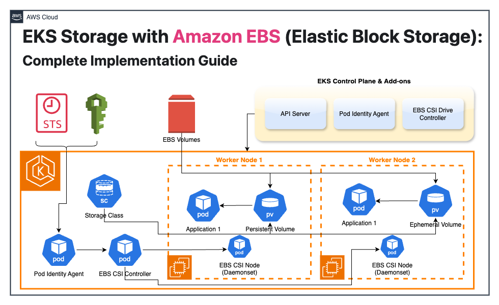

---
// filepath: /Users/anveshmuppeda/Desktop/anvesh/tech/git/kubernetes/docs/eks/010-eks-ebs-storage.md
sidebar_label: "EKS EBS Storage"
sidebar_position: 10
---  

# EKS Storage with Amazon EBS (Elastic Block Storage): Complete Implementation Guide

## Overview

Amazon Elastic Block Store (EBS) provides persistent, high-performance block storage for Amazon EKS clusters through the EBS Container Storage Interface (CSI) driver. This driver seamlessly manages the lifecycle of EBS volumes, enabling them to serve as storage backends for both persistent volumes and ephemeral volumes in Kubernetes.

  

The EBS CSI driver supports multiple volume types including:
- **Persistent Volumes** - Long-term storage that persists beyond pod lifecycle
- **Generic Ephemeral Volumes** - Temporary storage tied to pod lifecycle

## Important Considerations

Before implementing EBS storage in your EKS cluster, be aware of these key limitations and requirements:

### Compatibility Restrictions
- **EKS Auto Mode**: No manual EBS CSI controller installation required
- **Fargate Limitations**: EBS volumes cannot be mounted to Fargate pods
- **Hybrid Nodes**: EBS volumes are incompatible with EKS Hybrid Nodes
- **DaemonSet Requirements**: EBS CSI node DaemonSet requires EC2 instances (cannot run on Fargate)

### Version Support Policy
- Support provided for latest add-on version plus one prior version
- Security patches and bug fixes backported to previous release versions

### EKS Auto Mode Provisioner Requirements
- Must use `ebs.csi.eks.amazonaws.com` as provisioner
- Standard EBS CSI Driver (`ebs.csi.aws.com`) manages volumes separately
- Existing volumes require migration via snapshots for Auto Mode compatibility

## Prerequisites

### 1. EKS Cluster Requirements
Ensure your EKS cluster has the `aws-ebs-csi-driver` add-on installed. Verify compatibility:

```bash
aws eks describe-addon-versions --addon-name aws-ebs-csi-driver
```

**Expected Output:**
```yaml
addons:
- addonName: aws-ebs-csi-driver
  addonVersions:
  - addonVersion: v1.44.0-eksbuild.1
    architecture: [amd64, arm64]
    compatibilities:
    - clusterVersion: '1.33'
      defaultVersion: true
    - clusterVersion: '1.32'
      defaultVersion: true
    # ... additional versions
    computeTypes: [ec2]
    requiresConfiguration: false
    requiresIamPermissions: true
```

### 2. IAM Permissions Setup
The EBS CSI driver requires specific AWS IAM permissions, configurable through two methods:

#### Option A: Pod Identity (Recommended)
#### Option B: EKS IAM Roles for Service Accounts (IRSA)

### 3. Quick Setup with CloudFormation
For rapid deployment, use the provided EKS EBS Setup [CloudFormation Template](./cloudformation/eks-ebs-setup.yaml) which automatically configures:
- EKS cluster with EBS CSI driver add-on
- Required IAM roles and policies
- Pod Identity setup

## Environment Configuration

### Step 1: Create IAM Service Account (If not using CloudFormation)

```bash
eksctl create iamserviceaccount \
    --name ebs-csi-controller-sa \
    --namespace kube-system \
    --cluster my-cluster \
    --role-name AmazonEKS_EBS_CSI_DriverRole \
    --role-only \
    --attach-policy-arn arn:aws:iam::aws:policy/service-role/AmazonEBSCSIDriverPolicy \
    --approve
```

### Step 2: Verify EBS CSI Driver Add-on
Confirm the EBS CSI driver add-on is properly installed and configured in your cluster.

## Implementation Examples

## Example 1: Static Provisioning with Existing EBS Volumes

Static provisioning allows you to use pre-existing EBS volumes as Kubernetes persistent storage.

### Create Persistent Volume

Create `pv-static.yaml`:

```yaml
apiVersion: v1
kind: PersistentVolume
metadata:
  name: test-pv-static
spec:
  accessModes:
    - ReadWriteOnce
  capacity:
    storage: 5Gi
  csi:
    driver: ebs.csi.aws.com
    fsType: ext4
    volumeHandle: {REPLACE_WITH_EBS_VOLUME_ID}
  nodeAffinity:
    required:
      nodeSelectorTerms:
        - matchExpressions:
            - key: topology.kubernetes.io/zone
              operator: In
              values:
                - {REPLACE_WITH_AVAILABILITY_ZONE}
```

**Configuration Notes:**
- Replace `{REPLACE_WITH_EBS_VOLUME_ID}` with your actual EBS volume ID
- Replace `{REPLACE_WITH_AVAILABILITY_ZONE}` with the zone where your EBS volume resides

### Create Persistent Volume Claim

Create `pvc-static.yaml`:

```yaml
apiVersion: v1
kind: PersistentVolumeClaim
metadata:
  name: ebs-claim-static
spec:
  storageClassName: "" # Explicitly empty to prevent default StorageClass assignment
  volumeName: test-pv-static
  accessModes:
    - ReadWriteOnce
  resources:
    requests:
      storage: 5Gi
```

### Create Application Pod

Create `pod-static.yaml`:

```yaml
apiVersion: v1
kind: Pod
metadata:
  name: app-static
spec:
  containers:
    - name: app
      image: public.ecr.aws/amazonlinux/amazonlinux
      command: ["/bin/sh"]
      args: ["-c", "while true; do echo $(date -u) >> /data/out.txt; sleep 5; done"]
      volumeMounts:
        - name: persistent-storage
          mountPath: /data
  volumes:
    - name: persistent-storage
      persistentVolumeClaim:
        claimName: ebs-claim-static
```

### Deploy and Validate

```bash
# Deploy resources in order
kubectl apply -f pv-static.yaml
kubectl apply -f pvc-static.yaml
kubectl apply -f pod-static.yaml

# Verify deployment
kubectl get pv,pvc,pods

# Validate data persistence
kubectl exec app-static -- cat /data/out.txt

# Cleanup
kubectl delete pod app-static
kubectl delete pvc ebs-claim-static
kubectl delete pv test-pv-static
```

## Example 2: Dynamic Provisioning with StorageClass

Dynamic provisioning automatically creates EBS volumes when PVCs are requested.

### Create StorageClass

Create `storageclass-dynamic.yaml`:

```yaml
apiVersion: storage.k8s.io/v1
kind: StorageClass
metadata:
  name: ebs-sc-dynamic
provisioner: ebs.csi.aws.com
volumeBindingMode: WaitForFirstConsumer
parameters:
  type: gp3  # Optional: specify EBS volume type
  fsType: ext4
```

### Create Dynamic PVC

Create `pvc-dynamic.yaml`:

```yaml
apiVersion: v1
kind: PersistentVolumeClaim
metadata:
  name: ebs-claim-dynamic
spec:
  accessModes:
    - ReadWriteOnce
  storageClassName: ebs-sc-dynamic
  resources:
    requests:
      storage: 4Gi
```

### Create Application Pod

Create `pod-dynamic.yaml`:

```yaml
apiVersion: v1
kind: Pod
metadata:
  name: app-dynamic
spec:
  containers:
    - name: app
      image: public.ecr.aws/amazonlinux/amazonlinux
      command: ["/bin/sh"]
      args: ["-c", "while true; do echo $(date -u) >> /data/out.txt; sleep 5; done"]
      volumeMounts:
        - name: persistent-storage
          mountPath: /data
  volumes:
    - name: persistent-storage
      persistentVolumeClaim:
        claimName: ebs-claim-dynamic
```

### Deploy and Validate

```bash
# Deploy StorageClass
kubectl apply -f storageclass-dynamic.yaml

# Deploy PVC (volume will be created when pod is scheduled)
kubectl apply -f pvc-dynamic.yaml

# Check PVC status (should be Pending until pod creation)
kubectl get pvc ebs-claim-dynamic

# Deploy pod (triggers volume provisioning)
kubectl apply -f pod-dynamic.yaml

# Verify everything is running
kubectl get pods,pvc,pv

# Validate functionality
kubectl exec app-dynamic -- cat /data/out.txt

# Cleanup
kubectl delete pod app-dynamic
kubectl delete pvc ebs-claim-dynamic
kubectl delete sc ebs-sc-dynamic
```

## Example 3: EBS-Backed Ephemeral Volumes

Ephemeral volumes are automatically created and destroyed with their associated pods, ideal for temporary storage needs.

### Create Ephemeral StorageClass

Create `storageclass-ephemeral.yaml`:

```yaml
apiVersion: storage.k8s.io/v1
kind: StorageClass
metadata:
  name: ebs-ephemeral-storage
provisioner: ebs.csi.aws.com
allowVolumeExpansion: true
reclaimPolicy: Delete
volumeBindingMode: WaitForFirstConsumer
parameters:
  type: gp3
  fsType: ext4
```

### Create Pod with Ephemeral Volume

Create `pod-ephemeral.yaml`:

```yaml
apiVersion: v1
kind: Pod
metadata:
  name: app-ephemeral
spec:
  containers:
    - name: app
      image: public.ecr.aws/amazonlinux/amazonlinux
      command: ["/bin/sh"]
      args: ["-c", "while true; do echo $(date -u) >> /data/out.txt; sleep 5; done"]
      volumeMounts:
        - name: ephemeral-storage
          mountPath: /data
  volumes:
    - name: ephemeral-storage
      ephemeral:
        volumeClaimTemplate:
          spec:
            accessModes: ["ReadWriteOnce"]
            storageClassName: ebs-ephemeral-storage
            resources:
              requests:
                storage: 1Gi
```

### Deploy and Validate

```bash
# Deploy StorageClass
kubectl apply -f storageclass-ephemeral.yaml

# Deploy pod with ephemeral volume
kubectl apply -f pod-ephemeral.yaml

# Verify pod and volume creation
kubectl get pods,pvc,pv

# Validate functionality
kubectl exec app-ephemeral -- cat /data/out.txt

# Cleanup (volume is automatically deleted with pod)
kubectl delete pod app-ephemeral
kubectl delete sc ebs-ephemeral-storage
```

## Best Practices and Recommendations

### Performance Optimization
- **Volume Types**: Use `gp3` volumes for balanced performance and cost
- **Size Planning**: Start with appropriate initial sizes to avoid frequent resizing
- **Zone Awareness**: Ensure pods are scheduled in the same AZ as their volumes

### Security Considerations
- **IAM Permissions**: Follow principle of least privilege for EBS CSI driver roles
- **Encryption**: Enable EBS encryption for sensitive data
- **Access Controls**: Use appropriate Kubernetes RBAC for storage resources

### Cost Management
- **Volume Cleanup**: Implement proper cleanup procedures to avoid orphaned volumes
- **Storage Classes**: Use appropriate reclaim policies (`Delete` vs `Retain`)
- **Monitoring**: Track volume usage and costs through AWS Cost Explorer

### Troubleshooting Common Issues
- **Volume Attachment Failures**: Check node and volume AZ compatibility
- **Permission Errors**: Verify IAM roles and policies are correctly configured
- **Pod Scheduling Issues**: Ensure nodes exist in the required availability zones

## Monitoring and Observability

### Key Metrics to Monitor
- Volume attachment/detachment times
- I/O performance metrics
- Volume utilization rates
- Failed provisioning attempts

### Logging
- EBS CSI driver logs: `kubectl logs -n kube-system deployment/ebs-csi-controller`
- Node driver logs: `kubectl logs -n kube-system daemonset/ebs-csi-node`

## Conclusion

This comprehensive guide demonstrates how to effectively implement Amazon EBS storage within Amazon EKS clusters. By understanding the differences between static provisioning, dynamic provisioning, and ephemeral volumes, you can choose the appropriate storage strategy for your specific use cases.

Key takeaways:
- **Static Provisioning**: Best for pre-existing volumes and specific performance requirements
- **Dynamic Provisioning**: Ideal for automated workflows and scalable applications  
- **Ephemeral Volumes**: Perfect for temporary storage needs tied to pod lifecycles

With proper implementation of these patterns, your Kubernetes applications will have reliable, performant, and cost-effective persistent storage solutions that scale with your infrastructure needs.

## Additional Resources
- [Amazon EBS CSI Driver Documentation](https://docs.aws.amazon.com/eks/latest/userguide/ebs-csi.html)
- [Store Kubernetes volumes with Amazon EBS](https://github.com/kubernetes-sigs/aws-ebs-csi-driver/tree/master)

