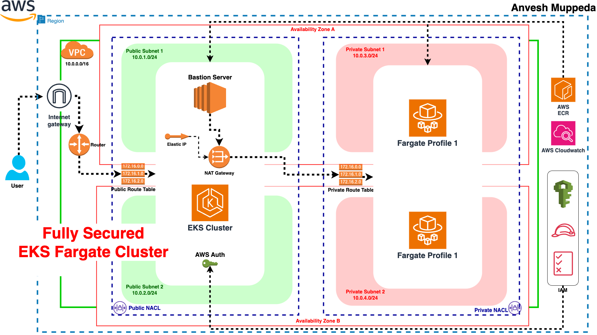
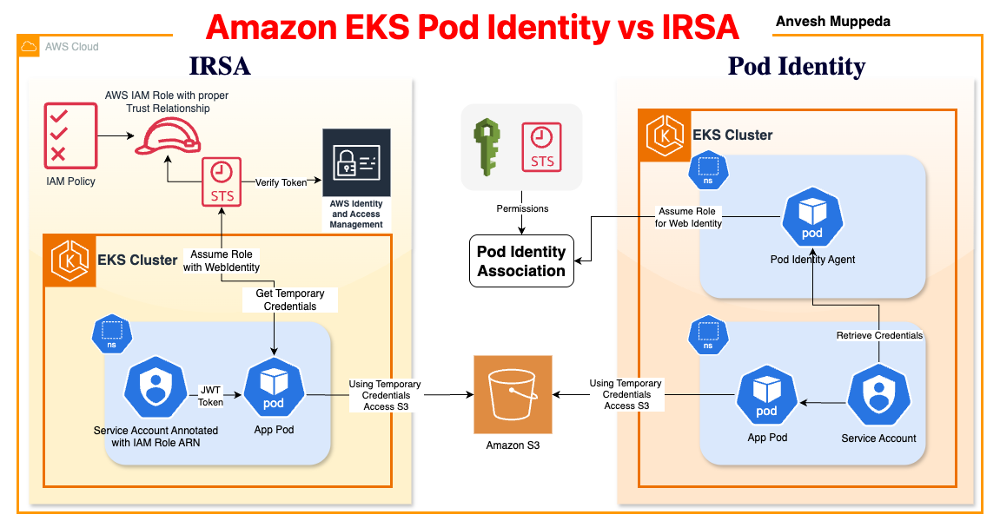

# AWS EKS Hands-On Guides  

## AWS EKS Fargate  

Create EKS Cluster with Fargate profile  

Related Blog: [⎈ A Hands-On Guide to Fully Secured EKS Fargate Cluster using CloudFormation 🛠️](https://medium.com/@muppedaanvesh/a-hands-on-guide-to-fully-secured-eks-fargate-cluster-using-cloudformation-%EF%B8%8F-77e496371274)  

  

## [AWS EKS Pod Identity vs IRSA](./Pod.Identity.vs.IRSA.MD)  

  

