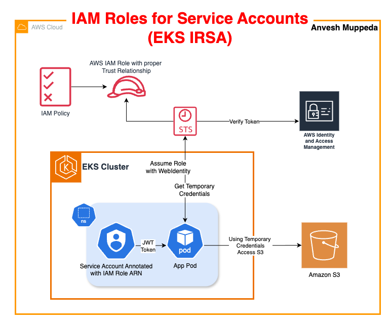

# AWS EKS IAM Roles for Service Accounts (IRSA): A Comprehensive Guide

In modern cloud-native architectures, securing Kubernetes workloads is paramount. **IRSA (IAM Roles for Service Accounts)** on AWS EKS provides a robust solution by enabling Pod-level permissions without sharing static AWS credentials. This guide will walk you through everything—from understanding IRSA to setting up your EKS cluster using both `eksctl` and CloudFormation, and finally deploying and testing a sample application.

---

## 1. Introduction

IAM Roles for Service Accounts (IRSA) revolutionizes permission management in EKS. By assigning each Kubernetes service account its own IAM role, IRSA ensures that Pods receive fine-grained AWS permissions. This eliminates the need for shared credentials or broadly scoped EC2 instance roles.



---

## 2. What is IRSA?

IRSA leverages AWS’s OpenID Connect (OIDC) provider integration with EKS, allowing Kubernetes service accounts to assume IAM roles. Each service account is bound to an IAM role that defines specific AWS permissions. This ensures that Pods operate with the principle of least privilege, enhancing both security and auditability.

---

## 3. Why IRSA?

- **Enhanced Security:**  
  No need for static AWS credentials or overly permissive instance roles.
  
- **Granular Permission Control:**  
  Each Pod gets dedicated, least-privilege access based on its role.
  
- **Improved Auditability:**  
  All API calls made by Pods are traceable in CloudTrail.
  
- **Simplified Management:**  
  Removes the necessity for sidecar tools like kiam or kube2iam.

---

## 4. Create an EKS Cluster

### Using eksctl

Create your EKS cluster with a configuration file that automatically sets up the OIDC provider—required for IRSA.

**cluster.yaml:**

```yaml
apiVersion: eksctl.io/v1alpha5
kind: ClusterConfig
metadata:
  name: eks-irsa-demo
  region: us-west-2
  version: "1.28"
iam:
  withOIDC: true  # Required for IRSA
managedNodeGroups:
  - name: ng-1
    instanceType: t3.medium
    minSize: 2
```

Run the following command to create your cluster:

```bash
eksctl create cluster -f cluster.yaml
```

### Using CloudFormation (CFT)

For an enterprise-ready approach, use [IRSA CloudFormation Template](./../cloudformation/eks-irsa.yaml) to provision your entire environment. The CFT template creates all required AWS resources including:

- EKS Cluster
- OIDC Provider
- IAM Roles with proper trust relationships

**Note:** If you need to change the namespace or service account for IRSA, update the `EKSIAMRoleforServiceAccount` logical ID in the template.  

```yaml
  # IRSA: IAM role for Kubernetes service accounts
  EKSIAMRoleforServiceAccount:
    Type: AWS::IAM::Role
    DependsOn: EKSOpenIDConnectProvider
    Properties:
      RoleName: !Sub "EKSIAMRoleforServiceAccount-${AWS::StackName}"
      AssumeRolePolicyDocument: !Sub
        - |
          {
            "Version": "2012-10-17",
            "Statement": [
                {
                    "Effect": "Allow",
                    "Principal": {
                        "Federated": "${OIDCProviderArn}"
                    },
                    "Action": "sts:AssumeRoleWithWebIdentity",
                    "Condition": {
                        "StringEquals": {
                            "${OIDCProvider}:aud": "sts.amazonaws.com",
                            "${OIDCProvider}:sub": "system:serviceaccount:${NameSpace}:${ServiceAccountName}"
                        }
                    }
                }
            ]
          }
        - OIDCProvider: !Select [1, !Split ["//", !GetAtt ControlPlane.OpenIdConnectIssuerUrl]]
          OIDCProviderArn: !GetAtt EKSOpenIDConnectProvider.Arn
          NameSpace: demo-ns
          ServiceAccountName: demo-sa
      ManagedPolicyArns:
          - arn:aws:iam::aws:policy/AmazonS3ReadOnlyAccess
      Description: IAM role for Kubernetes service accounts
```

---

> **Important:**  
> When using CloudFormation, if your cluster is created via CFT then **skip Step 5** (Create IAM Role and Service Account) as these resources are already provisioned by the template. The manual creation is optional in this case.

---

## 5. 🛠️ IRSA Implementation

You can implement IRSA using either the convenience of `eksctl` or manually with AWS CLI.

### Using eksctl

Deploy IRSA for your service account with a single command:

```bash
eksctl create iamserviceaccount \
  --name demo-sa \
  --namespace demo-ns \
  --cluster irsa-demo-cluster #Replace with your cluster name \
  --role-name IRSA-S3-Reader-Role \
  --attach-policy-arn arn:aws:iam::aws:policy/AmazonS3ReadOnlyAccess \
  --approve
```

### Manual Implementation Using AWS CLI

Run below commands to populate the required variables:  
```bash
export AWS_REGION="us-east-1"
account_id=$(aws sts get-caller-identity --query "Account" --output text)
oidc_provider=$(aws eks describe-cluster --name my-cluster --region $AWS_REGION --query "cluster.identity.oidc.issuer" --output text | sed -e "s/^https:\/\///")
export namespace=demo-ns
export service_account=demo-sa
```  

1. **Create Trust Policy:**  
   Create a `trust-relationship.json` file using your account ID and OIDC provider URL (above variables will do that).

    ```json
    cat >trust-relationship.json <<EOF
    {
    "Version": "2012-10-17",
    "Statement": [
        {
        "Effect": "Allow",
        "Principal": {
            "Federated": "arn:aws:iam::$account_id:oidc-provider/$oidc_provider"
        },
        "Action": "sts:AssumeRoleWithWebIdentity",
        "Condition": {
            "StringEquals": {
            "$oidc_provider:aud": "sts.amazonaws.com",
            "$oidc_provider:sub": "system:serviceaccount:$namespace:$service_account"
            }
        }
        }
    ]
    }
    EOF
    ```
2. **Create IAM Role:**

   ```bash
   aws iam create-role \
     --role-name IRSA-S3-Reader-Role \
     --assume-role-policy-document file://trust-relationship.json
   ```

3. **Attach Policy:**

   ```bash
   aws iam attach-role-policy \
     --role-name IRSA-S3-Reader-Role \
     --policy-arn arn:aws:iam::aws:policy/AmazonS3ReadOnlyAccess
   ```

---

## 6. Create Namespace & Service Account and Annotate with IAM Role

1. **Create a Namespace:**

   ```bash
   kubectl create namespace demo-ns
   ```

2. **Create the Service Account with Annotation:**

   ```bash
   cat <<EOF | kubectl apply -f -
   apiVersion: v1
   kind: ServiceAccount
   metadata:
     name: demo-sa
     namespace: demo-ns
   EOF
   ```
3. **Annotate your service account with the Amazon Resource Name (ARN) of the IAM role that you want the service account to assume**  
    ```bash
    kubectl annotate serviceaccount -n $namespace $service_account eks.amazonaws.com/role-arn=arn:aws:iam::$account_id:role/my-role
    ```
    ```bash
    ex:
    kubectl annotate serviceaccount -n demo-ns demo-sa eks.amazonaws.com/role-arn=arn:aws:iam::1234567890:role/my-role
    ```
3. **Verify the Annotation:**

   ```bash
   > k describe sa demo-sa -n demo-ns
    Name:                demo-sa
    Namespace:           demo-ns
    Labels:              <none>
    Annotations:         eks.amazonaws.com/role-arn: arn:aws:iam::975050084277:role/EKSIAMRoleforServiceAccount-irsa-cluster-stack
    Image pull secrets:  <none>
    Mountable secrets:   <none>
    Tokens:              <none>
    Events:              <none>
   ```

---

## 7. Deploy a Simple AWS CLI App and Test

### Deploy the Test Pod

Deploy a pod running the AWS CLI to test the IRSA configuration:

```bash
cat <<EOF | kubectl apply -f -
apiVersion: v1
kind: Pod
metadata:
  name: s3-access-test
  namespace: demo-ns
spec:
  serviceAccountName: demo-sa
  containers:
    - name: aws-cli
      image: amazon/aws-cli:latest
      command: ["/bin/sh", "-c"]
      args: ["sleep 3600"]
EOF
```

### Test the IRSA Configuration

1. **Enter the Pod:**

   ```bash
   kubectl exec -it s3-access-test -n demo-ns -- /bin/sh
   ```

2. **Inside the Pod, Run:**

   - **Verify IAM Role:**

     ```
     sh-4.2# aws sts get-caller-identity
    {
        "UserId": "AROA6GBMDR62RO6NME5EQ:botocore-session-1743984333",
        "Account": "975050084277",
        "Arn": "arn:aws:sts::975050084277:assumed-role/EKSIAMRoleforServiceAccount-irsa-cluster-stack/botocore-session-1743984333"
    }
    sh-4.2#
     ```

   - **List S3 Buckets (should succeed):**

     ```bash
     sh-4.2# aws s3 ls
    2025-04-06 16:59:17 cf-templates-bo1tkidmyuqb-us-east-1
    2025-04-06 22:00:56 my-test-bucket-1743976854
    sh-4.2#
     ```

   - **Try Creating an S3 Bucket (should fail due to read-only permissions):**

     ```bash
     sh-4.2# aws s3 mb s3://test-bucket-$(date +%s)
    make_bucket failed: s3://test-bucket-1743984371 An error occurred (AccessDenied) when calling the CreateBucket operation: User: arn:aws:sts::975050084277:assumed-role/EKSIAMRoleforServiceAccount-irsa-cluster-stack/botocore-session-1743984333 is not authorized to perform: s3:CreateBucket on resource: "arn:aws:s3:::test-bucket-1743984371" because no identity-based policy allows the s3:CreateBucket action
    sh-4.2#
     ```

---

## 8. Troubleshooting

- **AccessDenied Errors:**  
  Check that the IAM policy is correctly attached and that the trust policy matches the service account (`system:serviceaccount:<namespace>:<sa-name>`).

- **InvalidIdentityToken Issues:**  
  Ensure the OIDC provider URL in your IAM trust policy exactly matches the one from your EKS cluster.

- **Role Not Being Assumed:**  
  Verify the service account’s annotation (`eks.amazonaws.com/role-arn`) and confirm that the namespace and service account names are correct.

- **OIDC Provider Verification:**  
  Confirm that the OIDC provider is registered in the IAM console under Identity Providers.

---

## 9. Conclusion

IRSA fundamentally transforms AWS EKS security by enabling Pod-specific IAM roles. In this guide, we covered:

1. **Introduction:** Overview of IRSA and its benefits.
2. **What is IRSA:** How IRSA works to secure Kubernetes workloads.
3. **Why IRSA:** The security, auditability, and management advantages.
4. **Creating an EKS Cluster:** Methods using both `eksctl` and CloudFormation (with CFT provisioning all required resources).
5. **IRSA Implementation:** Options using `eksctl` and manual AWS CLI commands.
6. **Namespace & Service Account Creation:** Setting up and annotating the service account.
7. **Deploying & Testing:** Running a sample AWS CLI application.
8. **Troubleshooting:** Addressing common issues.
9. **Conclusion:** Final recap and best practices.

**Final Note:**  
If you opt for the CloudFormation deployment, skip the manual creation of the IAM Role and Service Account—they’re automatically provisioned by the template.

---

*Happy deploying! For more details and community insights, consider joining AWS EKS workshops or visiting the [AWS Documentation](https://docs.aws.amazon.com/eks/latest/userguide/iam-roles-for-service-accounts.html).*