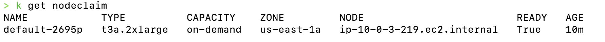
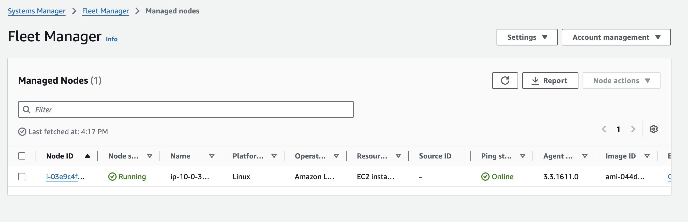

# Hands‑On Guide to Karpenter on AWS EKS

## Introduction

Karpenter is a modern Kubernetes node autoscaler designed for ease of use, performance, and flexibility. It streamlines node provisioning on AWS EKS by monitoring unschedulable pods and automatically launching or terminating EC2 instances based on real‑time demand. This guide will walk you through setting up an EKS cluster, configuring the required IAM permissions, deploying Karpenter via Helm, and testing node autoscaling with a sample application. Whether you prefer a programmatic approach using **eksctl** or the simplicity of CloudFormation templates, you’ll find clear and concise instructions below.

---

## Compatibility Matrix

Before you begin, make sure your cluster’s Kubernetes version is compatible with the version of Karpenter you plan to use. Here is the compatibility matrix:

| **Kubernetes Version** | **Minimum Karpenter Version Required** |
|------------------------|------------------------------------------|
| 1.26                   | >= 0.28                                  |
| 1.27                   | >= 0.28                                  |
| 1.28                   | >= 0.31                                  |
| 1.29                   | >= 0.34                                  |
| 1.30                   | >= 0.37                                  |
| 1.31                   | >= 1.0.5                                 |
| 1.32                   | >= 1.2                                   |

*Note:* If you prefer to set up the EKS cluster and the required IAM permissions using a CloudFormation template, skip steps 1 and 2 in the detailed instructions below. Instead, deploy the provided CloudFormation file (e.g., [EKS-Karpenter.cft.yaml](./../cloudformation/eks-karpenter.cft.yaml)) as follows:

```bash
export CLUSTER_NAME="karpenter-demo-cluster"  # Name of your EKS cluster

aws cloudformation deploy \
  --stack-name "Karpenter-${CLUSTER_NAME}" \
  --template-file "file://karpenter.cft.yaml" \
  --capabilities CAPABILITY_NAMED_IAM \
  --parameter-overrides "EKSClusterName=${CLUSTER_NAME}"
```

---

## Prerequisites

- **AWS CLI** configured with sufficient privileges.
- **kubectl** installed and configured.
- **eksctl** (version >= v0.202.0 recommended).
- **Helm** (for installing Karpenter).
- An active AWS account and a working VPC (and subnets/security groups tagged accordingly).

---

## Step‑By‑Step Guide

### 1. Set Environment Variables

Export necessary variables. Adjust values as needed:

```bash
export KARPENTER_NAMESPACE="kube-system"     # Namespace for Karpenter (default is kube-system)
export KARPENTER_VERSION="1.3.3"              # Desired Karpenter version
export K8S_VERSION="1.32"                     # Kubernetes version

export AWS_PARTITION="aws"                    # or aws-cn/aws-us-gov if applicable
export CLUSTER_NAME="karpenter-demo-cluster"  # Name of your EKS cluster
export AWS_DEFAULT_REGION="us-west-2"
export AWS_ACCOUNT_ID="$(aws sts get-caller-identity --query Account --output text)"
```

*Additional Variables:*  
If you plan to use dynamic AMI selection for your node classes, export extra variables such as `ALIAS_VERSION` (determined by querying SSM for your chosen Kubernetes version).

```bash
export ALIAS_VERSION="$(aws ssm get-parameter --name "/aws/service/eks/optimized-ami/${K8S_VERSION}/amazon-linux-2023/x86_64/standard/recommended/image_id" --query Parameter.Value | xargs aws ec2 describe-images --query 'Images[0].Name' --image-ids | sed -r 's/^.*(v[[:digit:]]+).*$/\1/')"
```

### 2. Create the EKS Cluster (if not using CFT)  

Using **eksctl**, create your cluster with a configuration file. The following snippet demonstrates a minimal configuration. Note that tagging the cluster (using `karpenter.sh/discovery`) is critical for resource discovery by Karpenter:

```yaml
eksctl create cluster -f - <<EOF
---
apiVersion: eksctl.io/v1alpha5
kind: ClusterConfig
metadata:
  name: ${CLUSTER_NAME}
  region: ${AWS_DEFAULT_REGION}
  version: "${K8S_VERSION}"
  tags:
    karpenter.sh/discovery: ${CLUSTER_NAME}
iam:
  withOIDC: true
  serviceAccounts:
  - metadata:
      name: karpenter
      namespace: "${KARPENTER_NAMESPACE}"
    roleName: ${CLUSTER_NAME}-karpenter
    attachPolicyARNs:
    - arn:${AWS_PARTITION}:iam::${AWS_ACCOUNT_ID}:policy/KarpenterControllerPolicy-${CLUSTER_NAME}
    roleOnly: true
iamIdentityMappings:
- arn: "arn:${AWS_PARTITION}:iam::${AWS_ACCOUNT_ID}:role/KarpenterNodeRole-${CLUSTER_NAME}"
  username: system:node:{{EC2PrivateDNSName}}
  groups:
  - system:bootstrappers
  - system:nodes
managedNodeGroups:
- instanceType: m5.large
  amiFamily: AmazonLinux2
  name: ${CLUSTER_NAME}-ng
  desiredCapacity: 2
  minSize: 1
  maxSize: 10
addons:
- name: eks-pod-identity-agent
EOF
```

*Tip:* If using CloudFormation (as noted earlier), skip this step.

### 3. Create Dependent IAM Permissions (if not using CFT)

If you’re not using the CloudFormation template, download and deploy the IAM permissions file:

```bash
curl -L "https://raw.githubusercontent.com/aws/karpenter-provider-aws/v${KARPENTER_VERSION}/website/content/en/preview/getting-started/getting-started-with-karpenter/karpenter-iam-permissions.yaml" -o karpenter-iam-permissions.yaml

aws cloudformation deploy \
  --stack-name "Karpenter-${CLUSTER_NAME}" \
  --template-file "file://karpenter-iam-permissions.yaml" \
  --capabilities CAPABILITY_NAMED_IAM \
  --parameter-overrides "ClusterName=${CLUSTER_NAME}"
```

### 4. aws-auth ConfigMap Entries with Karpenter Node role  
The nodes Karpenter launches need to be mapped in aws-auth. Run:  
```yaml
kubectl edit configmap aws-auth -n kube-system
```
Make sure the IAM role used by Karpenter nodes is listed under mapRoles. For example:  
```yaml 
- rolearn: arn:aws:iam::<account-id>:role/KarpenterNodeRole
  username: system:node:{{EC2PrivateDNSName}}
  groups:
    - system:bootstrappers
    - system:nodes
```

*Note:* If missing, Karpenter nodes won’t be able to join the cluster.  


### 5. Install Karpenter via Helm

Logout from the Helm registry and install the chart:

```bash
helm registry logout public.ecr.aws
```

Export KARPENTER_IAM_ROLE_ARN, which we have created as a part of step 3.
```bash
$ export KARPENTER_IAM_ROLE_ARN="arn:${AWS_PARTITION}:iam::${AWS_ACCOUNT_ID}:role/${CLUSTER_NAME}-karpenter"  
ex: 
$ export KARPENTER_IAM_ROLE_ARN="arn:aws:iam::1234567890:role/EKSWebIdentityRole-CF-karpenter-demo"
```

```bash
helm upgrade --install karpenter oci://public.ecr.aws/karpenter/karpenter \
  --version "${KARPENTER_VERSION}" \
  --namespace "${KARPENTER_NAMESPACE}" --create-namespace \
  --set "settings.clusterName=${CLUSTER_NAME}" \
  --set "settings.interruptionQueue=${CLUSTER_NAME}" \
  --set controller.resources.requests.cpu=1 \
  --set controller.resources.requests.memory=1Gi \
  --set controller.resources.limits.cpu=1 \
  --set controller.resources.limits.memory=1Gi \
  --set "serviceAccount.annotations.eks\.amazonaws\.com/role-arn=${KARPENTER_IAM_ROLE_ARN}" \
  --wait
```

Ensure that IRSA is properly configured and your service account is associated with the correct IAM role.

### 6. Create a NodePool

Define a NodePool that details the scheduling requirements and capacity limits:

```yaml
apiVersion: karpenter.sh/v1
kind: NodePool
metadata:
  name: default
spec:
  template:
    spec:
      requirements:
        - key: kubernetes.io/arch
          operator: In
          values: ["amd64"]
        - key: kubernetes.io/os
          operator: In
          values: ["linux"]
        - key: karpenter.sh/capacity-type
          operator: In
          values: ["on-demand"]
        - key: karpenter.k8s.aws/instance-category
          operator: In
          values: ["c", "m", "r"]
        - key: karpenter.k8s.aws/instance-generation
          operator: Gt
          values: ["2"]
      nodeClassRef:
        group: karpenter.k8s.aws
        kind: EC2NodeClass
        name: default
      expireAfter: 720h   # Automatically expire nodes after 30 days
  limits:
    cpu: 1000
  disruption:
    consolidationPolicy: WhenEmptyOrUnderutilized
    consolidateAfter: 1m
```

### 7. Create an EC2NodeClass

This custom resource defines the AWS settings (such as the role, AMI selection, subnets, security groups, and block device mappings) for node provisioning:

```bash
cat <<EOF | envsubst | kubectl apply -f -
apiVersion: karpenter.k8s.aws/v1
kind: EC2NodeClass
metadata:
  name: default
spec:
  role: "KarpenterNodeRole-${CLUSTER_NAME}"  # Ensure this matches the node role created earlier
  amiSelectorTerms:
    - alias: "al2023@${ALIAS_VERSION}"
  subnetSelectorTerms:
    - tags:
        karpenter.sh/discovery: "${CLUSTER_NAME}"
  securityGroupSelectorTerms:
    - tags:
        karpenter.sh/discovery: "${CLUSTER_NAME}"
EOF
```

*Note:* For private EKS clusters (with no outbound internet access) you can supply a pre‑created instance profile ARN using the `spec.instanceProfile` field.

### 8. Deploy a Sample Application

Deploy a simple application (using the Kubernetes pause image) that starts with zero replicas. This allows you to test that Karpenter provisions nodes when you scale up:

```bash
cat <<EOF | kubectl apply -f -
apiVersion: apps/v1
kind: Deployment
metadata:
  name: inflate
spec:
  replicas: 0
  selector:
    matchLabels:
      app: inflate
  template:
    metadata:
      labels:
        app: inflate
    spec:
      terminationGracePeriodSeconds: 0
      securityContext:
        runAsUser: 1000
        runAsGroup: 3000
        fsGroup: 2000
      containers:
      - name: inflate
        image: public.ecr.aws/eks-distro/kubernetes/pause:3.7
        resources:
          requests:
            cpu: 1
        securityContext:
          allowPrivilegeEscalation: false
EOF
```

### 9. Scale Up the Deployment

Trigger node provisioning by scaling the deployment:

```bash
kubectl scale deployment inflate --replicas 5
```  


Monitor the Karpenter logs and check your node list:

```bash
kubectl logs -f -n "${KARPENTER_NAMESPACE}" -l app.kubernetes.io/name=karpenter -c controller
kubectl get nodes
```  

#### Node Claim Status  
  

#### Fleet Manager Status  
  

#### Node Status  
  

### 10. Scale Down and Consolidate

Delete the deployment to allow Karpenter to consolidate unneeded nodes:

```bash
kubectl delete deployment inflate
```

You can also manually delete a node if needed:

```bash
kubectl delete node "${NODE_NAME}"
```

#### Delete Node  
  

#### Fleet Manager Status  
  

#### Node Status  
  


### 11. Clean Up Your Resources

When finished, uninstall Karpenter and delete your cluster resources:

1. **Uninstall Karpenter:**

   ```bash
   helm uninstall karpenter --namespace "${KARPENTER_NAMESPACE}"
   ```

2. **Delete the CloudFormation Stack (if used):**

   ```bash
   aws cloudformation delete-stack --stack-name "Karpenter-${CLUSTER_NAME}"
   ```

3. **Delete EC2 Launch Templates (if applicable):**

   ```bash
   aws ec2 describe-launch-templates --filters "Name=tag:karpenter.k8s.aws/cluster,Values=${CLUSTER_NAME}" \
     | jq -r ".LaunchTemplates[].LaunchTemplateName" \
     | xargs -I{} aws ec2 delete-launch-template --launch-template-name {}
   ```

4. **Delete the EKS Cluster:**

   ```bash
   eksctl delete cluster --name "${CLUSTER_NAME}"
   ```

---

## Detailed Steps of EC2 Node Provisioning by Karpenter

### 1. Detection of Unschedulable Pods  
- **What Happens:**  
  Karpenter continuously watches the cluster for pods that cannot be scheduled because there isn’t sufficient capacity.  
- **Key Point:**  
  These unschedulable or “pending” pods have specific resource needs (CPU, memory, special constraints like architecture or OS) that Karpenter will consider when deciding what type of node to provision.

### 2. Matching Pod Requirements to NodePools and EC2NodeClasses  
- **What Happens:**  
  Karpenter reviews the pre‑configured **NodePools** (which set general capacity limits, disruption policies, and scheduling preferences) and the detailed **EC2NodeClasses** (which specify AWS configuration like instance roles, AMI aliases, subnets, and security groups).  
- **Key Point:**  
  The combination of NodePool and EC2NodeClass tells Karpenter the “shape” or capacity required for a new node that will satisfy the pending pods.

### 3. Computing and Creating a NodeClaim  
- **What Happens:**  
  Based on the pod requirements and available AWS configurations, Karpenter computes the optimal “node shape.” This includes deciding on the total resource (CPU, memory, pods) that the node should offer.  
- **NodeClaim:**  
  Karpenter creates an immutable NodeClaim object in Kubernetes. This resource represents the demand for capacity and encapsulates details such as resource requests, scheduling constraints, and a link to the relevant NodePool/EC2NodeClass.
- **Key Point:**  
  NodeClaims serve as both the request for capacity and the marker that links the cloud provider’s capacity to your cluster’s Kubernetes node.

### 4. Provisioning Capacity via the EC2 Fleet API  
- **What Happens:**  
  Once a NodeClaim is computed, Karpenter translates it into an AWS API call to request new capacity.  
  - **Multiple Instance Options:**  
    Instead of requesting a single instance type, Karpenter uses the **EC2 Fleet API** (often via the `CreateFleet` call) to provide a list of candidate instance types that match the computed resource requirements.  
  - **Price and Capacity Optimized:**  
    The EC2 Fleet API uses strategies such as “price capacity optimized” to choose from the candidate instances. In this way, Karpenter leverages a diverse set of options (on‑demand, spot, multiple instance families) to maximize cost efficiency and availability.
- **Key Point:**  
  The Fleet API is critical because it allows a single API call to consider many instance types simultaneously. If capacity is insufficient for one option, the API can allocate a different compatible instance type without requiring multiple separate requests.

### 5. Instance Launch and Bootstrapping  
- **What Happens:**  
  After the EC2 Fleet API selects an instance, AWS launches the EC2 instance with the parameters defined in your EC2NodeClass (including the AMI, security groups, and IAM role/instance profile).  
- **Bootstrap Process:**  
  The new instance runs startup scripts (often embedded via UserData) to install the kubelet, configure networking, and apply instance settings. These steps ensure the node is ready to run workloads.
- **Key Point:**  
  The instance is tagged and given a provider ID. It represents the physical (or virtual) resource that will be registered as a Kubernetes node.

### 6. Registration and Initialization of the Node  
- **What Happens:**  
  As the instance boots up, its kubelet registers the node with the Kubernetes API server.  
- **Node Association:**  
  Karpenter watches for the node’s registration and correlates it with the earlier NodeClaim. This process includes:
  - Updating labels, taints, and annotations as defined by the NodePool and EC2NodeClass.
  - Waiting until the node’s reported resources (CPU, memory, pod capacity) match those requested in the NodeClaim.
- **Key Point:**  
  Once the node reaches the “Ready” state (all startup taints are removed and reported resource capacities are in line with expectations), the previously unschedulable pods are scheduled onto it.

### 7. Continuous Monitoring and Disruption Handling  
- **What Happens:**  
  Karpenter continues to monitor nodes and NodeClaims. If a node becomes underutilized or conditions change (for example, when pods are removed), Karpenter may decide to consolidate nodes to improve efficiency.
- **Disruption Management:**  
  If a node fails (for instance, due to an AWS capacity error or a node registration failure), the NodeClaim lifecycle includes marking such errors, possibly deleting the NodeClaim, and then reinitiating the provisioning process.
- **Key Point:**  
  This monitoring ensures that your cluster’s capacity always matches the real-time demand for pods while preventing unnecessary resource spending.

### In Summary

---  

- **Karpenter starts by detecting unschedulable pods** and then consults its NodePool and EC2NodeClass definitions to determine what kind of node is required.
- **A NodeClaim is computed and created,** representing a request for new capacity.
- **Karpenter translates the NodeClaim into an API call** using the EC2 Fleet API to request a set of candidate instance types and capacity, optimizing for price and available capacity.
- **AWS launches the instance**, and the instance boots up using startup scripts. The new EC2 node then registers itself with the Kubernetes cluster.
- **Karpenter updates the NodeClaim** to reflect that the node is now live, and the previously pending pods are scheduled onto the new node.
- **Karpenter then monitors the lifecycle** of nodes—handling scaling up and consolidation as needed to match the cluster’s workload.

This workflow illustrates that Karpenter leverages the EC2 Fleet API to dynamically request capacity from AWS. The Fleet API call is central because it allows Karpenter to select from a range of instance types efficiently and to adjust rapidly based on capacity availability and pricing, ensuring your cluster scales both reliably and cost‑effectively.

---  

## Differences between NodePools and NodeClasses in Karpenter:

Below is a simple explanation of the differences between **NodePools** and **NodeClasses** in Karpenter:

- **NodePools:**  
  - **High-Level Scheduling Grouping:**  
    They act as a “policy” or blueprint for how nodes should behave in your cluster.  
  - **Pod Constraints:**  
    They define which pods can be scheduled on the nodes by setting taints, startup taints, labels, and requirements. For example, you can use NodePools to require that only certain pods (those that tolerate a specific taint) run on a given set of nodes.
  - **Lifecycle Management:**  
    They set broader rules for node expiration, disruption (like consolidation behavior), and resource limits (e.g., maximum CPU or memory across the pool). Think of a NodePool as the high‑level “scheduling bucket” that determines overall node behavior.
  - **Policy Customization:**  
    They allow you to configure things like weight (which one to choose when a pod matches more than one pool), disruption budgets, and expiration policies.

- **NodeClasses (EC2NodeClasses):**  
  - **Low-Level Cloud Configuration:**  
    These provide the AWS‑specific settings needed to actually launch an EC2 instance. They define which AMI to use, the AWS subnets, security groups, block device mappings, and even low-level kubelet configurations.
  - **Instance Provisioning Details:**  
    When you create a NodeClaim, Karpenter refers to the NodeClass specified in the NodePool’s template. The NodeClass tells AWS exactly how to create the instance — including what instance profile or IAM role to attach.
  - **Reusable AWS Settings:**  
    Multiple NodePools can point to the same NodeClass if they want to use the same underlying AWS setup. For example, if several groups in your organization want nodes with similar networking, storage, and operating system settings, they can all refer to one common NodeClass.

### In Simple Terms

- **NodePools** are like the **“rules of engagement”** for your nodes — they determine which pods go where, when nodes are replaced, and set high-level resource limits.
- **NodeClasses** are like the **“technical spec sheet”** for your nodes — they define how to build the EC2 instance (AMI, networking, security, etc.) that will run your pods.

Together, they let Karpenter efficiently match the demand (unschedulable pods) to the right type of node by first determining *what* kind of node is needed (via the NodePool) and then *how* to build it on AWS (via the NodeClass).  

---

## Conclusion

This guide detailed each step in deploying Karpenter on an AWS EKS cluster—from setting up the cluster and configuring IAM permissions (or using a CloudFormation template) to deploying Karpenter, provisioning nodes via NodePool and EC2NodeClass, and finally testing autoscaling with a sample deployment. With a clear compatibility matrix, straightforward commands, and well-documented steps, you now have a blueprint to enable dynamic, cost‑efficient autoscaling for your Kubernetes workloads.

Be sure to test all changes in lower environments before moving to production. Keep abreast of updates via the official [Karpenter documentation](https://karpenter.sh/docs) and upgrade guides for any breaking changes.

---

## References

- [Getting Started with Karpenter Documentation](https://karpenter.sh/docs/getting-started/getting-started-with-karpenter/)  
- [CloudFormation for Karpenter IAM Permissions](https://karpenter.sh/docs/reference/cloudformation/)  
- [Karpenter NodeClasses Concepts](https://karpenter.sh/docs/concepts/nodeclasses/) 
- [Karpenter Upgrade Guide](https://karpenter.sh/docs/upgrading/upgrade-guide/)  

---

Happy scaling!  

