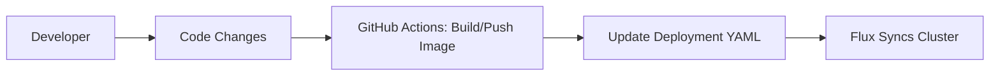
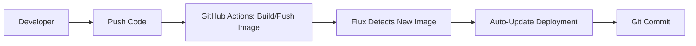
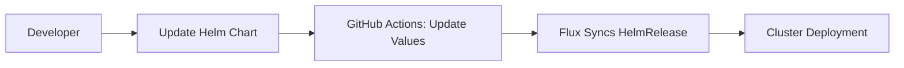

# **FluxCD GitOps Automation: End-to-End Guide**  
*With GitHub Actions and Kubernetes*  

---

## **Introduction**  
This guide walks through **three real-world GitOps scenarios** using FluxCD, GitHub Actions, and your repository structure.  
We’ll cover:  
1. **Manual Sync**: Deploy apps by committing Kubernetes manifests  
2. **Auto-Image Updates**: Automatically update deployments when images change  
3. **Helm Automation**: Declarative Helm chart management  

---

## **Repository Structure**  
```
📂 kubernetes-repo  
└── fluxcd  
    ├── repos  
    │   ├── app1/               # App1 code + Kubernetes manifests  
    │   ├── app2/               # App2 code  
    │   ├── app3/               # Helm chart for App3  
    │   └── infra-repo/         # Flux configuration files  
    └── .github/workflows/      # CI/CD pipelines (Docker builds)  
```

---

## **Example 1: Manual GitOps Deployment**  
*Trigger deployments by committing Kubernetes manifests*  

### **Workflow**  


### **Step-by-Step**  
1. **Bootstrap Flux**  
   ```bash
   flux bootstrap github \
     --owner=anveshmuppeda \
     --repository=kubernetes \
     --branch=fluxcd \
     --path=fluxcd/repos/infra-repo/clusters/dev
   ```

2. **Configure Flux to Watch App1**  
   Apply these files:  
   ```bash
   kubectl apply -f fluxcd/repos/infra-repo/apps/app1/gitrepository.yaml
   kubectl apply -f fluxcd/repos/infra-repo/apps/app1/kustomization.yaml
   ```

   *gitrepository.yaml*:  
   ```yaml
   # Tells Flux to monitor this path for changes
   apiVersion: source.toolkit.fluxcd.io/v1
   kind: GitRepository
   metadata:
     name: app1
     namespace: fluxcd-demo
   spec:
     url: https://github.com/anveshmuppeda/kubernetes
     ref:
       branch: fluxcd
     interval: 1m
   ```

   *kustomization.yaml*:  
   ```yaml
   # Applies manifests from this path
   apiVersion: kustomize.toolkit.fluxcd.io/v1
   kind: Kustomization
   metadata:
     name: app1
     namespace: fluxcd-demo
   spec:
     path: "./fluxcd/repos/app1/deploy"
     sourceRef:
       kind: GitRepository
       name: app1
     interval: 5m
   ```

3. **GitHub Actions Workflow**  
   When you push to `app1/src`:  
   - Builds Docker image with commit SHA tag  
   - Updates `app1-deployment.yaml`  
   - Commits changes to `fluxcd` branch  

   ```yaml
   # .github/workflows/docker-build-push-update.yaml
   - name: Update manifests
     run: |
       sed -i "s|image:.*|image: ${{ env.IMAGE }}|" fluxcd/repos/app1/deploy/app1-deployment.yaml
   ```

4. **Flux Auto-Sync**  
   Flux detects the Git commit and:  
   - Pulls updated `app1-deployment.yaml`  
   - Applies changes to Kubernetes cluster  

   Verify:  
   ```bash
   flux logs --kind=Kustomization --name=app1
   kubectl get pods -n fluxcd-demo
   ```

---

## **Example 2: Automated Image Updates**  
*Auto-update deployments when new images are pushed*  

### **Workflow**  


### **Step-by-Step**  
1. **Enable Image Automation**  
   ```bash
   flux bootstrap github ... --components-extra=image-reflector-controller,image-automation-controller
   ```

2. **Configure Image Scanning**  
   ```bash
   kubectl apply -f fluxcd/repos/infra-repo/apps/app2/imagerepository.yaml
   kubectl apply -f fluxcd/repos/infra-repo/apps/app2/imagepolicy.yaml
   kubectl apply -f fluxcd/repos/infra-repo/apps/app2/imageupdateautomation.yaml
   ```

   *imagepolicy.yaml*:  
   ```yaml
   # Defines which image versions to use
   apiVersion: image.toolkit.fluxcd.io/v1beta1
   kind: ImagePolicy
   metadata:
     name: app2
   spec:
     policy:
       semver:
         range: ">=1.0.0"
   ```

3. **GitHub Actions Workflow**  
   When you push to `app2/src`:  
   - Calculates new semantic version (v1.0.0 → v1.1.0)  
   - Builds/pushes image to Docker Hub  

   ```yaml
   # .github/workflows/docker-build-push.yaml
   - name: Calculate version
     run: |
       NEW_VERSION=$(calculate-next-version.sh)
       echo "NEW_VERSION=$NEW_VERSION" >> $GITHUB_OUTPUT
   ```

4. **Flux Auto-Update Process**  
   - Scans Docker Hub every 1 minute  
   - Updates `app2-deployment.yaml` in Git  
   - Commits change to `fluxcd` branch  

   Verify:  
   ```bash
   flux get image update app2
   kubectl describe imagepolicy app2 -n fluxcd-demo
   ```

---

## **Example 3: Helm Chart Deployment**  
*Declarative Helm releases with Git version control*  

### **Workflow**  


### **Step-by-Step**  
1. **Configure Helm Resources**  
   ```bash
   kubectl apply -f fluxcd/repos/infra-repo/apps/app3/helmchart.yaml
   kubectl apply -f fluxcd/repos/infra-repo/apps/app3/helmrelease.yaml
   ```

   *helmrelease.yaml*:  
   ```yaml
   # Declares desired Helm chart state
   apiVersion: helm.toolkit.fluxcd.io/v2
   kind: HelmRelease
   metadata:
     name: app3-release
   spec:
     chartRef:
       kind: HelmChart
       name: app3-chart
     values:
       image:
         tag: latest
   ```

2. **GitHub Actions Workflow**  
   When you update app3 charts:  
   - Updates `values.yaml` and `helmrelease.yaml`  
   ```yaml
   # .github/workflows/docker-build-push-update.yaml
   - name: Update Helm files
     run: |
       sed -i "s|tag:.*|tag: ${{ env.VERSION }}|" fluxcd/repos/app3/charts/simple-chart/values.yaml
   ```

3. **Flux Helm Reconciliation**  
   Flux:  
   - Detects changes in HelmChart/HelmRelease  
   - Runs `helm upgrade` automatically  

   Verify:  
   ```bash
   flux get helmreleases -n fluxcd-demo
   helm history app3-release -n fluxcd-demo
   ```

---

## **Key Automation Components**  
| Component              | Example 1 | Example 2 | Example 3 |  
|------------------------|-----------|-----------|-----------|  
| **GitHub Actions**     | Build + Manifest Update | Semantic Versioning | Helm Value Updates |  
| **Flux Controllers**   | source-controller, kustomize-controller | image-automation-controller | helm-controller |  
| **Update Trigger**     | Git commit | Image registry change | Git commit |  

---

## **Troubleshooting Tips**  
1. Check Flux logs:  
   ```bash
   flux logs --level=error
   ```
2. Verify image scanning:  
   ```bash
   kubectl get imagerepositories -n fluxcd-demo
   ```
3. Force reconciliation:  
   ```bash
   flux reconcile source git app1
   ```

---

## **Conclusion**  
This end-to-end implementation shows how to:  
1. **Manual Sync**: Use GitHub Actions + Flux for basic GitOps  
2. **Auto-Image Updates**: Implement full CI/CD with image scanning  
3. **Helm Automation**: Manage complex deployments declaratively  

[📘 Complete Example Repo](https://github.com/anveshmuppeda/fluxcd-demo) | [🔧 FluxCD Documentation](https://fluxcd.io/docs/)  
