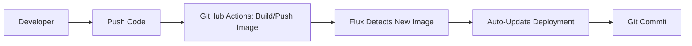

### **Example 2: Automated Image Updates**  
*Step-by-Step Explanation*

---

#### **Workflow Breakdown**  


---

### **1. Configure Flux Components**  

#### **a. GitRepository**  
##### We will also need to provide authentication for our git repo  
```bash
flux create secret git app2-githubsecret --url https://github.com/anveshmuppeda/kubernetes --username '' --password '' --namespace fluxcd-demo
```  
**File**: `fluxcd/repos/infra-repo/apps/app2/gitrepository.yaml`  
```yaml
apiVersion: source.toolkit.fluxcd.io/v1
kind: GitRepository
metadata:
  name: app2
  namespace: fluxcd-demo
spec:
  interval: 1m0s
  ref:
    branch: fluxcd
  url: https://github.com/anveshmuppeda/kubernetes
  secretRef:
    name: app2-githubsecret
```

**What it does**:  
- **Monitors Git Repo**: Watches the `fluxcd` branch of your repository.  
- **Sync Frequency**: Checks for changes every **1 minute**.  
- **Scope**: Tracks the repository for deployment manifests.  

---

#### **b. Kustomization**  
**File**: `fluxcd/repos/infra-repo/apps/app2/kustomization.yaml`  
```yaml
apiVersion: kustomize.toolkit.fluxcd.io/v1
kind: Kustomization
metadata:
  name: app2
  namespace: fluxcd-demo
spec:
  path: "./fluxcd/repos/infra-repo/apps/app2/deploy"
  sourceRef:
    kind: GitRepository
    name: app2
  interval: 15m
```

**What it does**:  
- **Applies Manifests**: Deploys YAML files from `fluxcd/repos/infra-repo/apps/app2/deploy`.  
- **Sync Frequency**: Reconciles cluster state every **15 minutes**.  

---


#### **c. Image Automation Objects**  
##### Create Docker registry secret to authenticate docker registry  
We need to create a image registry credential where we will push our image:  
```bash
kubectl -n default create secret docker-registry dockerhub-credential --docker-username '' --docker-password '' --docker-email 'test@test.com'
```
**i. ImageRepository**  
**File**: `fluxcd/repos/infra-repo/apps/app2/imagerepository.yaml`  
```yaml
apiVersion: image.toolkit.fluxcd.io/v1beta2
kind: ImageRepository
metadata:
  name: app2
  namespace: fluxcd-demo
spec:
  image: docker.io/anvesh35/fluxcd-demo-app2
  interval: 1m0s
  secretRef:
    name: dockerhub-credential
```

**What it does**:  
- **Scans Docker Hub**: Checks for new tags of `anvesh35/fluxcd-demo-app2` every **1 minute**.  
- **Metadata Storage**: Stores image metadata in the cluster for Flux to evaluate.  

---

**ii. ImagePolicy**  
**File**: `fluxcd/repos/infra-repo/apps/app2/imagepolicy.yaml`  
```yaml
apiVersion: image.toolkit.fluxcd.io/v1beta2
kind: ImagePolicy
metadata:
  name: app2
  namespace: fluxcd-demo
spec:
  imageRepositoryRef:
    name: app2
  policy:
    semver:
      range: ">=1.0.0"
```

**What it does**:  
- **Approval Rules**: Only allows image tags matching semantic versioning (e.g., `v1.2.3`).  
- **Version Range**: Accepts tags `v1.0.0` and higher.  

---

**iii. ImageUpdateAutomation**  
**File**: `fluxcd/repos/infra-repo/apps/app2/imageupdateautomation.yaml`  
```yaml
apiVersion: image.toolkit.fluxcd.io/v1beta1
kind: ImageUpdateAutomation
metadata:
  name: app2
  namespace: fluxcd-demo
spec:
  interval: 1m
  sourceRef:
    kind: GitRepository
    name: app2
  update:
    path: ./fluxcd/repos/infra-repo/apps/app2/deploy
    strategy: setters
```

**What it does**:  
- **Auto-Commit**: Updates `app2-deployment.yaml` with new image tags.  
- **Git Strategy**: Uses `setters` to replace image tags in YAML files.  
- **Commit Details**:  
  - Branch: `fluxcd`  
  - Author: `fluxcdbot@users.noreply.github.com`  

---

### **2. GitHub Actions Pipeline**  
**File**: `.github/workflows/docker-build-push.yaml`  

#### **Workflow Triggers**:  
```yaml
on:
  workflow_dispatch:
    inputs:
      version-bump:
        description: 'SemVer bump type'
        required: true
        default: 'minor'
  push:
    branches: [fluxcd]
    paths: [fluxcd/repos/app2/src/**]
```
- **Manual Trigger**: Lets you choose version bump type (major/minor/patch).  
- **Auto-Trigger**: Runs when code changes are pushed to `app2/src`.  

---

#### **Pipeline Steps**:  
1. **Checkout Code**:  
   ```yaml
   - name: Checkout code
     uses: actions/checkout@v3
   ```
   - Fetches the latest code from the `fluxcd` branch.  

2. **Calculate New Version**:  
   ```bash
   # Simplified version logic
   LATEST_TAG=$(curl -s https://hub.docker.com/v2/repositories/anvesh35/fluxcd-demo-app2/tags | jq -r '.results[].name' | grep '^v' | sort -V | tail -1)
   NEW_VERSION=$(semver bump $BUMP_TYPE $LATEST_TAG)
   ```
   - Determines the next version based on user input (e.g., `minor` bump from `v1.0.0` → `v1.1.0`).  

3. **Build/Push Image**:  
   ```yaml
   - name: Build and push
     uses: docker/build-push-action@v4
     with:
       tags: |
         anvesh35/fluxcd-demo-app2:${{ steps.version.outputs.new-tag }}
         anvesh35/fluxcd-demo-app2:latest
   ```
   - Tags the image with both the new version (e.g., `v1.1.0`) and `latest`.  

---

### **3. Flux Automation Process**  
1. **Image Detection**:  
   - Flux's `ImageRepository` detects the new `v1.1.0` tag in Docker Hub.  

2. **Policy Check**:  
   - `ImagePolicy` validates that `v1.1.0` matches `>=1.0.0`.  

3. **YAML Update**:  
   - `ImageUpdateAutomation` updates `app2-deployment.yaml`:  
     ```yaml
     image: anvesh35/fluxcd-demo-app2:v1.1.0
     ```  

4. **Git Commit**:  
   - Flux commits the updated YAML to the `fluxcd` branch.  

5. **Cluster Sync**:  
   - Flux's `Kustomization` applies the new manifest to the cluster.  

---

### **Verification**  
```bash
# Check image automation status
flux get image update app2

# View approved images
kubectl -n fluxcd-demo describe imagepolicy app2

# Track Git commits
git log --oneline -- path/to/app2-deployment.yaml
```

---

### **Troubleshooting**  
| **Issue**               | **Diagnosis**                                  | **Solution**                          |  
|-------------------------|-----------------------------------------------|---------------------------------------|  
| Image not updated       | ImagePolicy rejects the tag                   | Check semver range in ImagePolicy     |  
| No Git commit           | ImageUpdateAutomation misconfigured           | Verify `path` and Git credentials     |  
| Old image in cluster    | Kustomization sync interval too long          | Reduce `interval` in Kustomization    |  

---

### **Key Takeaways**  
1. **Full Automation**: New image tags trigger deployments without manual YAML edits.  
2. **Semantic Versioning**: Ensures only stable versions are deployed.  
3. **Auditability**: Every image update is recorded in Git history.  

For advanced use cases, see [Flux Image Automation Docs](https://fluxcd.io/docs/guides/image-update/).