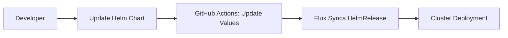

### **Example 3: Helm Chart Deployment**  
*Step-by-Step Explanation*

---

#### **Workflow Breakdown**  


---

### **1. Configure Flux Components**  

#### **a. GitRepository**  
**File**: `fluxcd/repos/infra-repo/apps/app3/gitrepository.yaml`  
```yaml
apiVersion: source.toolkit.fluxcd.io/v1
kind: GitRepository
metadata:
  name: app3
  namespace: fluxcd-demo
spec:
  url: https://github.com/anveshmuppeda/kubernetes
  ref:
    branch: fluxcd
  interval: 1m
  ignore: |
    /*
    !/fluxcd/repos/app3/
```

**What it does**:  
- **Focused Monitoring**: Only tracks the `app3/charts` directory in the repository.  
- **Sync Frequency**: Checks for changes every **1 minute**.  
- **Efficiency**: Ignores unrelated files to reduce overhead.  

---

#### **b. HelmChart**  
**File**: `fluxcd/repos/infra-repo/apps/app3/helmchart.yaml`  
```yaml
apiVersion: source.toolkit.fluxcd.io/v1beta1
kind: HelmChart
metadata:
  name: app3-chart
  namespace: fluxcd-demo
spec:
  chart: fluxcd/repos/app3/charts/simple-chart
  sourceRef:
    kind: GitRepository
    name: app3
  interval: 1m
```

**What it does**:  
- **Chart Packaging**: Packages the Helm chart located at `fluxcd/repos/app3/charts/simple-chart`.  
- **Source Binding**: Links to the `app3` GitRepository for tracking updates.  
- **Reconciliation**: Checks for chart changes every **1 minute**.  

---

#### **c. HelmRelease**  
**File**: `fluxcd/repos/infra-repo/apps/app3/helmrelease.yaml`  
```yaml
apiVersion: helm.toolkit.fluxcd.io/v2
kind: HelmRelease
metadata:
  name: app3-release
  namespace: fluxcd-demo
spec:
  interval: 1m
  chartRef:
    kind: HelmChart
    name: app3-chart
  values:
    image:
      repository: anvesh35/fluxcd-demo-app1
      tag: latest
```

**What it does**:  
- **Release Management**: Deploys the `app3-chart` Helm chart to the cluster.  
- **Value Overrides**: Sets custom values (e.g., `image.repository` and `image.tag`).  
- **Auto-Upgrade**: Reconciles every **1 minute** to match the chart’s desired state.  

---

### **2. GitHub Actions Integration**  
**Added to**: `.github/workflows/docker-build-push-update.yaml`  
```yaml
- name: Update Helm values
  run: |
    sed -i "s|tag:.*|tag: ${{ env.VERSION }}|" \
      fluxcd/repos/app3/charts/simple-chart/values.yaml
    sed -i "s|tag:.*|tag: ${{ env.VERSION }}|" \
      fluxcd/repos/infra-repo/apps/app3/helmrelease.yaml
```

**Workflow**:  
1. **Trigger**: Code changes to `app3/src` or manual workflow dispatch.  
2. **Action Steps**:  
   - Updates the `tag` in both:  
     - The chart’s `values.yaml` (default values).  
     - The HelmRelease’s `values` (overrides).  
3. **Commit**: Changes are pushed to the `fluxcd` branch.  

**Why Both Files?**  
- **values.yaml**: Contains default configurations for the Helm chart.  
- **HelmRelease**: Overrides specific values (e.g., `image.tag`) for customization.  

---

### **3. Flux Sync Process**  
1. **Detect Changes**:  
   - Flux’s `GitRepository` detects updates to `values.yaml` or `helmrelease.yaml`.  

2. **Reconcile HelmChart**:  
   - Repackages the chart if `values.yaml` or chart templates change.  

3. **Upgrade HelmRelease**:  
   - Flux’s Helm controller runs `helm upgrade` with the new values.  

4. **Cluster Deployment**:  
   - New image tag is deployed using the updated Helm release.  

---

### **Verification**  
```bash
# Check Helm release status
flux get helmreleases -n fluxcd-demo

# View Helm history
helm history app3-release -n fluxcd-demo

# Inspect deployed pods
kubectl -n fluxcd-demo get pods -l app=app3
```

**Expected Output**:  
```
NAME                           READY   STATUS    RESTARTS   AGE
app3-release-7c5ffd6d8-abcde   1/1     Running   0          2m
```

---

### **Troubleshooting**  
| **Issue**                  | **Diagnosis**                                  | **Solution**                          |  
|----------------------------|-----------------------------------------------|---------------------------------------|  
| Chart not packaged         | HelmChart path incorrect                      | Verify `chart:` field in HelmChart    |  
| Values not applied         | HelmRelease `values` misconfigured            | Check YAML indentation and keys       |  
| Upgrade failed             | Chart dependencies missing                    | Run `helm dependency update` locally  |  

---

### **Key Takeaways**  
1. **Declarative Helm**: Manage releases like Kubernetes resources (no `helm install/upgrade`).  
2. **Git-Driven Values**: Both chart defaults and overrides are version-controlled.  
3. **Consistency**: Flux ensures the cluster state always matches the HelmRelease definition.  

For advanced use cases, see [Flux Helm Docs](https://fluxcd.io/docs/guides/helmreleases/).