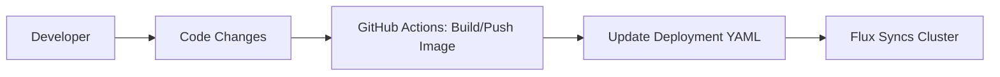

### **Example 1: Manual GitOps Deployment**  
*Step-by-Step Explanation*

---

#### **Workflow Breakdown**  


---

### **1. Configure Flux Objects**  
#### **a. GitRepository**  
**File**: `fluxcd/repos/infra-repo/apps/app1/gitrepository.yaml`  
```yaml
apiVersion: source.toolkit.fluxcd.io/v1
kind: GitRepository
metadata:
  name: app1
  namespace: fluxcd-demo
spec:
  url: https://github.com/anveshmuppeda/kubernetes
  ref:
    branch: fluxcd
  interval: 1m
```

**What it does**:  
- **Monitors Git Repo**: Watches the `fluxcd` branch of your repository.  
- **Sync Frequency**: Checks for changes every **1 minute**.  
- **Scope**: Tracks the entire repository for Kubernetes manifests.  

---

#### **b. Kustomization**  
**File**: `fluxcd/repos/infra-repo/apps/app1/kustomization.yaml`  
```yaml
apiVersion: kustomize.toolkit.fluxcd.io/v1
kind: Kustomization
metadata:
  name: app1
  namespace: fluxcd-demo
spec:
  path: "./fluxcd/repos/app1/deploy"
  sourceRef:
    kind: GitRepository
    name: app1
  interval: 5m
  prune: true
```

**What it does**:  
- **Applies Manifests**: Deploys all YAML files in `fluxcd/repos/app1/deploy`.  
- **Auto-Cleanup**: Removes Kubernetes resources if their manifests are deleted (`prune: true`).  
- **Sync Frequency**: Reconciles cluster state every **5 minutes**.  

---

### **2. GitHub Actions Automation**  
**File**: `.github/workflows/docker-build-push-update.yaml`  

#### **Workflow Triggers**:  
```yaml
on:
  push:
    branches: [fluxcd]
    paths: [fluxcd/repos/app1/src/**]
```
- **When**: Pushes to `fluxcd` branch with changes in `app1/src`.  
- **Why**: Ensures pipeline runs only for app1 source code changes.  

---

#### **Pipeline Steps**:  
1. **Checkout Code**:  
   ```yaml
   - name: Checkout code
     uses: actions/checkout@v3
   ```
   - Fetches the latest code from the `fluxcd` branch.  

2. **Build/Push Docker Image**:  
   ```yaml
   - name: Build Docker image
     uses: docker/build-push-action@v4
     with:
       context: fluxcd/repos/app1/src
       tags: anvesh35/fluxcd-demo-app1:${{ github.sha }}
       push: true
   ```
   - **Context**: Uses `app1/src/Dockerfile`.  
   - **Tagging**: Uses Git commit SHA (e.g., `anvesh35/fluxcd-demo-app1:3a8b9c2d`).  

3. **Update Deployment Manifest**:  
   ```bash
   sed -i "s|image:.*|image: anvesh35/fluxcd-demo-app1:${{ github.sha }}|" \
     fluxcd/repos/app1/deploy/app1-deployment.yaml
   ```
   - Replaces the image tag in `app1-deployment.yaml` with the new SHA.  

4. **Commit Changes**:  
   ```yaml
   - name: Commit changes
     uses: EndBug/add-and-commit@v7
     with:
       message: "Update app1 to ${{ github.sha }}"
       branch: fluxcd
   ```
   - Automatically commits the updated YAML to the `fluxcd` branch.  

---

### **3. Flux Sync Process**  
1. **Detect Changes**:  
   - Flux notices the new commit in the `fluxcd` branch (checks every 1 minute).  

2. **Pull Updates**:  
   - Downloads the latest `app1-deployment.yaml` from Git.  

3. **Apply to Cluster**:  
   - Uses `kubectl`-like logic to update the deployment with the new image tag.  

4. **Verify**:  
   ```bash
   kubectl -n fluxcd-demo get pods
   # Expected output:
   NAME                    READY   STATUS    RESTARTS   AGE
   app1-7cbbf6d5f9-abcde   1/1     Running   0          1m
   ```

---

### **Key Takeaways**  
1. **Git as Source of Truth**: All changes start with a Git commit.  
2. **Automated Sync**: Flux bridges Git and Kubernetes – no manual `kubectl apply` needed.  
3. **Traceability**: Every deployment is tied to a Git commit SHA.  

For issues, run:  
```bash
flux logs --kind=Kustomization --name=app1
``` 

This workflow ensures your cluster state **always matches what’s declared in Git** – the core principle of GitOps! 🚀

